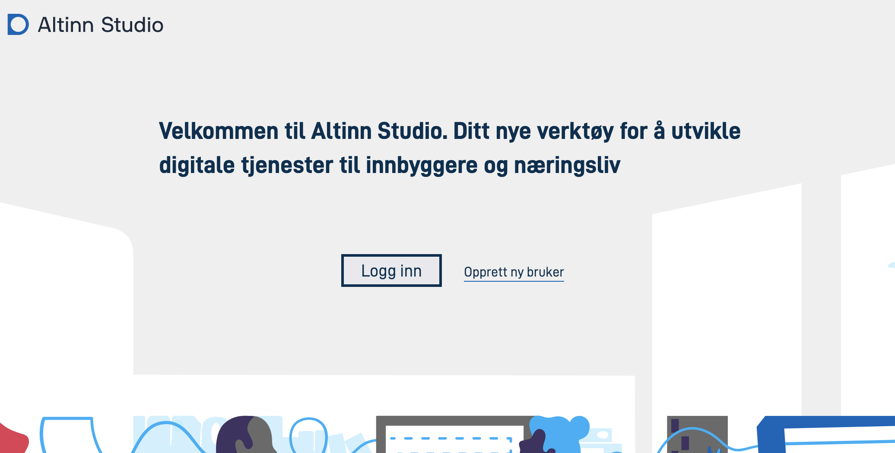
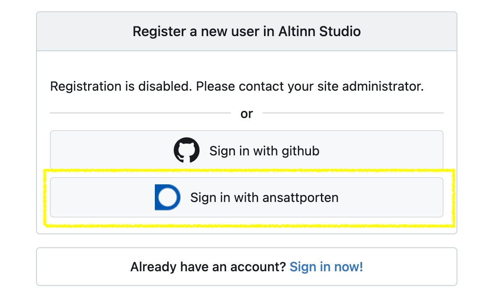
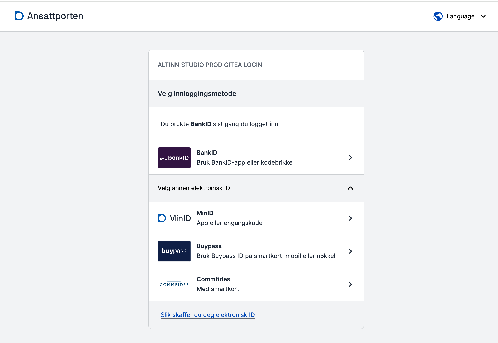

## Create a user in Altinn Studio

Your Altinn Studio user is personal to you and can be linked to one or more organizations to collaborate with others and access existing applications.

### Create user using Ansattporten
{.floating-bullet-numbers-sibling-ol}

1. Go to [altinn.studio](https://altinn.studio) and click "Create new user".
   
2. Register via Ansattporten.
   
3. Provide your credentials in Ansattporten. Use f.ex. BankID or MinId
   
4. Create an Altinn Studio user by filling in username, email, password, a captcha and click "Complete".
   The user in Altinn Studio will be connected to your Ansattporten user.
   
5. Activate your account
   - *An email is sendt to the email address you provided with a link. Copy the link into the browser adress bar and click ENTER.*
   
   {}
   If you see an error message indicating that the activation link is invalid og has expired, try logging in again via 
   Ansattporten. Your account shold be activated.
   {}
6. Give the Altinn Studio application access to your user account.
   

After your account is activated, click on the logo at the top left of the page to navigate to your service dashboard.
You are now ready to create your first service.

## Connect existing user to Ansattporten

If you have previously registered in Altinn Studio, via Github or email address, you can connect your Altinn Studio account
to login via Ansattporten by following the steps below.

1. Go to [altinn.studio](https://altinn.studio) and click "Log in".
   

2. Click the button "Log in with Ansattporten".
   

3. Log in through Ansattporten.
   - *You can use Ansattporten for login/registration if you can log in with BankID, MinId or EntraID. 
     There is currently no requirement for affiliation with a public sector organization.*

   

4. Select the tab "Connect to existing account" and log in with username/password.
   - *Have you forgotten your username/password? You can reset these yourself by following the link on the login form.*

  

Now your account is connected to Ansattporten, and you can use Ansattporten to log in to Altinn Studio.

## Join an organization

Organizations in Altinn Studio own the applications and enable collaboration between people within the organization.

To join an organization, an administrator must grant you access.
If you're uncertain about the administrator or if your organization is available in Altinn Studio,
you can seek assistance from the Altinn Servicedesk (mailto:tjenesteeier@altinn.no).

_Are you an administrator for your organization and want to add a user to a team? See our guide explaining how this is 
done [here](/en/altinn-studio/v8/guides/administration/access-management/studio/)._

## Create an organization

Digdir creates the organizations in Altinn Studio.

To get an organization in Altinn Studio, your organization must

- be a service owner and have an agreement with Altinn, or
- offer service development in Altinn Studio on behalf of organizations in public sector

Organizations that are not service owners will not get access to their own test or production environment.

To create an organization, email [Altinn Servicedesk](mailto:tjenesteeier@altinn.no) with the organization's name and who will be the administrator.
Creating the organization may require a few days, and we will notify you via email when it's ready.
