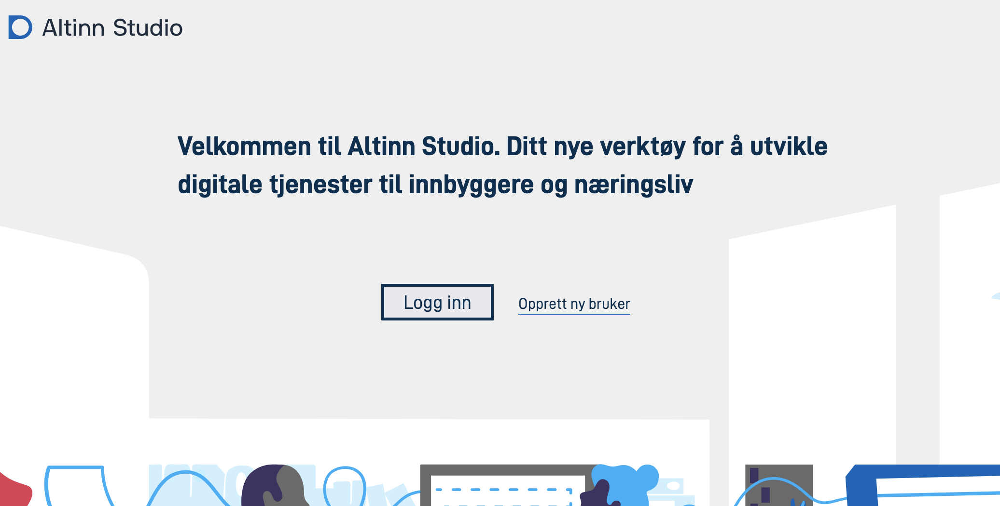
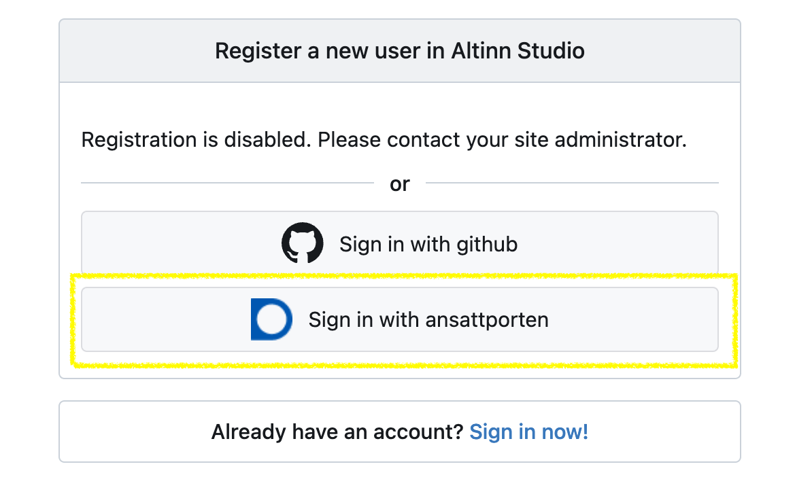
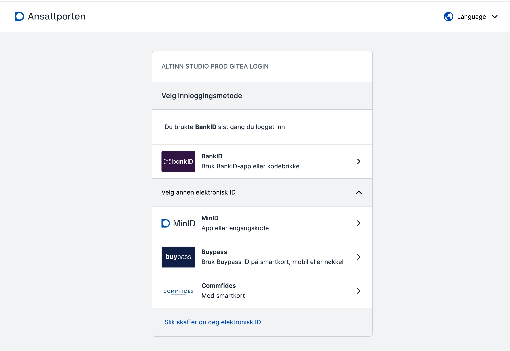
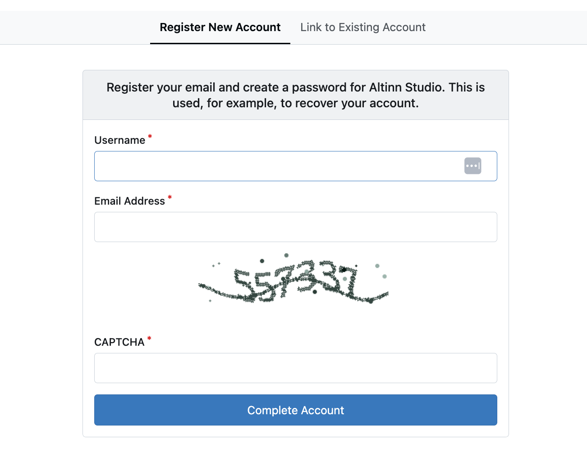
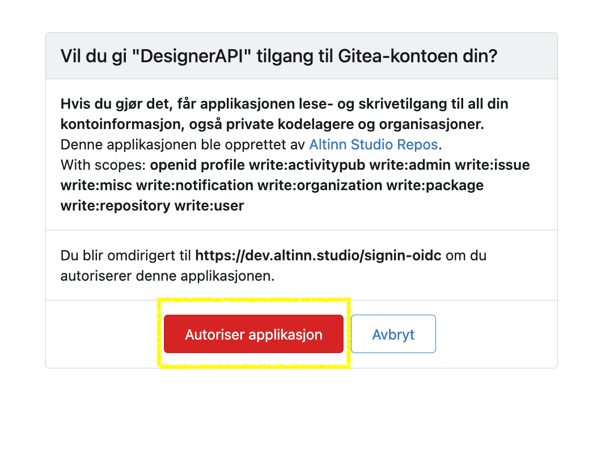

## Lag en bruker i Altinn Studio

Din Altinn Studio bruker er personlig for deg og kan knyttes til en eller flere organisasjoner for å samarbeide med 
andre og få tilgang til eksisterende apper.

### Lag en bruker med Ansattporten
{.floating-bullet-numbers-sibling-ol}

1. Gå til [altinn.studio](https://altinn.studio) og klikk på "Opprett ny  bruker".
   

2. Registrer deg via Ansattporten
   - *Registrering via kun epostadresse er ikke lenger støttet. Av sikkerhetsmessige årsaker er vi i gang med å fjerne 
      alle muligheter for registrering utenom Ansattporten. Vi anbefaler derfor at du velger Ansattporten.*
   
   

3. Logg inn gjennom Ansattporten.
   - *Du kan bruke ansattporten for innlogging/registrering om du kan logge inn i IDPorten. Det ikke et krav om knytning
      til en virksomhet i offentlig sektor.*

   

4. Lag en Altinn Studio bruker ved å fylle ut brukernavn, epost, passord, en captcha og klikk på “Fullfør”.  
   Brukeren i Altinn Studio vil bli koblet til din Ansattporten-bruker.
   

5. Aktiver kontoen din ved å bekrefte epostadressen du registrerte med.
   - *En epost er sendt til den epostadressen du oppga med en lenke. Kopier ut lenken og lim den inn i nettleservindu.*

   {}
   Hvis du får en feilmelding om at lenken er utløpt, prøv å logge inn på nytt (via Ansattporten). Kontoen skal være aktivert.
   {}

6. Gi Altinn Studio applikasjonen tilgang til din brukerkonto
   

Etter at kontoen  er aktivert, trykk på logoen øverst til venstre på siden for å navigere til ditt tjeneste-dashboard.
Du er nå klar til å lage din første tjeneste.

## Bli del av en organisasjon

Organisasjoner i Altinn Studio eier applikasjonene og gjør det mulig for flere innen samme organisasjon å samarbeide.

For å bli del av en organisasjon må en administrator for din organisasjon gi deg tilgang.
Hvis du er usikker på hvem som er administrator eller du ikke vet om organisasjonen din er satt opp i Altinn Studio
kan du spørre [Altinn Servicedesk](mailto:tjenesteeier@altinn.no) om hjelp.

_Er du administrator for din organisasjon og skal legge inn brukere? Se veiledning for hvordan det gjøres [her](/nb/altinn-studio/v8/guides/administration/access-management/studio/)._

## Opprette en organisasjon

Det er Digdir som oppretter organisasjoner i Altinn Studio.

For å kunne få en organisasjon i Altinn Studio må din virksomhet

- være tjenesteeier og ha inngått en avtale med Altinn, eller
- tilby tjenesteutvikling i Altinn Studio på vegne av offentlige virksomheter

Organisasjoner som ikke er tjenesteeiere vil ikke få tilgang til eget test- eller produksjonsmiljø. 

For å opprette en ny organisasjon, send en epost til [Altinn Servicedesk](mailto:tjenesteeier@altinn.no) med navn på organisasjonen og hvem som skal være administrator.
Det vil kunne ta noen dager og du vil få svar på epost så snart det er gjort.
