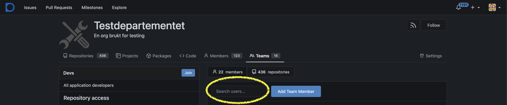
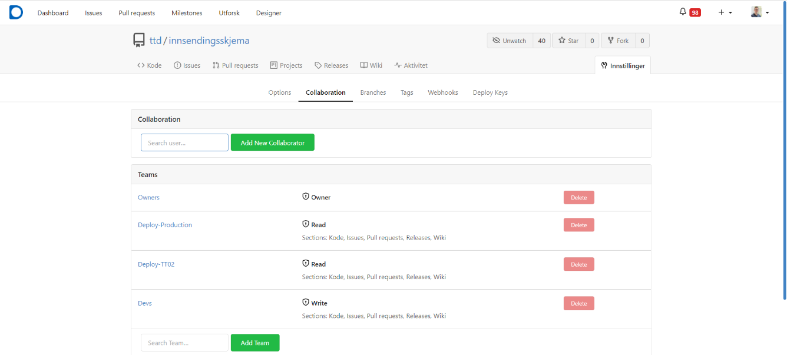

## Access Management for the Organization

As the owner of an organization in Altinn Studio, you have the ability to configure the access for other users
associated with the organization. This is done via Gitea at the following link:
https://altinn.studio/repos/org/{org}/teams/ Remember to replace `{org}`.

Four standard teams have been defined that set guidelines for what a user is allowed to do within an organization in
Altinn Studio. If necessary, as an owner, you can add/remove users in teams, create new teams, and change configurations
of existing teams.

[See an overview of the standard teams and the access they grant here](../../../../reference/access-management/studio/).

### How to add a user to a team
The following steps can be done by a user that is an _owner_ for the organization.
- Navigate to https://altinn.studio/repos/org/{org}/teams/ Remember to replace `{org}` with your org.
- Open the relevant team by clicking on the name of the team, or on the "View" button at the top of the team overview
- Type in the users Altinn Studio _username_ in the text field at the top of the list of users
  - Select the user from the list that appears when you start typing.
- Click the button "Add Team Member".
- The user is now added to the team.

## Edit Access Management for a single repository
Access can be granted to both teams and
individual users. To maintain an overview, we primarily recommend setting up teams for access control. 

1. Navigate to the repository: `https://altinn.studio/repos/{org}/{app}/` (replace `{org}` and `{app}` with your org code and app name.)
    - Alternatively, navigate to https://altinn.studio/repos/explore/repos and search for your app.
2. Click the `Settings` button on the right side of the top menu for the repository.
3. Select the `Collaborators` tab.
4. Grant access to a specific user in the "Collaborators" section by typing user name, and clicking "Add Collaborator". 
5. Grant access to a specific team in the "Teams" section by typing team name and clicking "Add Team". 

## How to Remove a User from a Team
You will need the username of the user you wish to remove.
1. Navigate to the teams page for your organization: `https://altinn.studio/repos/org/{org}/teams/` - replace `{org}` with your organization code.
2. Select the team from which you want to remove the user by clicking "View."
3. Choose the user from the list of members, and select "Remove."

Note that a user can also leave a team on their own by navigating to the same view and clicking the "Leave" button in the upper left corner next to the team name.

## How to Remove a User from the Organization
You will need the username of the user you wish to remove. See the above instructions for how to remove a user from individual teams.
1. Navigate to the teams page for your organization: `https://altinn.studio/repos/org/{org}/teams/` - replace `{org}` with your organization code.
2. Remove the user from any teams within your organization to which they belong.
   - Common teams include `devs` for write access to services, `Deploy-<environment>` for deployment access to services, and `Resources-Publish-<environment>` for access to publish resources.
   - If your organization has a different team structure, you must check all teams the user may belong to.
3. Verify that the user is no longer part of your organization by navigating to the user’s profile: `https://altinn.studio/repos/{username}`
   and checking that your organization (with logo) is no longer displayed under the user’s profile picture on the left side.
