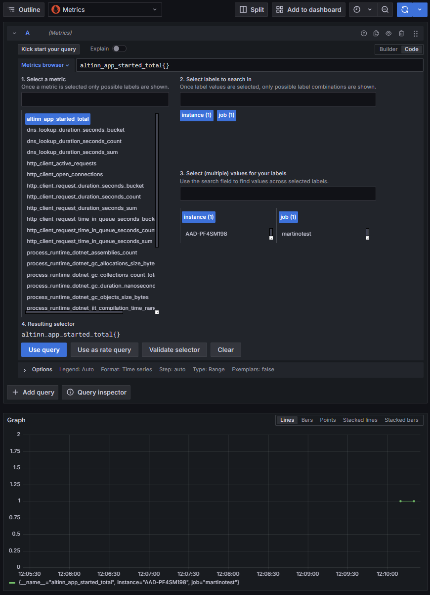
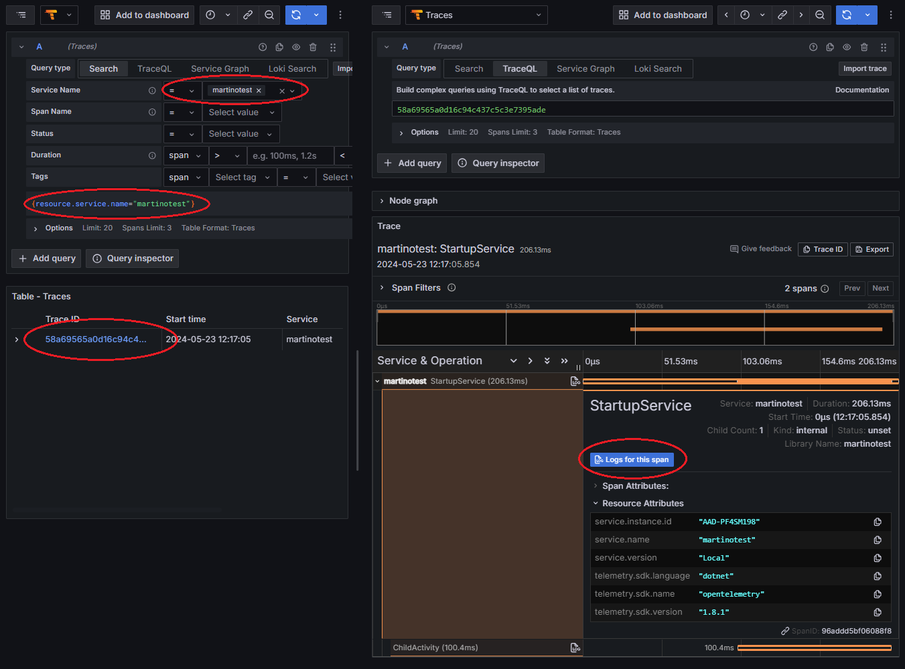
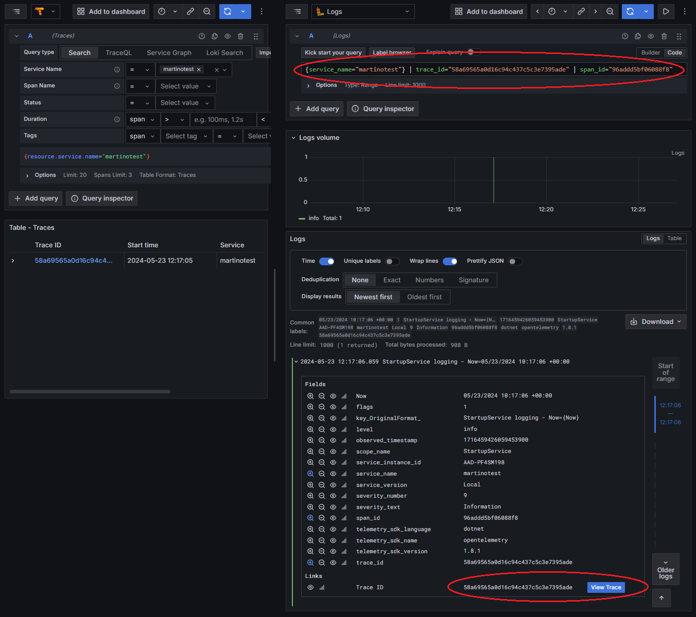

{}
Konfigurasjon av [OpenTelemetry (OTel)](https://opentelemetry.io/) krever minimum versjon 8 av Altinn.App-biblioteker.
Det eksisterende Application Insights SDK-oppsettet er utgått, og vil fjernes i versjon 9.
{}

## Konfigurering av en app

Du aktiverer det nye monitorerings- og instrumenteringsoppsettet basert på OpenTelemetry ved å sette 
`UseOpenTelemetry` til `true` i *appsettings.json* eller tilsvarende.


{
  "AppSettings": {
    "UseOpenTelemetry": true
  }
}


Når appen kjøres med denne innstillingen så vil Altinn.App-biblioteket sende telemetri til localtest ved lokal kjøring
og til Azure Monitor ved kjøring i et miljø.

[Les mer om konfigurasjonsmuligheter på referansesiden for konfigurasjon](/nb/altinn-studio/v8/reference/monitoring/configuration/).

## Egendefinert instrumentering

Vi illustrerer egendefinert instrumentering med et enkelt eksempel.

I *Program.cs* legger vi til en enkel *IHostedService*-implementasjon
som kan instrumenteres til å eksponere telemetri.
En *IHostedService* som registreres med *AddHostedService* vil sørge for at *StartAsync* kjøres
som del av oppstarts-prosedyren i prosessen/containeren. Målet med dette eksempelet
er å få ut noe telemetri som du kan se i visualiseringsverktøy lokalt og bli kjent med løsningen.
I praksis vil vi få et tall som økes med 1 når appen startes, og en trace som inneholder en child-span og relateres til en 
logg-melding.

Vi anbefaler å eksperimentere mer med dette eksempelet - test ut andre typer metrikker, legg til attributter på traces o.l.

Telemetri- og instrumentering-APIene i Altinn.App-biblioteket blir eksponert gjennom *Telemetry*-klassen. Det er
et trådsikkert singleton-objekt tilgjengelig i dependency injection-containeren.
Vi utvider *Program.cs* med dette.

Hvis de ikke allerede er der, trenger vi følgende avhengigheter øverst i filen:

```csharp
using System;
using System.Threading;
using System.Threading.Tasks;
using Microsoft.Extensions.Logging;
using Microsoft.Extensions.Hosting;
using Altinn.App.Core.Features;
```

Legg til klassen nedenfor nederst i filen:

```csharp
sealed class StartupService(ILogger<StartupService> logger, Telemetry telemetry) : IHostedService
{
    public async Task StartAsync(CancellationToken cancellationToken)
    {
        // Lag en egendefinert metrikk - en teller i dette tilfellet. Navnet blir `altinn_app_started`
        var counter = telemetry.Meter.CreateCounter<long>(Telemetry.Metrics.CreateName("started"));
        // Inkrementer telleren
        counter.Add(1);

        // Start en aktivitet, som blir utsendt som et OTel span
        using var activity = telemetry.ActivitySource.StartActivity("StartupService");
        {
            // Vent litt, deretter legg til en underaktivitet
            await Task.Delay(100, cancellationToken);
            using var childActivity = telemetry.ActivitySource.StartActivity("ChildActivity");
            await Task.Delay(100, cancellationToken);
        }

        // Logger kommer fra `ILogger<T>` interfacet
        var now = DateTimeOffset.UtcNow;
        logger.LogInformation("StartupService logging - Now={Now}", now);
    }

    public Task StopAsync(CancellationToken cancellationToken) => Task.CompletedTask;
}
```

Nå kan vi registrere klassen i .NETs dependency injection-container, som vil sørge for at
*StartAsync* blir kjørt når prosessen starter opp.

```csharp
void RegisterCustomAppServices(IServiceCollection services, IConfiguration config, IWebHostEnvironment env)
{
    services.AddHostedService<StartupService>();
}
```

Nå kan du kjøre appen. I neste del ser vi på telemetrien.

[Du kan også lese mer om instrumentering på referansesiden for instrumentering](/nb/altinn-studio/v8/reference/monitoring/instrumentation/).

## Visualisering

Her viser vi kort hvordan du kan visualisere telemetrien fra eksempelet over.

### Lokal utvikling

Ved lokal utvikling så kan en monitoreringsstack bestående av Grafana og OpenTelemetry Collector
settes opp ved siden av localtest og Platform APIer. [Se localtest README for mer informasjon](https://github.com/Altinn/app-localtest/blob/main/README.md).

Monitoreringsoppsettet i localtest inneholder en Grafana-instans med ASP.NET Core dashboard og et preview Altinn app dashboard.
I tillegg gir det muligheten til å fritt undersøke telemetrien som eksponeres fra Altinn-plattformen og biblioteket.

Telemetrien fra plattformtjenester i localtest ser annerledes ut enn telemetri fra andre miljøer, fordi plattformtjenestene som kjører lokalt har annen kode og konfigurasjon.

[Les mer om lokal Grafana på referansesiden for visualisering](/nb/altinn-studio/v8/reference/monitoring/visualisation/#grafana).

Hvis du har implementert koden over, så skal du kunne finne `altinn_app_started`-metrikken på "Explore"-siden når "Metrics"-datakilden er valgt.
Du kan også finne logger og traces fra koden over på denne siden ved hjelp av de andre datakildene.

Åpne Grafana på [local.altinn.cloud/grafana/](http://local.altinn.cloud/grafana/) og naviger via sidemenyen.

Vi starter med å utforske metrikker ved å navigere til *Explore*-siden, der vi kan velge *Metrics* som kilde i nedtrekksmenyen. Her
kan vi se på ønskelig metrikk ved hjelp av *Select a metric*-seksjonen:



For å se traces bruker vi *Traces* som kilde på *Explore*-siden. Vi velger vårt appnavn som *Service Name*. Nå kan vi se
traces i *Table view*-seksjonen. Vi trykker på *trace ID* for å se full trace i et nytt pop-up på høyre side.



Ved å trykke på *Logs for this span*-knappen kan vi navigere til de relevante loggene for det valgte span. En spørring genereres automatisk, som vist i bildet under. Legg merke til at kildetype endres fra *Traces* til *Logs* og at vi enkelt kan navigere tilbake.



### Deployment til et miljø

Når appen er deployed til et test- eller produksjonsmiljø, sendes telemetrien til Azure Monitor.

[Les mer om Azure Monitor på referansesiden for visualisering](/nb/altinn-studio/v8/reference/monitoring/visualisation/#azure-monitor).

I Azure Monitor finner du logger og traces ved å bruke *Transaction search*-menyen, mens metrikker ligger under *Metrics*.

{}
I fremtiden vil apper i produksjon og andre miljøer også bruke Grafana som monitoreringsløsning.
{}
