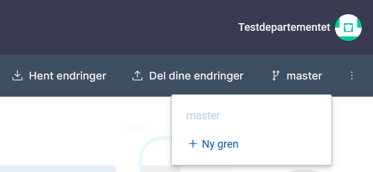
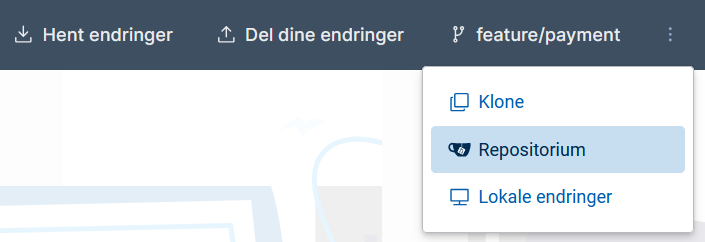
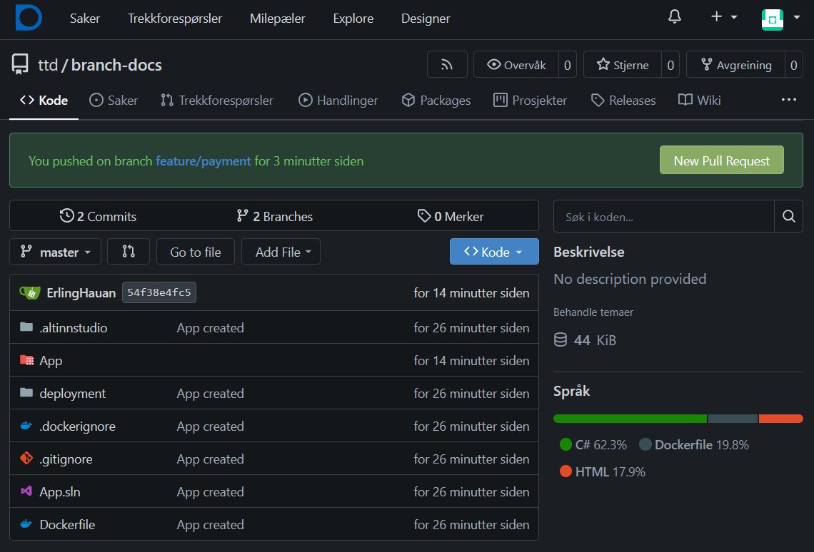
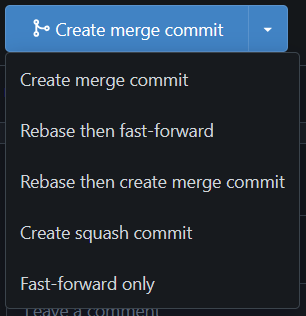
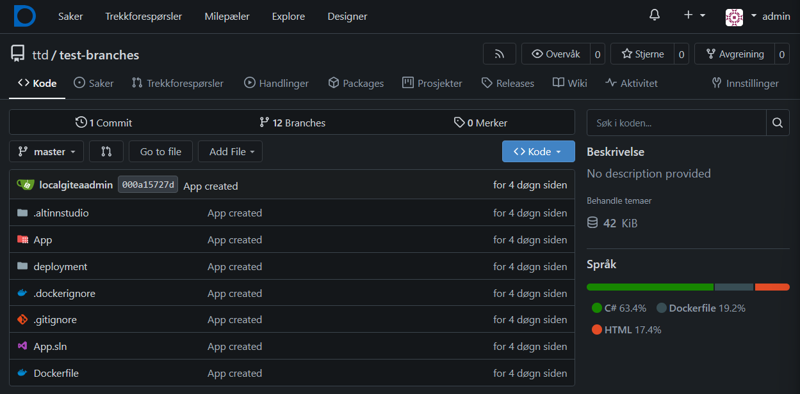

Branches allow you to create a separate development line for your app. You can think of it as a copy of the code where you can make changes without affecting the main version.

## How do branches work in Altinn Studio?
When you create a new app, it automatically gets a `master` branch. This is the main version of your app. When you want to develop new features or make changes, you can

- create a new branch from `master` - this gives you a working copy

- save changes in the new branch without affecting `master`

- merge the branch back to `master` when you're satisfied

## Benefits of branches
Branches allow you to work on multiple things simultaneously, for example one branch for new functionality and another for bug fixes. Different team members can also work in their own branches without interfering with each other's work. If something goes wrong, the `master` branch remains safe and unchanged.

## How to use branches in Studio
In Studio, you can switch between branches using the branch selector at the top right of the user interface. Here you can also create new branches.

1. Click on **New branch** to create a new branch.

2. In the window that appears, enter the name your branch should have, for example `feature/payment` or `bugfix/hide-input-field`.

3. If you have changes in the app that you haven't shared, you'll get a warning. Here you can choose between deleting your changes or going back to share them.

### Merging branches to `master`
#### Pull request
1. Share the changes from your development branch by clicking **Del dine endringer**.
2. Go to Gitea using the **Repository** button in the dropdown menu on the right:

3. In Gitea you'll get a prompt to create a pull request from the development branch:

4. Click on **New Pull Request**
5. Create an appropriate title and description for the changes in your branch.
6. Click on **Create Pull Request**.

### Merging a pull request
Depending on how you or your team works, you can choose to merge the pull request yourself or ask a colleague to review it first.

When you're ready to merge the branch, you'll get the following options:

1. Select **Create merge commit** if you want to keep the message history from the commits in your branch. If you prefer to combine the entire history into one message, choose **Create squash commit**.
2. After selecting the type of merge commit, click on **Create merge commit**. This performs the actual merge to `master`.

You'll now get the message `Pull request successfully merged and closed`, and a question about whether you want to delete your branch. It can be useful to delete the branch so that unused branches don't pile up.

### Deleting a branch
If you want to delete a branch, go back to the main page for your repository in Gitea:

1. Click on the branch selector, where it says **master**.
2. Click on **View all branches**.
3. Find the branch you want to delete and click on the trash can.

Note: If you delete a branch, it's permanent. You cannot restore it.
