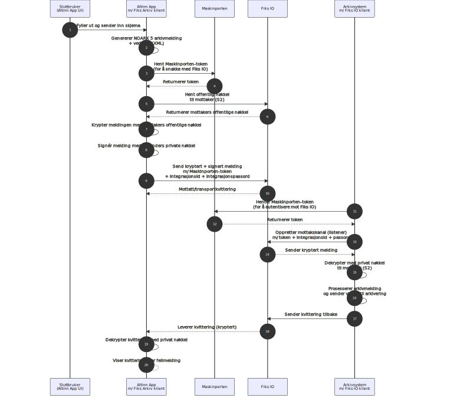

In addition to the documentation below, we have created a 
[sample application](https://altinn.studio/repos/ttd/fiks-arkiv-test) showing the complete Fiks Arkiv setup in an app.

## Prerequisites

Before setting up the Fiks Arkiv integration in your app you will need to have the following set up: 

- **Fiks Protokoll** enabled in Fiks forvaltning portal for your organisation
- **Samarbeidsportalen** access to configure Maskinporten clients (national ID provider)
- An **archive system** that integrates with Fiks Arkiv (e.g., Public 360)

## Integration architecture and flow



## Configuration for sending messages from Altinn App

1.  Create a Maskinporten client

    - Set up a Maskinporten client with scopes: `ks:fiks`, `altinn:serviceowner/instances.read` and
    `altinn:serviceowner/instances.write`

    - Generate a **JWK keypair for Maskinporten authentication** and upload the public key to the newly generated Maskinporten client

    -  Keep the following configuration values for the Altinn App setup
        - Client id for the generated Maskinporten client
        - Public and private key of the **Maskinporten JWK keypair** (base64 encoded)


    _This maskinporten client will be used to authenticate requests from the Altinn App both towards Altinn Platform 
    and Fiks._


    A more detailed explanation on how to set up a Maskinporten client in Samarbeidsportalen is available below.

    {}
    {}
    {}


2. Create a Fiks Arkiv account

    - Generate a **separate JWK keypair for Fiks Arkiv encryption** (different from the Maskinporten keypair).
     The public part should be in .pem format and saved to a file. 
     The private part should be a base64 encoded string.

    - In Fiks Forvaltning, set up a new system under Fiks Protokoll for your organisation.
    - Create an account linked to this system. The account should be configured with the following properties

        | Property          | Value             |
        |-------------------|-------------------|
        | Protokolltype     | no.ks.fiks.arkiv  |
        | Versjon           | v1                |
        | Protokollparter   | klient.arkivering / klient.full* |

        \* _klient.arkivering_ should be used unless the account will be used for other tasks as well.

    - Upload the public key (.PEM file) generated to the account

    - Keep the following configuration values for the Altinn App setup
        - Integration ID and password of the Fiks system
                
        - The account ID of the Fiks account
                
        - Private part of the **Fiks Arkiv encryption JWK keypair** as a base64 string

        TODO: Link evt. til eksisterende doc for Konto-oppsett som KS digital selv har.

3. Configure and prepare the Altinn App
    The Altinn Fiks package automatically handles a lot of the integration for you. The simplest setup for a Fiks Integration
    involves setting up configuration values for connection to Maskinporten and Fiks, as well as specifying which 
    data should be sent to Fiks and who the recipient is. 
    
    That being said, all interfaces can be overriden with custom logic should you wish to have more control yourself. 
    The standard way is what is described here, but interfaces will be mentioned for those that wish for more control.

    - Add a reference to the NuGet package
    [Altinn.App.Clients.Fiks](https://www.nuget.org/packages/Altinn.App.Clients.Fiks/) in your project file.
    The package version should match the version of the _Altinn.App.Core_ and _Altinn.App.Api_ packages.

        
        App/App.csproj
        

        ```xml {hl_lines=[5]}
            <PackageReference Include="Altinn.App.Api" Version="8.9.0">
            <CopyToOutputDirectory>lib\$(TargetFramework)\*.xml</CopyToOutputDirectory>
            </PackageReference>
            <PackageReference Include="Altinn.App.Core" Version="8.9.0" />
            <PackageReference Include="Altinn.App.Clients.Fiks" Version="8.9.0" />
        ```

    - Register the required Fiks and Maskinporten services in the program file.

        
        App/Program.cs
        

        ```cs
        void RegisterCustomAppServices(
            IServiceCollection services,
            IConfiguration config,
            IWebHostEnvironment env
        )
        {           
            // redacted code 

            services
                .AddFiksArkiv()
                .WithFiksIOConfig("FiksIOSettings")
                .WithFiksArkivConfig("FiksArkivSettings")
                .WithMaskinportenConfig("MaskinportenSettings");
        }
        ```

        __Todo: Skal vi si noe om hva hver av disse linjene registrerer???__

        __Note:__ You are free to select section names for the configuration values, 
        but these must match the section names used in appsettings.json and/or the applications secret management 
        platform (e.g. Azure Key Vault).

        E.g. if your appsettings section for the Maskinporten integration section looks like this:

        
        App/appsettings.json
        

        ```json
        {
            "MaskinportenSettings": {
            "Authority": "https://test.maskinporten.no/",
            "ClientId": "",
            "JwkBase64": ""
            }
        }
        ```

        The secrets in Azure Key Vault should have names like this:

        ```
        MaskinportenSettings--Authority
        MaskinportenSettings--ClientId
        MaskinportenSettings--JwkBase64
        ```

    - Set up configuration values in appsettings.json or Azure Key Vault. 

        All sensitive values should be registered in Azure Key Vault, and not checked 
        in to appsettings.json.


{}
The client id for the Maskinporten client generated in step 1 and the base64 encoded public and private key
should be added as _ClientId_ and _JwkBase64_ in the _MaskinportenSettings_ section. 

{}
{}

{}

It is recommended that all FiksIO setting values are persisted in Azure Key Vault 
or the secret management provider used by your application. 

| Setting Name                | Description                                                                                            | 
|-----------------------------|--------------------------------------------------------------------------------------------------------| 
| AccountId                   | The account ID for the FIKS IO account.                                                                | 
| IntegrationId               | The integration ID for the FIKS IO account.                                                            |
| IntegrationPassword         | The password for the Fiks Arkiv system integration                                                     |
| AccountPrivateKeyBase64     | The account's private key, base64 encoded PEM format, used for authentication and decrypting messages. |

Todo: Si at dette burde bo i KV. Og format på secret navn i KV. 

App/appsettings.json


```json
  "FiksIOSettings": {
    "AccountId": "retrieved from secrets",
    "IntegrationId": "retrieved from secrets",
    "IntegrationPassword": "retrieved from secrets",
    "AccountPrivateKeyBase64": "retrieved from secrets"
  }
```

 It is important that the name of these secrets in Azure Key Vault corresponds with the name of the section in the 
   appsettings file in the application repository.
   E.g. if your appsettings section for the Maskinporten integration section looks like this:

   
   App/appsettings.json
   

   ```json
   {
     "MaskinportenSettings": {
       "Authority": "https://test.maskinporten.no/",
       "ClientId": "",
       "JwkBase64": ""
     }
   }
   ```

   The secrets in Azure Key Vault should have names like this:

   ```
   MaskinportenSettings--Authority
   MaskinportenSettings--ClientId
   MaskinportenSettings--JwkBase64
   ```
{}

{}

| Setting Name      | Description                                                                                   | 
|-------------------|-----------------------------------------------------------------------------------------------| 
| Receipt         | Settings related to the receipt for a successful shipment, including confirmation and archive records. |
 | Recipient       | Settings related to the recipient of the Fiks Arkiv message, such as account, identifier, and name.   | 
 | Metadata        | Settings related to shipment metadata, including system ID, rule ID, case file info, and titles.      | 
 | Documents       | Settings for documents sent to Fiks Arkiv, including the primary document and optional attachments.    | 
 | ErrorHandling   | Settings for error handling, such as progressing to the next task or sending a specific action on failure. | 
 | SuccessHandling | Settings for success handling, such as progressing to the next task, sending an action, or marking the instance as complete. |

 FiksArkivSettings
| Setting Name      | Description                                                                                   | 
|-------------------|-----------------------------------------------------------------------------------------------| 
| Receipt         | Settings related to the receipt for a successful shipment, including confirmation and archive records. |
 | Recipient       | Settings related to the recipient of the Fiks Arkiv message, such as account, identifier, and name.   | 
 | Metadata        | Settings related to shipment metadata, including system ID, rule ID, case file info, and titles.      | 
 | Documents       | Settings for documents sent to Fiks Arkiv, including the primary document and optional attachments.    | 
 | ErrorHandling   | Settings for error handling, such as progressing to the next task or sending a specific action on failure. | 
 | SuccessHandling | Settings for success handling, such as progressing to the next task, sending an action, or marking the instance as complete. |
---
FiksArkivReceiptSettings
| Setting Name         | Description                                                                                   |
 |----------------------|-----------------------------------------------------------------------------------------------| 
 | ConfirmationRecord | Settings for the storage of the confirmation record (arkivkvittering) after shipment.         | 
 | ArchiveRecord      | Settings for the storage of the archive record (arkivmelding) after shipment.                 |
---
FiksArkivRecipientSettings
| Setting Name         | Description                                                                                   | 
|----------------------|-----------------------------------------------------------------------------------------------|
 | FiksAccount        | The Fiks Arkiv recipient account (GUID) to ship messages to.                                  | 
 | Identifier         | An optional identifier for the recipient (e.g., municipality number).                         | 
 | Name               | An optional name for the recipient.                                                           | 
 | OrganizationNumber | An optional organization number for the recipient.                                            |
---
FiksArkivMetadataSettings
| Setting Name         | Description                                                                                   | 
|----------------------|-----------------------------------------------------------------------------------------------| 
| SystemId           | The system ID for the generated arkivmelding.xml. Defaults to "Altinn Studio" if not provided.| 
| RuleId             | The rule ID for the generated arkivmelding.xml. Omitted if not provided.                      |
 | CaseFileId         | The ID for the generated saksmappe (case file) element. Defaults to instance identifier if not provided. | 
 | CaseFileTitle      | The title for the generated saksmappe (case file) element. Defaults to application title if not provided. |
  | JournalEntryTitle  | The title for the generated journalpost (journal entry) element. Defaults to application title if not provided. |
---
FiksArkivDocumentSettings
| Setting Name         | Description                                                                                   | 
|----------------------|-----------------------------------------------------------------------------------------------|
 | PrimaryDocument    | The settings for the primary document payload (main form data or PDF) sent as Hoveddokument.| 
 | Attachments        | Optional settings for additional documents sent as Vedlegg (attachments).                   |
---
FiksArkivErrorHandlingSettings
| Setting Name         | Description                                                                                   |
 |----------------------|-----------------------------------------------------------------------------------------------| 
 | MoveToNextTask     | Whether to automatically progress to the next task after failing to send the message.         | 
 | Action             | The action to send when progressing to the next task after failure (default: "reject").       |
---
FiksArkivSuccessHandlingSettings
| Setting Name         | Description                                                                                   | 
|----------------------|-----------------------------------------------------------------------------------------------| 
| MoveToNextTask     | Whether to automatically progress to the next task after successfully sending the message.    | 
| Action             | The action to send when progressing to the next task after success.                          | 
| MarkInstanceComplete | Whether to mark the instance as completed after successfully sending the message.         |
---
{}
        

        

    - Business logic for identifying recipient
        - programatisk som sjenkebevilling eller via skjemadata felter som testappen. 
    
    - Mulighet for overstyring av arkivmeldingen som genereres.

    -  Upload configuration values in appsettings.json or Key Vault
        -  "Soknad-bevillinger-FiksIOSettings"
        -  "Soknad-bevillinger-FiksArkivSettings":

    -  Update process flow of app
        

    - Update policy of app to match the new process flow

Må nevnes:  Hva må settes opp og hva blir håndtert automatisk av nugetpakken. Ref servicetask etc. 
## Configuration for receiving messages in archive system

As Digdir does not offer the archive system or Fiks Arkiv, we do not have extensive documentation here, but recommend that 
the application developer reference KS Digital's documentation along side the documentation of 
the archive system provider. 

However, as more application owners make use of the integration we have seen a few common pit falls.
These along with solutions are listed below, to be used at your convenience. 

### Create a Fiks Arkiv account

1. For your organization, set up a new system under Fiks Protokoll 
2. Create an account linked to this system

    The account should be configured with the following properties

    | Property          | Value             |
    |-------------------|-------------------|
    | Protokolltype     | no.ks.fiks.arkiv  |
    | Versjon           | v1                |
    | Protokollparter   | arkiv.full        |

3. Please reference archive system documentation on requirements for the encryption key pair.

4. Under the account, navigate to the _Søk etter systemer_ tab and look up the system created in the section for configuring sending of messages.
Give this system permission to send messages to the recipient account by clickin _Gi tilang_.
    

### Known issues in configuration of Public 360

__The encryption key is not documented__

The maskinporten token uploaded in P360 is used as the private part of the encryption key
the Fiks Arkiv account that receives messages should upload the public part of this certificate
as the encryption key. 

