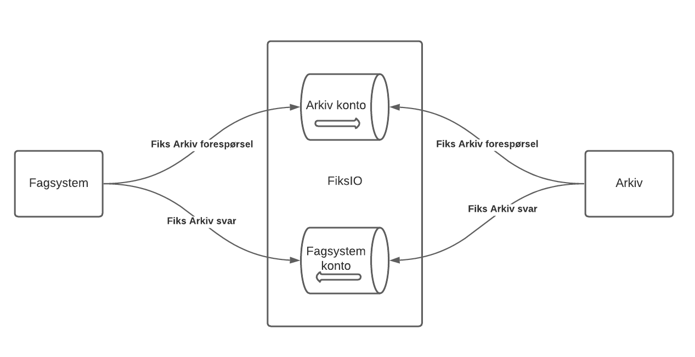
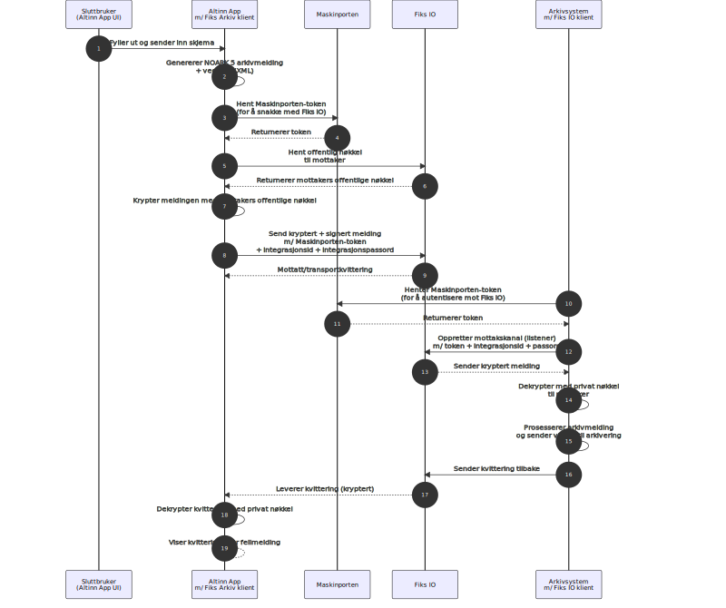
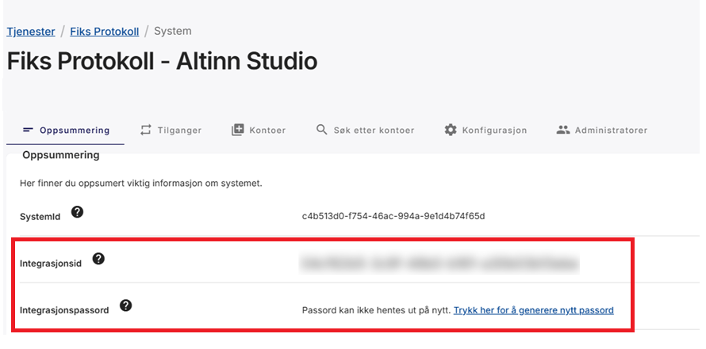
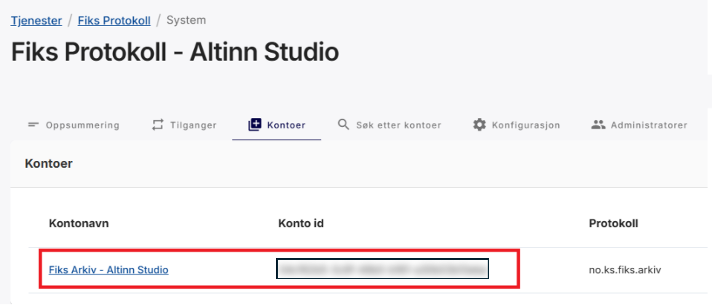
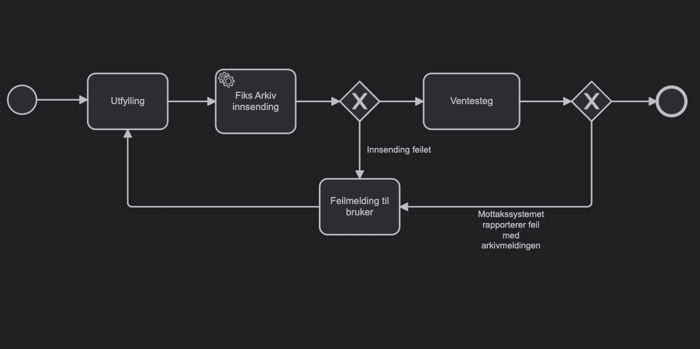

{}
Nuget versjon [v8.9.0](https://github.com/Altinn/app-lib-dotnet/releases/tag/v8.9.0) eller høyere
kreves for å støtte Fiks Arkiv.
{}

I tillegg til dokumentasjonen tilgjengelig her, har vi en 
[demo applikasjon](https://altinn.studio/repos/ttd/fiks-arkiv-test) som viser et fullstendig oppsett
for Fiks Arkiv integrasjon i en app.


## Forutsetninger

Før du setter opp Fiks Arkiv-integrasjonen i appen din, må du ha følgende på plass:

- **Fiks Protokoll** aktivert i Fiks forvaltningsportalen for din organisasjon
- Tilgang til **Samarbeidsportalen** for å konfigurere Maskinporten-klienter
- Et **arkivsystem** som integrerer med Fiks Arkiv (f.eks. Public 360)

## Integrasjonsarkitektur og flyt


Kilde: [KS Digital](https://github.com/ks-no/fiks-arkiv-specification)



## Konfigurasjon for sending av meldinger fra Altinn App
{.floating-bullet-numbers-sibling-ol}

### Steg 1: Opprett en Maskinporten-klient

- Sett opp en Maskinporten-klient med følgende scopes: `ks:fiks`, `altinn:serviceowner/instances.read` og
`altinn:serviceowner/instances.write`
- Generer et **JWK-nøkkelpar for Maskinporten authentication** og last opp den offentlige nøkkelen til den nyopprettede Maskinporten-klienten
- Ta vare på følgende konfigurasjonsverdier for Altinn App-oppsettet
  - Klient-id for den genererte Maskinporten-klienten
  - Offentlig og privat nøkkel for **Maskinporten JWK-nøkkelparet** (base64-enkodet)
_Denne Maskinporten-klienten vil bli brukt til å autentisere forespørsler fra Altinn-appen både mot Altinn Platform 
og Fiks._

En detaljert veiledning for hvordan du setter opp en Maskinporten-klient i Samarbeidsportalen er tilgjengelig nedenfor.

{}
{}
{}

### Steg 2: Opprett en Fiks Arkiv-konto

{}
For å sikre at kvittering for arkivmelding blir sendt til rett applikasjon, kan ikke flere apper dele på én konto.
Det er derfor anbefalt at man setter opp én konto per unike Altinn app.
{}

- Generer et **x509-sertifikat for Fiks Arkiv-kryptering**.
 
  Formatkrav:
  - Offentlig del: .PEM-fil, som skal lastes opp i Fiks Forvaltning
  - Privat del: .PEM-formatert streng, base64-kodet som skal lastes opp som en hemmelighet for Altinn-appen. 

  Bruk ditt foretrukne verktøy for å generere sertifikatet. En veiledning er tilgjengelig på slutten av denne seksjonen.

- I Fiks Forvaltning, sett opp et nytt system under Fiks Protokoll for din organisasjon.
  [KS Digitals veiledning for systemoppsett](https://developers.fiks.ks.no/tjenester/fiksprotokoll/veiledning_3_opprette_system/)
   

- Opprett en konto knyttet til dette systemet. [KS Digitals veiledning for kontooppsett](https://developers.fiks.ks.no/tjenester/fiksprotokoll/veiledning_4_opprette_konto/) 
 
  Kontoen skal konfigureres med følgende egenskaper
    
    | Property          | Value             |
    |-------------------|-------------------|
    | Protokolltype     | no.ks.fiks.arkiv  |
    | Versjon           | v1                |
    | Protokollparter   | klient.arkivering / klient.full* |

    \* _klient.arkivering_ bør brukes med mindre kontoen skal brukes til andre oppgaver også.

- Ta vare på følgende konfigurasjonsverdier for Altinn App-oppsettet
    - Integrasjons-ID og passord for Fiks-systemet
            
    - Konto-ID for Fiks-kontoen
            
    - Privat del av **x509-sertifikatet** som en base64-streng

{}
{}
{}

### Steg 3: Konfigurer og forbered Altinn-appen
    
Altinn Fiks-pakken håndterer automatisk mye av integrasjonen for deg. Det enkleste oppsettet for en Fiks-integrasjon
involverer å sette opp konfigurasjonsverdier for tilkobling til Maskinporten og Fiks, samt å spesifisere hvilke 
data som skal sendes til Fiks og hvem mottakeren er. 

Når det er sagt kan alle grensesnitt kan overstyres med tilpasset logikk dersom du ønsker mer kontroll selv. 
Standardmåten er det som beskrives her, men grensesnitt vil bli nevnt for de som ønsker mer kontroll.

-  Legg til en referanse til NuGet-pakken
[Altinn.App.Clients.Fiks](https://www.nuget.org/packages/Altinn.App.Clients.Fiks/) i prosjektfilen din.
Pakkeversjonen bør samsvare med versjonen av _Altinn.App.Core_ og _Altinn.App.Api_ pakkene.
    
    App/App.csproj
    
    ```xml {hl_lines=[5]}
        <PackageReference Include="Altinn.App.Api" Version="8.9.0">
        <CopyToOutputDirectory>lib\$(TargetFramework)\*.xml</CopyToOutputDirectory>
        </PackageReference>
        <PackageReference Include="Altinn.App.Core" Version="8.9.0" />
        <PackageReference Include="Altinn.App.Clients.Fiks" Version="8.9.0" />
    ```
- Registrer alle Fiks Arkiv-avhengigheter inkludert nødvendig konfigurasjon i programfilen.
    
    App/Program.cs
    

    ```csharp
    void RegisterCustomAppServices(
        IServiceCollection services,
        IConfiguration config,
        IWebHostEnvironment env
    )
    {           
        // redacted code 

        services
            .AddFiksArkiv()
            .WithFiksIOConfig("FiksIOSettings")
            .WithFiksArkivConfig("FiksArkivSettings")
            .WithMaskinportenConfig("MaskinportenSettings");
    }
    ```
    **Merk:** Du kan fritt velge seksjonsnavn for konfigurasjonsverdiene, 
    men disse må samsvare med seksjonsnavnene som brukes i appsettings.json og/eller applikasjonens hemmelighetsadministrasjons-
    plattform (f.eks. Azure Key Vault).

- Sett opp konfigurasjonsverdier i appsettings.json eller Azure Key Vault. 
    Alle sensitive verdier bør registreres i Azure Key Vault, og ikke sjekkes 
    inn i appsettings.json.


{}

Klient-id for Maskinporten-klienten generert i steg 1 og den base64-kodede offentlige og private nøkkelen
bør legges til som _ClientId_ og _JwkBase64_ i _MaskinportenSettings_-seksjonen. 


| **Innstillingsnavn**  | **Beskrivelse**                                                                       |
|-------------------|---------------------------------------------------------------------------------------|
| **Authority**     | Maskinporten authority/audience som skal brukes for autentisering og autorisasjon.      |
| **ClientId**      | Klient-ID som er registrert hos Maskinporten. Typisk en uuid4-streng.  |
| **JwkBase64**     | Privatnøkkelen som brukes til å autentisere med Maskinporten, i Base64-kodet JWK-format. |

### Configuration Example
{.floating-bullet-numbers-sibling-ol}

- **Seksjonsnavn:** `MaskinportenSettings`
- **Service-registrering:**
  

App/Program.cs


```csharp {hl_lines=[3]}
services
    .AddFiksArkiv()
    .WithMaskinportenConfig("MaskinportenSettings");
```

#### Application settings


App/appsettings.json


```json
"MaskinportenSettings": {
    "Authority": "https://test.maskinporten.no/",
    "ClientId": "retrieved from secrets",
    "JwkBase64": "retrieved from secrets"
}
```

#### Key Vault Secrets

- `MaskinportenSettings--ClientId`
- `MaskinportenSettings--JwkBase64`


For at applikasjonen skal kunne lese hemmelighetene fra Azure Key Vault, må den konfigureres til å gjøre det.
   Se [hemmeligheter-seksjonen](/nb/altinn-studio/v8/reference/configuration/secrets/) for å oppnå dette.


_Merk: Hemmelighetene leses av applikasjonen ved oppstart, så hvis du gjør endringer etter at applikasjonen er publisert, 
må du publisere applikasjonen på nytt for at de skal tre i kraft._
{}

{}

| **Innstillingsnavn**        | **Beskrivelse**                                                                                       |
|-----------------------------|-------------------------------------------------------------------------------------------------------|
| **AccountId**               | Unik identifikator for FIKS IO-kontoen.                                                          |
| **IntegrationId**           | Unik identifikator for FIKS IO-integrasjonen.                                                      |
| **IntegrationPassword**     | Passord brukt for Fiks Arkiv systemintegrasjonen.                                                |
| **AccountPrivateKeyBase64** | Base64-kodet privatnøkkel i PEM-format, brukt til autentisering og meldingsdekryptering.           |

### Konfigurasjonseksempel
{.floating-bullet-numbers-sibling-ol}

Det anbefales å lagre alle sensitive FiksIO-innstillingsverdier sikkert i **Azure Key Vault**
eller hemmelighetsadministrasjonsleverandøren som brukes av applikasjonen din.

- **Seksjonsnavn:** `FiksIOSettings`
- **Service-registrering:**
  

App/Program.cs


```csharp {hl_lines=[3]}
services
    .AddFiksArkiv()
    .WithFiksIOConfig("FiksIOSettings");
```

#### Application settings


App/appsettings.json


```json
"FiksIOSettings": {
    "AccountId": "c3c87fac-06be-44ed-a11c-aa137d12863c",
    "IntegrationId": "08b3d8b9-5026-46dc-936c-8e6709efa72c",
    "IntegrationPassword": "retrieved from secrets",
    "AccountPrivateKeyBase64": "retrieved from secrets"
}
```

#### Key Vault Secrets

- `FiksIOSettings--IntegrationPassword`
- `FiksIOSettings--AccountPrivateKeyBase64`

{}

{}


#### Service-registrering 

- **Seksjonsnavn:** `FiksArkivSettings`
- **Service-registrering:**

  

App/Program.cs


```csharp  {hl_lines=[3]}
services
    .AddFiksArkiv()
    .WithFiksArkivConfig("FiksArkivSettings");
```
    
#### Overordnet struktur

```bash
FiksArkivSettings
├─ Receipt
│  ├─ ConfirmationRecord
│  └─ ArchiveRecord
├─ Recipient
│  ├─ FiksAccount
│  ├─ Identifier
│  ├─ Name
│  └─ OrganizationNumber
├─ Metadata
│  ├─ SystemId
│  ├─ RuleId
│  ├─ CaseFileId
│  ├─ CaseFileTitle
│  └─ JournalEntryTitle
├─ Documents
│  ├─ PrimaryDocument
│  └─ Attachments{}
├─ ErrorHandling
│  ├─ MoveToNextTask
│  └─ Action
└─ SuccessHandling
   ├─ MoveToNextTask
   ├─ Action
   └─ MarkInstanceComplete
```

Videre bryter vi ned hver underseksjon av **FiksArkivSettings**, viser hvordan verdier bindes (statisk vs. dynamisk), 
og gir et komplett `appsettings.json`-eksempel.

{}
Ettersom koden kan endres, er innstillingene dokumentert etter beste evne. 
Hvis du ønsker en nøyaktig fremstilling av de tilgjengelige innstillingene, vennligst se [kildekoden](https://github.com/Altinn/app-lib-dotnet/blob/main/src/Altinn.App.Clients.Fiks/FiksArkiv/Models/FiksArkivSettings.cs#L55).
{}


#### Seksjoner og innstillinger

- **Receipt** (FiksArkivSettings.Receipt)
  
  Innstillinger relatert til postene som opprettes etter en vellykket forsendelse.
   
  {}
  Merk: Datatypene som defineres her må ha tilsvarende oppføringer i datatype-definisjonen i applicationmetadata. 
  {}
    
    | Innstillingsnavn       | Formål                                                    | Format |
    |------------------------|-----------------------------------------------------------|--------|
    | **ConfirmationRecord** | Definerer datatypen og navnet for _arkivkvitteringen_.   | `{ "DataType": "string", "Filename": "string" }` |
    | **ArchiveRecord**      | Definerer datatypen og navnet for _arkivmeldingen_.      | `{ "DataType": "string", "Filename": "string" }` |

    **Eksempel på konfigurasjon:**


App/appsettings.json


```json
"FiksArkivSettings": {
  "Receipt": {
    "ConfirmationRecord": {
      "DataType": "fiks-receipt",
      "Filename": "Arkivkvittering.xml"
    },
    "ArchiveRecord": {
      "DataType": "fiks-archive-record", 
      "Filename": "Arkivmelding.xml"
    }
  }
}
```


App/config/applicationmetadata.json


```json
{
  "dataTypes":[
    {
      "id": "fiks-receipt",
      "allowedContributers": [ "app:owned" ],
      "maxCount": 1,
      "minCount": 0,
      "enablePdfCreation": false,
      "enableFileScan": false,
      "validationErrorOnPendingFileScan": false
    },
    {
      "id": "fiks-archive-record",
      "allowedContributers": [ "app:owned" ],
      "maxCount": 1,
      "minCount": 0,
      "enablePdfCreation": false,
      "enableFileScan": false,
      "validationErrorOnPendingFileScan": false
    }
  ]
}
```

- **Recipient** (FiksArkivSettings.Recipient)
  
    Innstillinger relatert til hvem som skal motta Fiks Arkiv-meldingen.

    | Innstillingsnavn       | Formål                                           | Type              |
    |------------------------|--------------------------------------------------|-------------------|
    | **FiksAccount**        | Mottaker-konto GUID som meldinger skal sendes til. | GUID (påkrevd)   |
    | **Identifier**         | Mottaker-identifikator (f.eks. kommunenummer).  | string (påkrevd)  | 
    | **Name**               | Mottakernavn.                                    | string (påkrevd)  |
    | **OrganizationNumber** | Valgfritt organisasjonsnummer for mottaker.     | string (valgfritt)|

    Mottaker-innstillinger støtter både statiske og dynamiske konfigurasjonsformater - se 
    [Hvordan verdier oppgis](#hvordan-verdier-oppgis) for syntaks og bruk `DataModelBinding` når felt varierer 
    per instans.

    **Eksempel på konfigurasjon:**


App/appsettings.json


```json
  "FiksArkivSettings": {
    "Recipient": {
      "FiksAccount": {
        "DataModelBinding": {
          "DataType": "HelperDataModel",
          "Field": "Recipient.AccountId"
        }
      },
      "Identifier": {
        "DataModelBinding": {
          "DataType": "HelperDataModel",
          "Field": "Recipient.Identifier"
        }
      },
      "OrganizationNumber": {
        "DataModelBinding": {
          "DataType": "HelperDataModel",
          "Field": "Recipient.OrgNumber"
        }
      },
      "Name": {
        "DataModelBinding": {
          "DataType": "HelperDataModel",
          "Field": "Recipient.Name"
      }
    }
  }
}
```

- **Metadata** (FiksArkivSettings.Metadata)

  Kontekstuell informasjon brukt av arkivsystemet.

  | Innstillingsnavn      | Formål                                                                                    | Standardatferd                                        |
  |-----------------------|-------------------------------------------------------------------------------------------|-------------------------------------------------------|
  | **SystemId**          | System-ID brukt i den genererte `arkivmelding.xml`.                                       | Standard til `Altinn Studio` hvis ikke oppgitt.      |
  | **RuleId**            | Valgfri regel-ID for behandling av innkommende melding i systemer som støtter regel-IDer. | Utelatt hvis ikke oppgitt.                           |
  | **CaseFileId**        | ID for den genererte saksmappen *(saksmappe element)*.                                    | Standard til instansidentifikatoren hvis ikke oppgitt.|
  | **CaseFileTitle**     | Tittel for det genererte *saksmappe tittel* elementet.                                    | Standard til applikasjonstittel hvis ikke oppgitt.   |
  | **JournalEntryTitle** | Tittel for det genererte *journalpost tittel* elementet.                                  | Standard til applikasjonstittel hvis ikke oppgitt.   |

  Metadata støtter både statiske og dynamiske konfigurasjonsformater - se 
  [Hvordan verdier oppgis](#hvordan-verdier-oppgis) for syntaks og bruk `DataModelBinding` når felt varierer 
  per instans.

    **Eksempel på konfigurasjon:**


App/appsettings.json


```json
"FiksArkivSettings": {
  "Metadata": {
   "JournalEntryTitle": {
      "DataModelBinding": {
       "DataType": "HelperDataModel",
       "Field": "JournalEntryTitle"
      }
    },
    "CaseFileTitle": {
      "DataModelBinding": {
       "DataType": "HelperDataModel",
       "Field": "CaseFileTitle"
      }
    }
  }
}
```

- **Documents** (FiksArkivSettings.Documents)

Definisjon av dokumentene som skal inkluderes i arkivmeldingen (arkivmelding) som sendes til Fiks Arkiv.

| Innstillingsnavn    | Formål                                                                            |
|---------------------|-----------------------------------------------------------------------------------|
| **PrimaryDocument** | Hoveddokumentet (f.eks. skjemadata eller PDF) sendt som **Hoveddokument**.       |
| **Attachments**     | Valgfrie tilleggsdokumenter sendt som **Vedlegg** (array av vedlegg).            |

> Hver dokumentoppføring bruker typisk `DataType` for å indikere kilde og/eller format. For eksempel `"ref-data-as-pdf"` for en PDF generert fra referansedata.


  **Eksempel på konfigurasjon:**


App/appsettings.json



```json
"FiksArkivSettings": {
  "Documents": {
    "PrimaryDocument": {
      "DataType": "ref-data-as-pdf"
    },
    "Attachments": [
      {
        "DataType": "DataModel"
      },
      {
        "DataType": "vedlegg-datatype"
      }
    ]
  }
}
```      


- **ErrorHandling** (FiksArkivErrorHandlingSettings)

Hva applikasjonen skal gjøre når et sendingsforsøk feiler.

| Innstillingsnavn    | Formål                                                             | Type |
|---------------------|--------------------------------------------------------------------|------|
| **MoveToNextTask**  | Om applikasjonen automatisk skal gå videre til neste oppgave ved feil. | bool |
| **Action**          | Handlingen som skal sendes ved videregang i prosess etter feil (standard: `reject`). | string |


  **Eksempel på konfigurasjon:**


App/appsettings.json



```json
"FiksArkivSettings": {
  "ErrorHandling": {
    "MoveToNextTask": true
  }
}
```      

- **SuccessHandling** (FiksArkivSuccessHandlingSettings)
  
Hva applikasjonen skal gjøre når et sendingsforsøk lykkes.

| Innstillingsnavn         | Formål                                                             | Type    |
|--------------------------|--------------------------------------------------------------------|---------|
| **MoveToNextTask**       | Om applikasjonen automatisk skal gå videre til neste oppgave ved suksess. | bool    |
| **Action**               | Handlingen som skal sendes ved videregang i prosess etter suksess. | string  |
| **MarkInstanceComplete** | Om instansen skal markeres som fullført etter suksess.            | bool    |

  **Eksempel på konfigurasjon:**


App/appsettings.json



```json
"FiksArkivSettings": {
  "SuccessHandling": {
      "MoveToNextTask": true,
      "MarkInstanceComplete": true
  }
}
```      

#### Praktiske tips

- **Start enkelt**: Konfigurer `Recipient` og `Metadata` først; legg til `Documents` og `Receipt` detaljer etter behov.
- **Bruk binding for variabilitet**: Foretrekk `DataModelBinding` for felt som varierer per instans eller miljø.
- **Husk standardverdier**: Hvis du utelater visse metadatafelt, brukes fornuftige standardverdier (som applikasjonstittel).
- **Handlinger og flyt**: Sett `ErrorHandling` og `SuccessHandling` til å samsvare med prosessen din (f.eks. gå til neste oppgave, merk instans som fullført).


#### Hvordan verdier oppgis

Hver innstilling kan oppgis på en av to måter:
{.floating-bullet-numbers-sibling-ol}

1. **Statisk (hardkodet) verdi**
   
   ```json
   "JournalEntryTitle": {
     "Value": "Hallo"
   }
   ```
2. **Dynamisk verdi via datamodell-binding**
  
   ```json
   "CaseFileTitle": {
     "DataModelBinding": {
       "DataType": "HelperDataModel",
       "Field": "CaseFileTitle"
     }
   }
   ```

Bruk **`Value`** når du kjenner teksten på forhånd; bruk **`DataModelBinding`** når verdier skal komme fra runtime-dataene dine (f.eks. felt samlet inn i et skjema eller hjelpemodell).


#### Feilsøking

- **Manglende titler**: Hvis journalpost- eller saksmappetitler er tomme, sjekk at din `DataModelBinding` peker til eksisterende felt, eller oppgi en `Value`.
- **Feil mottaker**: Bekreft at `FiksAccount` inneholder en gyldig GUID og samsvarer med den tiltenkte mottakeren.
- **Vedleggsoppløsning**: Sørg for at hver vedleggs `DataType` er definert i applicationmetadata.

{}

- Definer ønsket prosessflyt for applikasjonen
  
  Den anbefalte prosessflyten for en applikasjon som bruker Fiks Arkiv er avbildet nedenfor. 
  Tilbakemeldingstrinnet er nødvendig for å muliggjøre respons fra den asynkrone prosessen med å sende arkivmeldingen
  og motta svar før det bekreftes til brukeren at sendingen var vellykket. 

  

- Definer policy for applikasjonen

  Sørg for at hver oppgave i prosessflyten har autorisasjonsregler knyttet til seg som spesifiserer hvilke enheter som har lov til 
å fullføre hvilke handlinger gitt en bestemt tilstand. 

### Overstyre standardatferd

Hvis standard arkivmelding og funksjonalitet ikke dekker det du trenger i arkivmeldingen din, 
er det mulig å overstyre implementeringen av funksjonalitet for generering av arkivmelding og 
behandling av responsen fra den mottakende Fiks-kontoen.

#### Overstyr generering av arkivmelding

Grensesnittet som skal implementeres er `IFiksArkivPayloadGenerator`.

Hvis din implementerte klasse heter `OverridePayloadGenerator`, vil tjenesteregistreringen være som følger:


App/Program.cs


```csharp {hl_lines=[3]}
services
  .AddFiksArkiv()    
  .WithPayloadGenerator<OverridePayloadGenerator>()     
```

#### Overstyr behandling av responsmelding 

Grensesnittet som skal implementeres er `IFiksArkivResponseHandler`.

Hvis din implementerte klasse heter `OverrideResponseHandler`, vil tjenesteregistreringen være som følger:



App/Program.cs



```csharp {hl_lines=[3]}
services
  .AddFiksArkiv()    
  .WithResponseHandler<OverrideResponseHandler>(); 
```

## Konfigurasjon for mottak av meldinger i arkivsystem

Ettersom Digdir ikke tilbyr arkivsystemet eller Fiks Arkiv, har vi ikke omfattende dokumentasjon her, men anbefaler at 
applikasjonsutvikleren refererer til KS Digitals dokumentasjon sammen med dokumentasjonen fra 
arkivsystemleverandøren. 

Imidlertid, ettersom flere applikasjonseiere tar i bruk integrasjonen har vi sett noen vanlige fallgruver.
Disse sammen med løsninger er listet opp nedenfor, til din disposisjon. 

### Opprett en Fiks Arkiv-konto
{.floating-bullet-numbers-sibling-ol}
1. For din organisasjon, sett opp et nytt system under Fiks Protokoll 
2. Opprett en konto knyttet til dette systemet

    Kontoen skal konfigureres med følgende egenskaper

    | Egenskap          | Verdi             |
    |-------------------|-----------------|
    | Protokolltype     | no.ks.fiks.arkiv  |
    | Versjon           | v1                |
    | Protokollparter   | arkiv.full        |

3. Vennligst se arkivsystemdokumentasjonen for krav til krypteringsnøkkelparet.

4. Under kontoen, naviger til fanen _Søk etter systemer_ og slå opp systemet som ble opprettet for å sende meldinger.
Gi dette systemet tillatelse til å sende meldinger til mottakerkontoen ved å klikke _Gi tilgang_.
    

### Kjente problemer i konfigurasjon av Public 360

#### Krypteringsnøkkelen er ikke dokumentert

Maskinporten-tokenet som lastes opp i P360 brukes som den private delen av krypteringsnøkkelen
Fiks Arkiv-kontoen som mottar meldinger skal laste opp den offentlige delen av dette sertifikatet
som krypteringsnøkkelen. 


## Ekstern dokumentasjon 

Mer om Fiks Arkiv:
- <https://developers.fiks.ks.no/felles/integrasjoner/>
- <https://github.com/ks-no/fiks-arkiv-specification/wiki>

