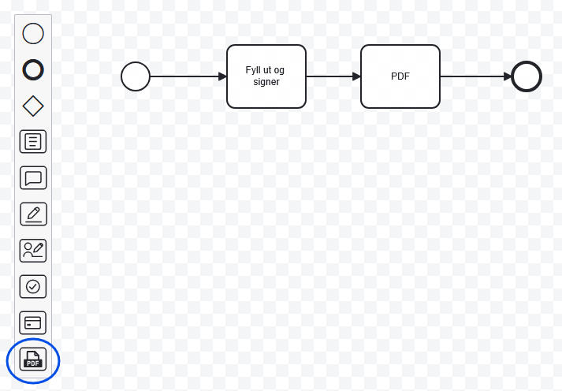
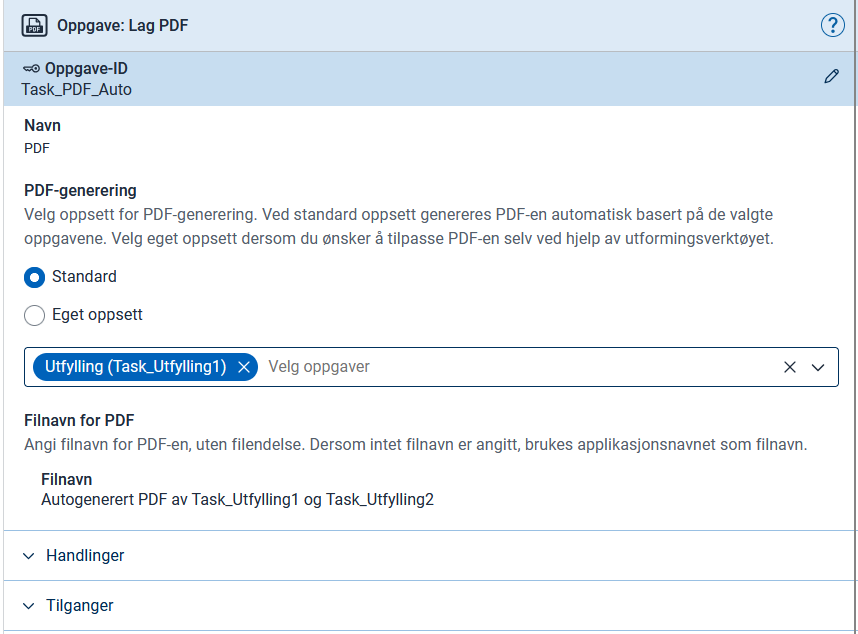
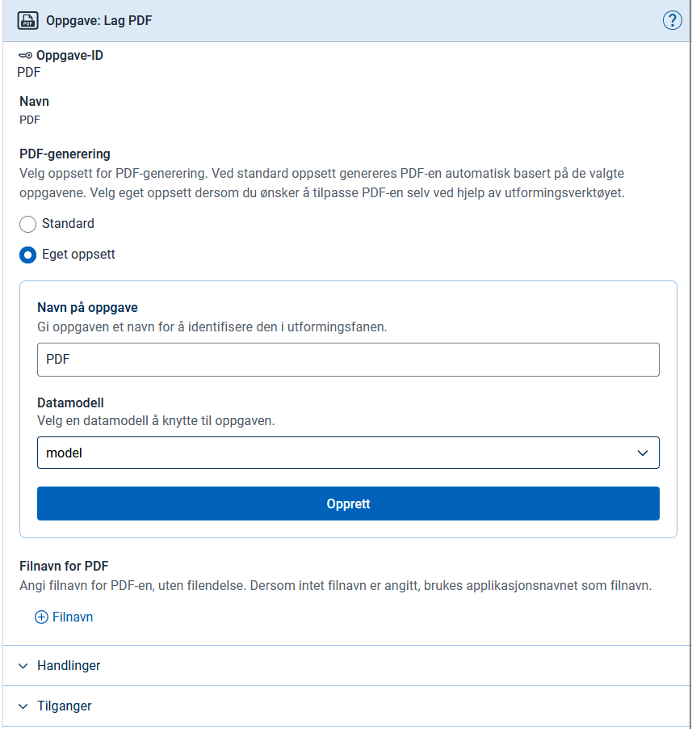

## Oversikt

Appen kan generere PDF som en standard systemoppgave du legger til som et steg i prosessen.


Tidligere lå ikke denne funksjonaliteten i en systemoppgave, men var bakt inn i den generelle koden for å endre prosesssteg. Dersom du satte opp appen før versjon 8.9, bør du deaktivere funksjonaliteten som kjører utenfor prosessdefinisjonen.

Det gjør du ved å slå av "enablePdfGeneration" på alle datatyper.

<br />
Fordeler med å migrere til systemoppgave:

- Du kan prøve på nytt dersom PDF-genereringen feiler, uten å kjøre "process next" på nytt. Det unngår utilsiktede sideeffekter.
- Du kan lage flere PDF-er fra én oppgave, eller slå sammen flere oppgaver til én PDF.
- I fremtiden kan PDF-generering kjøre som bakgrunnsjobb, med automatiske forsøk og bedre skalering.


{}
Krever minst versjon 8.9.0 av Altinn NuGet-pakkene.
{}

## Oppsett

Du kan bruke arbeidsflyt-fanen i Altinn Studio for å legge til en PDF-systemoppgave.



Dra og slipp PDF-systemoppgaven dit i prosessen der du ønsker å generere en PDF, ofte rett etter en dataoppgave.

Når du har plassert oppgaven, åpner et konfigurasjonspanel seg til høyre i skjermbildet.
Der velger du mellom to tilnærminger: standard eller egendefinert PDF.

{}

Velger du dette alternativet, angir du hvilke tidligere oppgaver som skal inngå i PDF-en. Innholdet bygger på komponentene i de valgte oppgavene, vist i oppsummeringsmodus. Denne funksjonen tar ikke hensyn til pdfLayoutName-konfigurasjon i Settings.json.



Altinn Studio setter inn en systemoppgave i `process.bpmn`. Resultatet kan avvike noe fra eksempelet nedenfor.


  App/config/process/process.bpmn


```xml
<bpmn:serviceTask id="Pdf" name="PDF">
    <bpmn:extensionElements>
        <altinn:taskExtension>
            <altinn:taskType>pdf</altinn:taskType>
            <altinn:actions>
              <altinn:action>reject</altinn:action> <!-- Legges til via Handlinger, dersom man skal kunne f.eks. gå tilbake. -->
            </altinn:actions>
            <altinn:pdfConfig>
                <altinn:filenameTextResourceKey>pdfFileName</altinn:filenameTextResourceKey>
                <altinn:autoPdfTaskIds>
                    <altinn:taskId>Task_Utfylling1</altinn:taskId>
                </altinn:autoPdfTaskIds>
            </altinn:pdfConfig>
        </altinn:taskExtension>
    </bpmn:extensionElements>
    <bpmn:incoming>Flow_0er70tq</bpmn:incoming>
    <bpmn:outgoing>Flow_19ikt1z</bpmn:outgoing>
</bpmn:serviceTask>
```

{}

{}

Velger du dette alternativet, kan du selv bestemme innholdet i PDF-en ved å definere et eget layout-set for PDF-systemoppgaven.

Du oppgir først et navn for layout-settet og velger deretter en datamodell som standardmodell for settet. Du kan f.eks. velge modellen til en av oppgavene som inngår i PDF-en.



Altinn Studio setter inn en systemoppgave i `process.bpmn` og genererer layout-set-filene, men uten innhold i PdfLayout.json.


  App/config/process/process.bpmn


```xml
<bpmn:serviceTask id="Pdf" name="PDF">
    <bpmn:extensionElements>
        <altinn:taskExtension>
        <altinn:taskType>pdf</altinn:taskType>
        <altinn:actions>
          <altinn:action>reject</altinn:action> <!-- Legges til via Handlinger, dersom man skal kunne f.eks. gå tilbake. -->
        </altinn:actions>
        <altinn:pdfConfig>
            <altinn:filenameTextResourceKey>pdfFileName</altinn:filenameTextResourceKey>
        </altinn:pdfConfig>
        </altinn:taskExtension>
    </bpmn:extensionElements>
    <bpmn:incoming>SequenceFlow_0c458hu</bpmn:incoming>
    <bpmn:outgoing>SequenceFlow_5assd2s</bpmn:outgoing>
</bpmn:serviceTask>
```

### Layout-set

PDF-systemoppgaven trenger et eget layout-set for å definere innholdet. Bruker du arbeidsflyt-editoren, genererer Altinn Studio dette automatisk. Da trenger du bare å redigere innholdet i `PdfLayout.json`.

Filene og mappestrukturen skal se omtrent slik ut:

```
App/ui/
├── layout-sets.json
├── form/
│   ├── Settings.json
│   └── layouts/
│       └── ...
└── Pdf/
    ├── Settings.json
    └── layouts/
        ├── PdfLayout.json
        └── ServiceTask.json
```

#### layout-sets.json


  App/ui/layout-sets.json


```json {hl_lines="11-17"}
{
  "$schema": "https://altinncdn.no/toolkits/altinn-app-frontend/4/schemas/json/layout/layout-sets.schema.v1.json",
  "sets": [
    {
      "id": "form",
      "dataType": "model",
      "tasks": [
        "Task_Utfylling1"
      ]
    },
    {
      "id": "Pdf",
      "dataType": "model",
      "tasks": [
        "Pdf"
      ]
    }
  ],
  "uiSettings": {
    "taskNavigation": [
      {
        "taskId": "Task_Utfylling1",
        "name": "Utfylling"
      },
      {
        "type": "receipt"
      }
    ]
  }
}
```

#### Settings.json


  App/ui/Pdf/Settings.json


```json
{
  "$schema": "https://altinncdn.no/schemas/json/layout/layoutSettings.schema.v1.json",
  "pages": {
    "pdfLayoutName": "PdfLayout",
    "order": [
      "ServiceTask"
    ]
  }
} 
```

#### PdfLayout.json

I denne filen definerer du innholdet i PDF-en. Du bruker typisk Summary2-komponenten, enten mot enkeltkomponenter eller mot hele sider og layout-set.


  App/ui/Pdf/layouts/PdfLayout.json


```json
{
  "$schema": "https://altinncdn.no/toolkits/altinn-app-frontend/4/schemas/json/layout/layout.schema.v1.json",
  "data": {
    "layout": [
      {
        "id": "InstanceInformation",
        "type": "InstanceInformation"
      },
      {
        "id": "SummaryTaskUtfylling1",
        "type": "Summary2",
        "target": {
          "type": "layoutSet",
          "taskId": "Task_Utfylling1"
        }
      }
    ]
  }
}
```

#### ServiceTask.json

Denne layout-filen viser innhold til brukeren dersom PDF-genereringen feiler, for eksempel feilmeldinger eller instruksjoner. Tilpass gjerne.

Dersom du vil la brukeren avbryte systemoppgaven, f.eks. for å gå tilbake til forrige oppgave, må du legge til `reject`-handlingen i prosessdefinisjonen (se XML-eksemplene over) og gi rettigheter til handlingen i appens tilgangspolicy. Hvor brukeren sendes videre, avhenger av sekvensflytene i BPMN-prosessen.


  App/ui/Pdf/layouts/ServiceTask.json


```json
{
  "$schema": "https://altinncdn.no/schemas/json/layout/layout.schema.v1.json",
  "data": {
    "layout": [
      {
        "size": "L",
        "id": "service-task-title",
        "type": "Header",
        "textResourceBindings": {
          "title": "service_task_custom_pdf_default.title"
        }
      },
      {
        "id": "service-task-body",
        "type": "Paragraph",
        "textResourceBindings": {
          "title": "service_task_custom_pdf_default.body"
        }
      },
      {
        "id": "service-task-help-text",
        "type": "Paragraph",
        "textResourceBindings": {
          "title": "service_task_custom_pdf_default.help_text"
        }
      },
      {
        "id": "service-task-button-group",
        "type": "ButtonGroup",
        "children": [
          "service-task-retry-button",
          "service-task-back-button"
        ]
      },
      {
        "id": "service-task-retry-button",
        "type": "Button",
        "textResourceBindings": {
          "title": "service_task_custom_pdf_default.retry_button"
        }
      },
      {
        "id": "service-task-back-button",
        "type": "ActionButton",
        "textResourceBindings": {
          "title": "service_task_custom_pdf_default.back_button"
        },
        "action": "reject",
        "buttonStyle": "secondary"
      }
    ]
  }
}
```

{}

## Filnavn

Det er valgfritt å inkludere `<altinn:filenameTextResourceKey>`. Her oppgir du en tekstressursnøkkel som brukes som filnavn, med støtte for språk og variabler. Utelater du den, får PDF-en applikasjonens navn som filnavn.

```json
{
  "id": "pdfFileName",
  "value": "Mitt filnavn {0}",
  "variables": [
    {
      "key": "EtDatamodellfelt",
      "dataSource": "dataModel.model"
    }
  ]
}
```


  Ved bruk av standard PDF kan du ikke bruke `dataModel.default`. Du må bruke den faktiske ID-en til datamodellen, f.eks. `dataModel.model`.


## Test

Fyll ut skjemaet og gå videre. Når du når PDF-systemoppgaven i arbeidsflyten, genererer appen PDF-en og går automatisk videre til neste steg i prosessen, for eksempel kvittering.

## Feilsøking

Dersom du får feilmelding om at systemoppgaven feilet under PDF-generering, kan du åpne skjemaet i appen og legge til query-parameteren `pdf=1`. Da ser du det samme innholdet som PDF-en skulle ha vist, og eventuelle feilmeldinger.