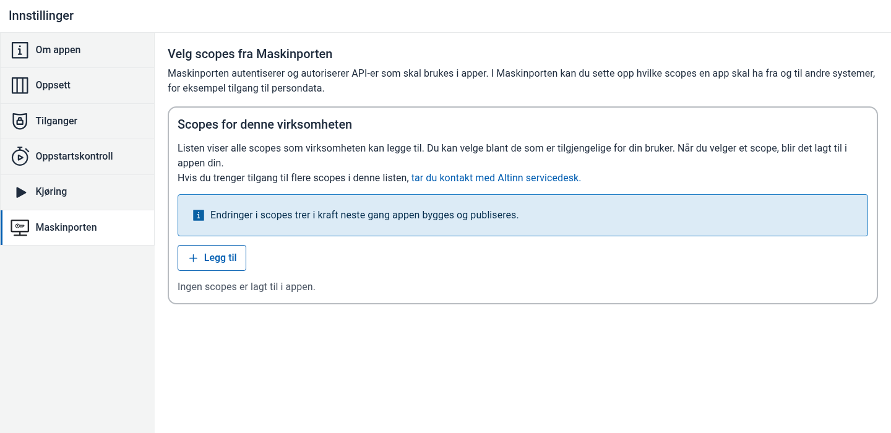
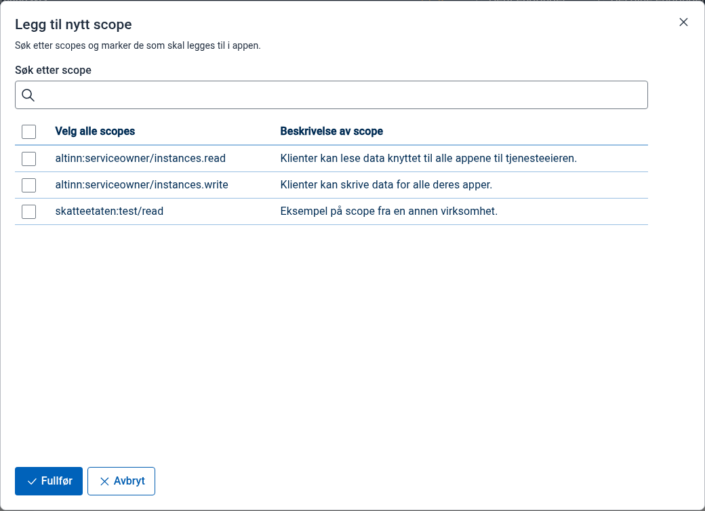
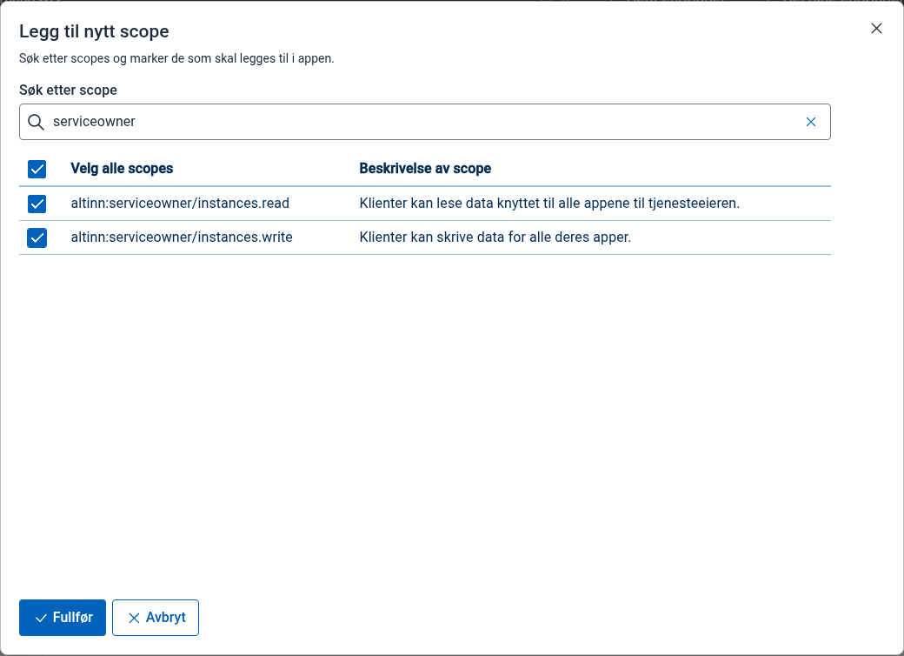
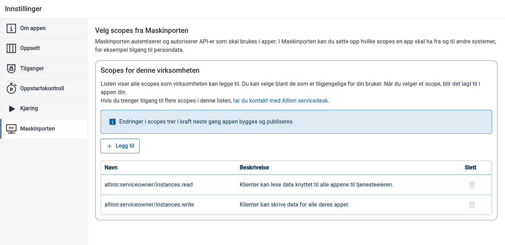

Denne veiledningen viser hvordan du legger Maskinporten-scopes til en app i Altinn Studio.

Før du starter må du være logget inn med Ansattporten på vegne av virksomheten som eier appen. Appen må også ha en tjenesteeierregel i `App/config/authorization/policy.xml` som gir `[org]` rettighetene `read` og `write`.

{}
Hvis appen bare trenger standardscopene for tjenesteeier, `altinn:serviceowner/instances.read` og `altinn:serviceowner/instances.write`, kan apper som bruker Altinn App v8.3 eller nyere bruke knappen **Legg til standard-scopes** når den vises. Apper som bruker Altinn App v9 får disse scopene automatisk hvis de mangler.
{}

## Steg

1. Åpne appen i Altinn Studio. Gå til **Innstillinger**, åpne fanen **Maskinporten**, og velg **Legg til**.

   

2. I dialogen **Legg til nytt scope** kan du søke etter scopes som virksomheten har tilgang til.

   

3. Søk etter scopene appen trenger, og marker ett eller flere scopes i listen.

   

4. Velg **Fullfør** for å lagre scopene i appinnstillingene.

   

5. Bygg og publiser appen på nytt. Scope-endringer trer i kraft neste gang appen bygges og publiseres.
{.floating-bullet-numbers}
