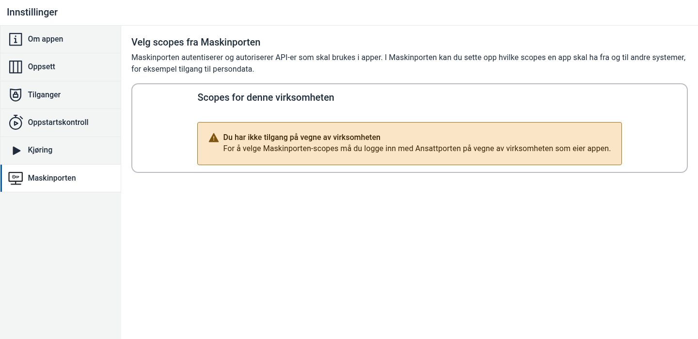

Denne veiledningen viser hvordan du legger Maskinporten-scopes til en app i Altinn Studio.

Før du starter må du være logget inn med Ansattporten på vegne av virksomheten som eier appen. Appen må også ha en tjenesteeierregel i `App/config/authorization/policy.xml` som gir `[org]` rettighetene `read` og `write`.

{}
Hvis appen bare trenger standardscopene for tjenesteeier, `altinn:serviceowner`, `altinn:serviceowner/instances.read` og `altinn:serviceowner/instances.write`, kan apper som bruker Altinn App v8.3 eller nyere bruke knappen **Legg til standard-scopes** når den vises. Apper som bruker Altinn App v9 får disse scopene automatisk hvis de mangler.
{}

## Steg

1. Åpne appen i Altinn Studio. Gå til **Innstillinger**, åpne fanen **Maskinporten**, og velg **Legg til**.

   

2. I dialogen **Legg til nytt scope** kan du søke etter scopes som virksomheten har tilgang til.

   

3. Søk etter scopene appen trenger, og marker ett eller flere scopes i listen.

   

4. Velg **Fullfør** for å lagre scopene i appinnstillingene.

   

5. Bygg og publiser appen på nytt. Scope-endringer trer i kraft neste gang appen bygges og publiseres.
{.floating-bullet-numbers}

## Hvis du ikke har tilgang

Hvis Studio viser meldingen **Du har ikke tilgang på vegne av virksomheten**, kan ikke Studio hente tilgjengelige Maskinporten-scopes for virksomheten som eier appen med Ansattporten-tilgangen du allerede er logget inn med. Scopes som allerede er lagt til i appen vises fortsatt, men du kan ikke legge til eller fjerne scopes før tilgangen er på plass.

For å løse dette:

1. Kontroller at appen eies av riktig virksomhet i Altinn Studio.
2. Be en direktør/leder i virksomheten, eller noen med Altinn-rollen **Hovedadministrator**, gi brukeren din tilgang til selvbetjening av klienter i ID-porten/Maskinporten i Altinn. Hvis virksomheten også administrerer API-scopes selv, må brukeren også ha tilgang til selvbetjening av API-er. Se [Digdirs veiledning for tilgang i test- og produksjonsmiljø](https://docs.digdir.no/docs/Maskinporten/maskinporten_sjolvbetjening_web.html#tilgang-i-test-og-produksjonsmilj%C3%B8).
3. Alternativt kan en bruker som allerede har denne tilgangen legge til scopene i appen.
4. Prøv igjen i Altinn Studio når tilgangen er på plass.
5. Kontakt Altinn servicedesk hvis tilgangen skal være riktig, men meldingen fortsatt vises.
{.floating-bullet-numbers}
