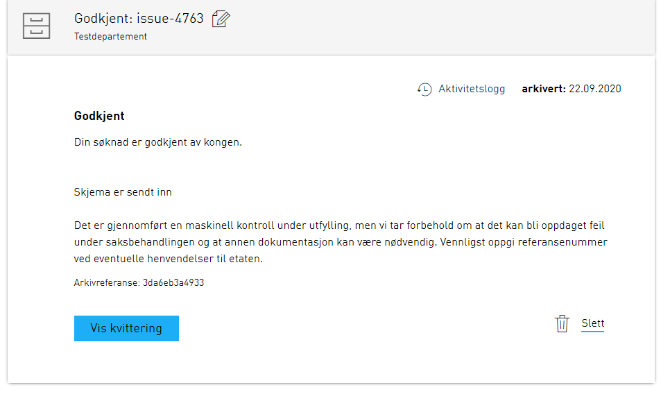
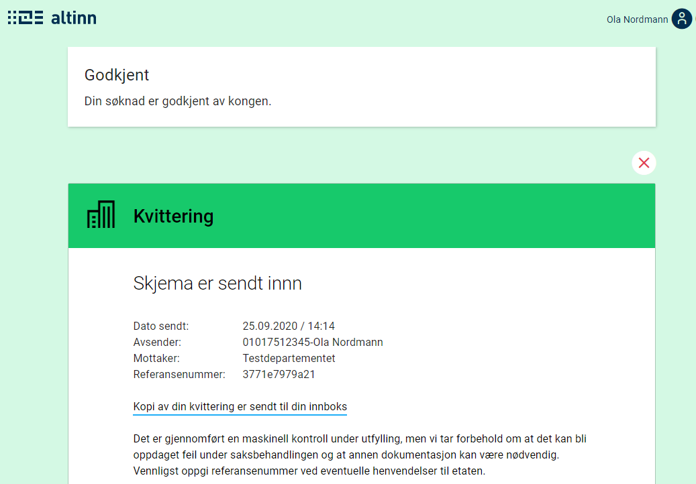

⚠️ This page is currently incomplete and more information will be provided at a later date.

An instantiated application will have a corresponding instance object. This object contains metadata about the specific
instance.
If you want to learn more about the instance and the affiliated API, you can read the technical documentation about this
under [API](../../../../api).

## Sub status

As an app-owner you can set a sub status for the instance. This gives the end user more information about the
current state of the instance.
The sub status is displayed both in the Altinn message box and on the receipt page.

The sub status is an object which can be set in the instance object. How this is done is described under [API](../../../../api).
Sub status is a simple object which contains `label` and `description`. These fields can either contain plain text, or a
text key that refers to the application
texts. It is worth noting that variables in text are not supported for these texts.
In the message box, `label` is displayed in its entirety if it contains 25 symbols or fewer. If `label` contains more that 25 symbols, only the first 22 symbols
will be displayed and "..." will be added to the end.

Example of a status object:
```json
{
    "label": "some.label",
    "description": "Description in clear text"
}
```

Below you see an example of how sub status looks like in the message box and in the receipt where the sub status is set
up in the following way:
```json
{
    "label": "Accepted",
    "description": "Your application has been accepted by the king."
}
```





## Automatic deletion of drafts

As an application owner you may want to delete a user's draft after a certain period of time. 
To achieve this, three steps are required:

1. Configure the application to allow the service owner to delete instances.
2. Identify which instances are incomplete by querying storage.
3. Delete the instance through an exposed endpoint within the application.

### Step 1: Configure the application

Service owners are by default not allowed to delete instances. 
To get the required permissions, a rule must be added to `policy.xml` in `App/config/authorization`.
The rule can be copied from our [rule library](../../configuration/authorization/rules/#org-can-delete-an-instance-of-orgapp-in-any-task-or-event).

### Step 2: Identify incomplete instances by sending a request to storage

Storage exposes a set of query parameters which can be used to retrieve a set of instances.
The example below retrieves all non-submitted instances of an application that was instantiated on the 30th of September 2020 or earlier.

You can experiment with query parameters for your service here:

`HTTP GET https://platform.altinn.no/storage/api/v1/instances?appId={org}/{app}&created=lte:2020-09-30&process.currentTask=Task_1`

### Step 3: Delete instance through endpoint exposed in the application

After identifying the instances that are to be deleted, you can send a call with the instance ID (instanceOwner.partyId/instanceGuid) to the application to delete them.

`HTTP DELETE https://ttd.apps.altinn.no/ttd/apps-test/instances/{instanceOwner.partyId}/{instanceGuid}`
