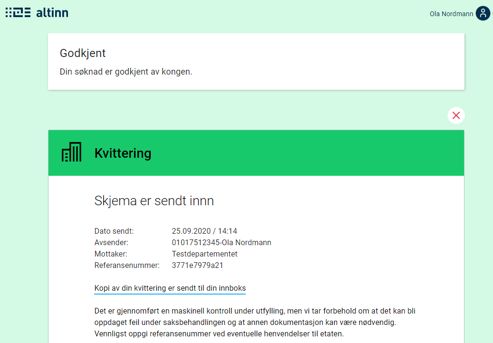

⚠️ Denne siden er foreløpig ikke fullstendig. Mer informasjon vil komme på et senere tidspunkt.

En instansiert applikasjon vil ha et tilhørende instansobjekt. Dette objektet inneholder metadata om den spesifikke instansen.
Om du ønsker å lære mer om instans og API-et rundt, så kan du lese teknisk dokumentasjon om dette under [API](../../../../api).


## Substatus

Som app-eier kan man sette en substatus på instansen. Dette er for å kunne gi sluttbruker ytterligere informasjon om hvilken tilstand instansen befinner seg i.
Substatus vil vises frem både i meldingsboksen i Altinn og på kvitteringssiden.

Substatusen er et objekt som kan settes på instansobjektet. Hvordan dette gjøres står beskrevet under [API](../../../../api).
Substatus er et enkelt objekt som inneholder `label` og `description`. Disse feltene kan enten inneholde ren tekst, eller en tekstnøkkel som referer til applikasjonstekstene. Det er verdt å merke seg at variabler i tekst støttes ikke for disse tekstene.
I meldingsboksen vises `label` i sin helhet hvis den har en lengde på inntil 25 tegn. Hvis `label` består av mer enn 25 tegn, vises bare de 22 første tegnene, og "..." legges på til slutt.

Eksempel på et substatus-objekt:
```json
{
    "label": "some.label",
    "description": "Beskrivelse i klartekst"
}
```

Under ser du eksempel på hvordan substatus ser ut i meldingsboksen og i kvitteringen, når substatusen settes opp slik:
```json
{
    "label": "Godkjent",
    "description": "Din søknad er godkjent av kongen."
}
```




## Automatisert sletting av utkast

Som applikasjonseier kan man i noen tilfeller ønske å slette sluttbrukerens utkast av en tjeneste dersom det har gått en viss tid siden instansiering. 
For å oppnå dette, er det tre steg som må tas.

1. Konfigurér applikasjonen slik at tjenesteeier har lov til å slette instanser.
2. Identifisér hvilke instanser som ikke er fullført ved hjelp av spørring mot storage.
3. Slett instans via endepunkt eksponert i applikasjonen.

### Steg 1: Konfigurér applikasjonen

Som standard har ikke tjenesteeier lov til å slette instanser knyttet til en applikasjon.
For å få lov til dette, må det legges til en ny regel i `policy.xml` som finnes i `App/config/authorization`.
Regelen kan kopieres fra [regelbiblioteket](../../configuration/authorization/rules/#org-kan-slette-en-instans-av-orgapp-uavhengig-av-hvor-den-er-i-prosessen).

### Steg 2: Identifisér hvilke instanser som ikke er fullført ved hjelp av spørring mot storage

Storage eksponerer et sett med queryparametere som kan brukes for å hente ut et sett med instanser. 
I eksempelet nedenfor får man ut alle instanser som er instansiert av en gitt applikasjon 30. september 2020 eller tidligere, 
og som enda står i utfyllingssteget.

Her kan man prøve seg litt fram for å finne de rette queryparameterene for akkurat deres tjeneste:

`HTTP GET https://platform.altinn.no/storage/api/v1/instances?appId={org}/{app}&created=lte:2020-09-30&process.currentTask=Task_1`

### Steg 3: Slett instans via endepunkt eksponert i applikasjonen

Når man har identifisert instansene som skal slettes, er det bare å sende et kall
til applikasjonen for å få slettet disse. Da må ID på instansene (instanceOwner.partyId/instanceGuid) oppgis.

`HTTP DELETE https://ttd.apps.altinn.no/ttd/apps-test/instances/{instanceOwner.partyId}/{instanceGuid}`
