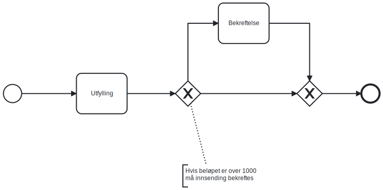

## Prerequisites

* Your application uses version 7.1.0 or newer of the Altinn nugets.
* Application with a process containing a exclusive gateway

## Example process with exclusive gateways

```xml
<?xml version="1.0" encoding="UTF-8"?>
<bpmn:definitions xmlns:xsi="http://www.w3.org/2001/XMLSchema-instance" xmlns:bpmn="http://www.omg.org/spec/BPMN/20100524/MODEL" xmlns:bpmndi="http://www.omg.org/spec/BPMN/20100524/DI" xmlns:dc="http://www.omg.org/spec/DD/20100524/DC" xmlns:di="http://www.omg.org/spec/DD/20100524/DI" xmlns:altinn="http://altinn.no" id="Altinn_SingleDataTask_Process_Definition" targetNamespace="http://bpmn.io/schema/bpmn" exporter="bpmn-js (https://demo.bpmn.io)" exporterVersion="10.2.0">
  <bpmn:process id="SingleDataTask" isExecutable="false">
    <bpmn:startEvent id="StartEvent_1">
      <bpmn:outgoing>Flow_s_t1</bpmn:outgoing>
    </bpmn:startEvent>
    <bpmn:sequenceFlow id="Flow_s_t1" sourceRef="StartEvent_1" targetRef="Task_1" />
    <bpmn:task id="Task_1" name="Utfylling" altinn:tasktype="data">
      <bpmn:incoming>Flow_s_t1</bpmn:incoming>
      <bpmn:outgoing>Flow_t1_g1</bpmn:outgoing>
    </bpmn:task>
    <bpmn:sequenceFlow id="Flow_t1_g1" sourceRef="Task_1" targetRef="Gateway_1" />
    <bpmn:exclusiveGateway id="Gateway_1">
      <bpmn:incoming>Flow_t1_g1</bpmn:incoming>
      <bpmn:outgoing>Flow_g1_g2</bpmn:outgoing>
      <bpmn:outgoing>Flow_g1_t2</bpmn:outgoing>
    </bpmn:exclusiveGateway>
    <bpmn:sequenceFlow id="Flow_g1_g2" sourceRef="Gateway_1" targetRef="Gateway_2" />
    <bpmn:sequenceFlow id="Flow_g1_t2" sourceRef="Gateway_1" targetRef="Task_2" />
    <bpmn:task id="Task_2" name="Bekreftelse" altinn:tasktype="confirmation">
      <bpmn:incoming>Flow_g1_t2</bpmn:incoming>
      <bpmn:outgoing>Flow_t2_g2</bpmn:outgoing>
    </bpmn:task>
    <bpmn:sequenceFlow id="Flow_t2_g2" sourceRef="Task_2" targetRef="Gateway_2" />
    <bpmn:exclusiveGateway id="Gateway_2">
      <bpmn:incoming>Flow_g1_g2</bpmn:incoming>
      <bpmn:incoming>Flow_t2_g2</bpmn:incoming>
      <bpmn:outgoing>Flow_g2_end</bpmn:outgoing>
    </bpmn:exclusiveGateway>
    <bpmn:sequenceFlow id="Flow_g2_end" sourceRef="Gateway_2" targetRef="EndEvent_1" />
    <bpmn:endEvent id="EndEvent_1">
      <bpmn:incoming>Flow_g2_end</bpmn:incoming>
    </bpmn:endEvent>
  </bpmn:process>
  <!-- BPMN Diagram part is omitted for previty -->
</bpmn:definitions>
```

Visual representation of the bpmn definition



## Implementing and injecting custom gateway code

To choose correct sequence flow out of the exclusive gateway based on instance data the application needs create a class
implementing `Altinn.App.Core.Features.IProcessExclusiveGateway` and register it as a service in the dependency
injection.

The interface has one string Property `GatewayId`, and a method `FilterAsync`

`GatewayId` is used to identify the Gateway in the process definition it is connected to.

In our example definition a implementation for the first gateway (Gateway_1) would have this property set to `Gateway_1`
as this is the value of the attribute `id` for the exclusive gateway in the process definition.

The method FilterAsync is where you implement your custom logic to filter the available sequence flow(s) out of the
gateway based on the instance data.

For further documentation of the interface read the xml documentation for the
interface [here](https://github.com/Altinn/app-lib-dotnet/blob/main/src/Altinn.App.Core/Features/IProcessExclusiveGateway.cs)

After you have written your custom implementation register it in `Program.cs` in the `RegisterCustomAppServices` method.

Example: 

```csharp
void RegisterCustomAppServices(
    IServiceCollection services, 
    IConfiguration config, 
    IWebHostEnvironment env)
{
    services.AddTransient<IProcessExclusiveGateway, GatewayOne>();
}
```