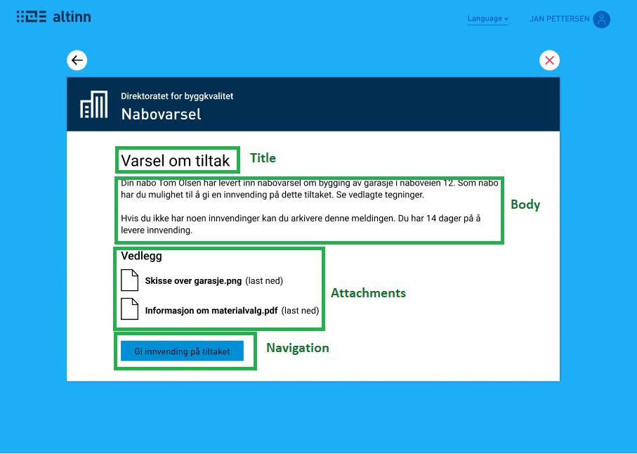

A message in Altinn 3 is really just a data step, in the same way as for example filling out a form. It is set up through a data model for the message, and a layout 
describing what the message should look like in the GUI. Because of this, message is not its own task type. This enables greater flexibility for Messages in Altinn 3 and allows them to be used as either the only task in a process, or as a part of a larger process.

We have made some tools to simplify the process of getting started with setting up a message in an app.

## Data model
We have made a standard data model for messages, to make getting started easier. This data model can be found [here](https://altinncdn.no/schemas/xsd/message/message.schema.v1.xsd). It can be used as is, as a starting point, or exchanged for your own data model.

## Layout
The layout can be defined by yourself in the same way as a form.

