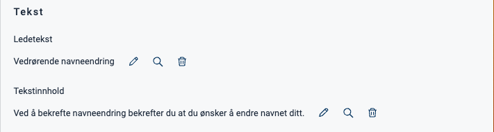

{}
🚧 This documentation is a work in progress.
{}

---

## Usage

Alerts are commonly used to display important information to users that should be highlighted.

### Anatomy
<iframe style="border: 0px solid rgba(0, 0, 0, 0.1);" width="100%" height="300" src="https://embed.figma.com/proto/ycDW0BPrMDW3SKZ56de4hY/https%3A%2F%2Fdocs.altinn.studio?page-id=0%3A1&node-id=628-7728&viewport=-659%2C1333%2C0.57&scaling=contain&content-scaling=responsive&starting-point-node-id=628%3A7728&show-proto-sidebar=0&embed-host=share" allowfullscreen></iframe>


{}
1. **Heading**: A brief and descriptive title.
2. **Icon**: A graphical symbol that conveys the severity of the alert.
3. **Text content**: The written information or message associated with the alert.
{} 

<!-- 
Add the following sections if relevant:

### Behavior

(How the component behaves in different contexts)

### Style

(Visual styling (e.g. alignment, padding, dos and don'ts))

### Best Practices

(Industry standards, dos and don'ts)

### Content guidelines

(E.g. punctuation rules, standard labels, etc.)

### Accessibility

(Component-specific best practices for accessibility.)

### Mobile

(How to apply component in mobile environments.)

-->
### Related

- [`Panel`]()


## Properties

| **Property** | **Type**                                       | **Description**                                                                                |
|--------------|------------------------------------------------|------------------------------------------------------------------------------------------------|
| `severity`   | string | String value indicating the severity level of the alert. This affect the styling of the alert. **Enum:** `"success" \| "info" \| "danger" \| "warning"` |

<!-- The following is an autogenerated list of the properties available for {} based on the component's JSON schema file (linked below).

{}
We are currently updating how we implement components, and the list of properties may not be entirely accurate.
{} -->

<!-- The `component-props` shortcode automatically generates a list of component properties from the component's json schema.
The component name can be explicitly given as argument (e.g. `component-props "Grid"`).
If no argument is given, the shortcode pulls the component name from 'schemaname' in the frontmatter. -->

<!-- {} -->

## Configuration

### Add component

You can add a component in [Altinn Studio Designer]() by dragging it from the left-side panel to the middle page area.
Selecting the component brings up its configuration panel on the right-hand side.

### Settings in Altinn Studio Designer

{}
We are currently updating Altinn Studio with more configuration options!
 The documentation is continuously updated, but more settings may be available than described here, and some settings may be in beta.
{}




Property settings available in Altinn Studio Designer.


- **Komponent-ID** (`id`): Automatically generated component ID (editable).
- **Ledetekst** (`textResourceBindings.title`): Alert heading.
- **Tekstinnhold** (`textResourceBindings.body`): Alert content.
- **Alvorlighetsgrad** (`severity`): Severity level. Influences the alert's styling (colors and icon).




Corresponding settings in the page's JSON file.


App/ui/layouts/{page}.json


```json{hl_lines=""}
{
  "data": {
    "layout": [
      {
        "id": "alert-id",
        "type": "Alert",
        "severity": "info",
        "textResourceBindings": {
          "title": "",
          "body": ""
        }
      }
    ]
  }
}
```




### Heading and content

You can add heading and content by creating a new or pick an existing [text resource]().









App/ui/layouts/{page}.json


```json{hl_lines="7-10"}
{
  "data": {
    "layout": [
      {
        "id": "alert-id",
        "type": "Alert",
        "textResourceBindings": {
          "title": "Vedrørende navneendring",
          "body": "Ved å bekrefte navneendring bekrefter du at du ønsker å endre navnet ditt."
        },
        "severity": "info"
      }
      }
    ]
  }
}
```



### Severity level

By changing the severity level, you can change the styling (colors and icon) of the alert.

#### `info`




<iframe style="border: 0px solid rgba(0, 0, 0, 0.1);" width="100%" height="300" src="https://embed.figma.com/proto/ycDW0BPrMDW3SKZ56de4hY/https%3A%2F%2Fdocs.altinn.studio?page-id=0%3A1&node-id=628-8141&viewport=-659%2C1333%2C0.57&scaling=contain&content-scaling=responsive&starting-point-node-id=628%3A8141&show-proto-sidebar=0&embed-host=share" allowfullscreen></iframe>






App/ui/layouts/{page}.json


```json{hl_lines="11"}
{
  "data": {
    "layout": [
      {
        "id": "alert-id",
        "type": "Alert",
        "textResourceBindings": {
          "title": "Vedrørende navneendring",
          "body": "Ved å bekrefte navneendring bekrefter du at du ønsker å endre navnet ditt."
        },
        "severity": "info"
      }
      }
    ]
  }
}
```



#### `success`




<iframe style="border: 0px solid rgba(0, 0, 0, 0.1);" width="100%" height="300" src="https://embed.figma.com/proto/ycDW0BPrMDW3SKZ56de4hY/https%3A%2F%2Fdocs.altinn.studio?page-id=0%3A1&node-id=628-8184&viewport=-659%2C1333%2C0.57&scaling=contain&content-scaling=responsive&starting-point-node-id=628%3A8184&show-proto-sidebar=0&embed-host=share" allowfullscreen></iframe>






App/ui/layouts/{page}.json


```json{hl_lines="11"}
{
  "data": {
    "layout": [
      {
        "id": "alert-id",
        "type": "Alert",
        "textResourceBindings": {
          "title": "Vedrørende navneendring",
          "body": "Ved å bekrefte navneendring bekrefter du at du ønsker å endre navnet ditt."
        },
        "severity": "success"
      }
      }
    ]
  }
}
```



#### `warning`




<iframe style="border: 0px solid rgba(0, 0, 0, 0.1);" width="100%" height="300" src="https://embed.figma.com/proto/ycDW0BPrMDW3SKZ56de4hY/https%3A%2F%2Fdocs.altinn.studio?page-id=0%3A1&node-id=628-8169&viewport=-659%2C1333%2C0.57&scaling=contain&content-scaling=responsive&starting-point-node-id=628%3A8169&show-proto-sidebar=0&embed-host=share" allowfullscreen></iframe>






App/ui/layouts/{page}.json


```json{hl_lines="11"}
{
  "data": {
    "layout": [
      {
        "id": "alert-id",
        "type": "Alert",
        "textResourceBindings": {
          "title": "Vedrørende navneendring",
          "body": "Ved å bekrefte navneendring bekrefter du at du ønsker å endre navnet ditt."
        },
        "severity": "warning"
      }
      }
    ]
  }
}
```



#### `danger`




<iframe style="border: 0px solid rgba(0, 0, 0, 0.1);" width="100%" height="300" src="https://embed.figma.com/proto/ycDW0BPrMDW3SKZ56de4hY/https%3A%2F%2Fdocs.altinn.studio?page-id=0%3A1&node-id=628-8199&viewport=-659%2C1333%2C0.57&scaling=contain&content-scaling=responsive&starting-point-node-id=628%3A8199&show-proto-sidebar=0&embed-host=share" allowfullscreen></iframe>






App/ui/layouts/{page}.json


```json{hl_lines="11"}
{
  "data": {
    "layout": [
      {
        "id": "alert-id",
        "type": "Alert",
        "textResourceBindings": {
          "title": "Vedrørende navneendring",
          "body": "Ved å bekrefte navneendring bekrefter du at du ønsker å endre navnet ditt."
        },
        "severity": "danger"
      }
      }
    ]
  }
}
```



These examples are taken from <a href="https://www.figma.com/community/file/1344307804742953785/altinn-studio-komponenter" target="_blank">Altinn Studio Komponenter</a>. Note that the examples are not identical to the actual code but have been adapted to create prototypes in Figma.