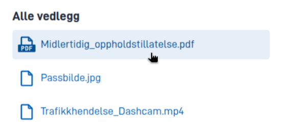

## Bruk

Komponenten `AttachmentList` kan brukes til å vise alle vedlegg som er lastet opp i skjemaet, samt lenke til dem slik at
brukeren kan laste dem ned. Man kan også begrense komponenten til å bare vise et utvalg vedleggstyper/datatyper.

### Anatomi



## Egenskaper

Følgende er en liste over tilgjengelige egenskaper for {}.

{}
Vi oppdaterer for øyeblikket hvordan vi implementerer komponenter. Listen over egenskaper kan derfor være noe unøyaktig.
{}

| **Egenskap**                 | **Type** | **Beskrivelse**                                                                                                                                                            |
|------------------------------|----------|----------------------------------------------------------------------------------------------------------------------------------------------------------------------------|
| `id`                         | streng   | Komponent-ID-en. Må være unik innenfor alle oppsett/sider i et oppsett-sett. Kan ikke slutte med <bindestrek><tall>.                                                       |
| `type`                       | streng   | Må være `AttachmentList`.                                                                                                                                                  |
| `textResourceBindings.title` | streng   | Ledetekst                                                                                                                                                                  |
| `dataTypeIds`                | streng[] | Liste over datatyper som skal vises i listen. Hvis ingen datatyper er spesifisert, vises alle vedlegg.                                                                     |
| `links`                      | boolsk   | Viser lenker til vedleggene i listen. Denne er aktivert som standard. Hvis den blir deaktivert (satt til `false`), vil bare navnene på vedleggene vises sammen med ikoner. |

## Konfigurering

{}
Vi oppdaterer for øyeblikket Altinn Studio med flere muligheter for innstillinger!
 Dokumentasjonen oppdateres fortløpende, men det kan være flere innstillinger tilgjengelig enn det som beskrives her og noen innstillinger kan være i betaversjon.
{}

### Legg til komponent




Du kan legge til en komponent i [Altinn Studio Designer](/nb/altinn-studio/v8/getting-started/) ved å dra den fra komponent-listen til sideområdet.
Når du velger komponenten, vises innstillingspanelet for den.




Grunnleggende komponent:


App/ui/layouts/{page}.json


```json{hl_lines="6-12"}
{
  "$schema": "https://altinncdn.no/toolkits/altinn-app-frontend/4/schemas/json/layout/layout.schema.v1.json",
  {
    "data": {
      "layout": [
        {
          "id": "myAttachmentList",
          "type": "AttachmentList",
          "textResourceBindings": {
            "title": "Alle vedlegg"
          }
        }
      ]
    }
  }
}
```




### Begrensning av vedleggstyper

Man kan begrense komponenten til vise frem et utvalg vedleggstyper/datatyper. Gyldige verdier er:
- Alle datatyper som definert i `applicationmetadata.json` under `dataTypes`, med unntak av datamodeller (disse regnes aldri som vedlegg)
- Datatypen `ref-data-as-pdf` (representerer automatisk genererte PDF-filer for et utfylt skjema).

Eksempel:

```json{hl_lines="7-10"}
{
  "id": "myAttachmentList",
  "type": "AttachmentList",
  "textResourceBindings": {
    "title": "Noen vedlegg"
  },
  "dataTypeIds": [
    "ref-data-as-pdf",
    "my-custom-data-type"
  ]
}
```