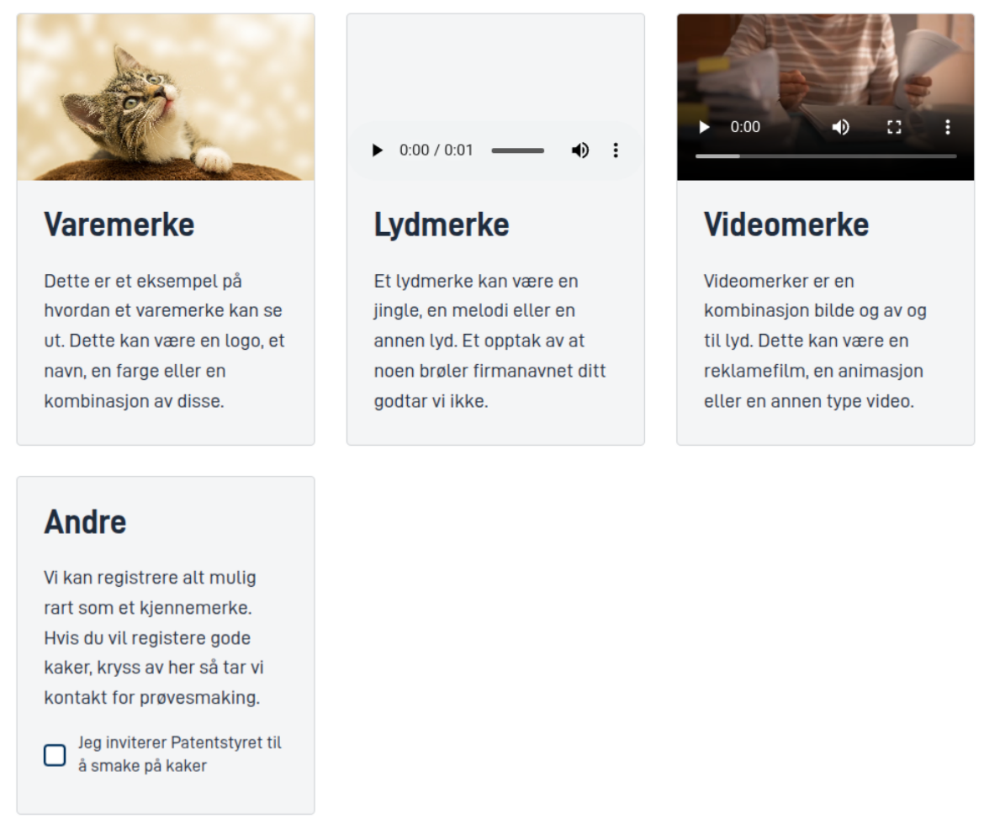

## Bruk

Cards-komponenten kan brukes til å vise ulike typer innhold (andre komponenter), i en kort-basert layout.
Den kan brukes til å vise informasjon, bilder, lydklipp, videoer, og skjemakomponenter.

### Anatomi



I skjermbildet over ser vi en Cards-komponent med 4 kort.

- Det første kortet har en **ledetekst**, **beskrivelse** og bruker en [**Image-komponent**](/nb/altinn-studio/v8/reference/ux/components/image/) for å vise et bilde som media.
- Det andre kortet har en **ledetekst**, **beskrivelse** og bruker en [**Audio-komponent**](/nb/altinn-studio/v8/reference/ux/components/audio/) for å vise et lydklipp som media.
- Det tredje kortet har en **ledetekst**, **beskrivelse** og bruker en [**Video-komponent**](/nb/altinn-studio/v8/reference/ux/components/video/) for å vise en video som media.
- Det fjerde kortet har en **ledetekst**, **beskrivelse** og bruker en [**Checkboxes-komponent**](/nb/altinn-studio/v8/reference/ux/components/checkboxes/) for å vise en bekreftelses-sjekkboks under beskrivelsen.

Visuelt vil et kort vanligvis vise innhold i denne rekkefølgen:

- **Øverst** vises en `media`-komponent (f.eks. bilde, video, lydklipp), dersom det er spesifisert (i `cards[0].media`). Man kan også **endre** media-plasseringen til å vises nederst om man setter `mediaPosition` til `bottom` på komponenten.
- **Under media** vises ledeteksten, dersom man har angitt en (i `cards[0].title`).
- **Under ledeteksten** vises beskrivelsen, dersom man har angitt en (i `cards[0].description`).
- **Under beskrivelsen** vises innholdet i kortet, dersom det er spesifisert (i `cards[0].children`).
- **Under innholdet** vises eventuell tekst spesifisert i `cards[0].footer`.
- **Nederst** vises en eventuell `media`-komponent om denne er spesifisert, og `mediaPosition` er satt til `bottom`.

### Stil

Denne komponenten har flere egenskaper for å styre utseendet. Det kan være verdt å eksperimentere med de ulike
for å oppnå ønsket utseende, og noe som fungerer sammen med skjema-komponentene og eventuelle media-komponenter man
bruker i kortene.

- `color` kan settes på komponenten for å styre bakgrunnsfargen til kortene. Her kan man
  velge mellom `neutral` og `subtle`.
- `minWidth` brukes til å bestemme hvor bredt hvert kort må være, som en minimumsverdi. Standardverdien om man ikke 
  har angitt noe er `250px`, og dette vil være styrende for hvor mange kort man kan ha på en rad. I tillegg til `px`
  kan man også bruke `rem` og `%` for å spesifisere bredden.
- `minMediaHeight` brukes til å bestemme minimums-høyden til komponenter man har spesifisert i `media`
  (f.eks. bilde, video, lydklipp). Standardverdien er `150px`. Også her kan man bruke `px`, `rem` og `%` for å
  spesifisere høyden.

## Egenskaper

Følgende er en liste over tilgjengelige egenskaper for {}.

{}
Vi oppdaterer for øyeblikket hvordan vi implementerer komponenter. Listen over egenskaper kan derfor være noe unøyaktig.
{}

| **Egenskap**           | **Type** | **Beskrivelse**                                                                                                      |
|------------------------|----------|----------------------------------------------------------------------------------------------------------------------|
| `mediaPosition`        | `string` | Bestemmer posisjonen til media-komponenten. Kan være `top` eller `bottom`. Standard er `top`.                        |
| `minMediaHeight`       | `string` | Bestemmer minimumshøyden til komponenter spesifisert i `media` (f.eks. bilde, video, lydklipp). Standard er `150px`. |
| `minWidth`             | `string` | Bestemmer minimumsbredden til hvert kort. Standard er `250px`.                                                       |
| `color`                | `string` | Bestemmer bakgrunnsfargen til kortene. Kan være `neutral` eller `subtle`.                                            |
| `cards`                | `array`  | En liste med kort som skal vises.                                                                                    |
| `cards[0].title`       | `string` | Tittelen/ledeteksten til kortet.                                                                                     |
| `cards[0].description` | `string` | Beskrivelsen til kortet.                                                                                             |
| `cards[0].footer`      | `string` | Bunnteksten til kortet.                                                                                              |
| `cards[0].media`       | `string` | ID-en til en media-komponent som skal vises på toppen/bunnen av kortet.                                              |
| `cards[0].children`    | `array`  | En liste med ID-er til komponenter som skal vises i kortet.                                                          |

## Konfigurering

{}
Vi oppdaterer for øyeblikket Altinn Studio med flere muligheter for innstillinger!
 Dokumentasjonen oppdateres fortløpende, men det kan være flere innstillinger tilgjengelig enn det som beskrives her og noen innstillinger kan være i betaversjon.
{}

### Legg til komponent




Du kan legge til en komponent i [Altinn Studio Designer](/nb/altinn-studio/v8/getting-started/) ved å dra den fra komponent-listen til sideområdet.
Når du velger komponenten, vises innstillingspanelet for den.




Grunnleggende komponent:


App/ui/layouts/{page}.json


```json{hl_lines="6-"}
{
  "$schema": "https://altinncdn.no/toolkits/altinn-app-frontend/4/schemas/json/layout/layout.schema.v1.json",
  "data": {
    "layout": [
      {
        "id": "myCards",
        "type": "Cards",
        "minWidth": "250px",
        "minMediaHeight": "150px",
        "mediaPosition": "top",
        "color": "subtle",
        "cards": [
          {
            "title": "Lydfil",
            "description": "Dette kan også være en ID på en tekstressurs",
            "media": "myAudio"
          },
          {
            "title": "cards.video.title",
            "description": "cards.video.description",
            "media": "myVideo"
          },
          {
            "title": "Med komponenter og footer, men uten media",
            "description": "Eksempeltekst",
            "children": ["myCheckboxes"],
            "footer": "Eksempeltekst"
          }
        ]
      }
    ]
  }
}
```



