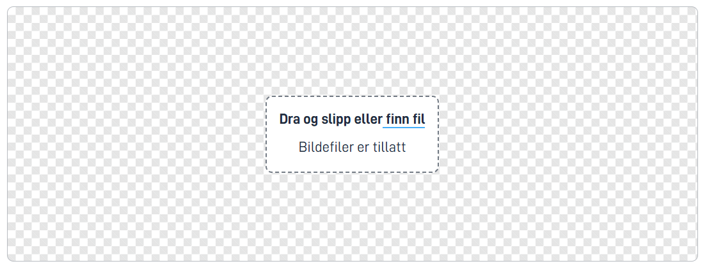

## Usage

Use the image upload component when users need to upload an image, such as a profile picture. The component has built-in functionality for cropping the image before it is saved.

### Anatomy

1. **Upload image**: The user clicks on the upload area to open the file explorer and select an image from their device. Alternatively, the user can drag and drop an image directly into the upload area.
   
2. **Preview**: After upload, a preview of the image is displayed. The user can crop the image by dragging it and zooming in/out within the specified frame, either with a mouse or a keyboard.
   
3. **Control panel**: Below the image is a control panel with buttons to zoom in, zoom out, reset cropping and positioning, upload a new image, and save the cropped image.
4. **Save image**: When the user is satisfied with the cropping, they click the «Save» button to save the cropped image. The cropped image is then displayed in the preview along with a delete button that allows the user to remove the image and upload a new one if desired.
   

### Configuration

The component has some specific properties that can be configured in addition to the general properties that apply to all components. Below is a list of the most important properties:

| Property | Type   | Description                                                   | Required | Default value                            |
| -------- | ------ | ------------------------------------------------------------- | -------- | ---------------------------------------- |
| id       | string | Unique ID for the component                                   | yes      |                                          |
| type     | string | Component type, for this component it is always `ImageUpload` | yes      |                                          |
| crop     | object | Configuration for the cropping area                           | no       | `{ "shape": "circle", "diameter": 250 }` |

#### Examples of the `crop` object

Circular cropping (default):

```json
"crop": {
   "shape": "circle",
   "diameter": 250
}
```

Rectangular cropping:

```json
"crop": {
   "shape": "rectangle",
   "width": 270,
   "height": 200
}
```

{}
**Note:** For usability on smaller screens, we recommend a maximum size of 270 pixels in width for the cropping area. This ensures that users with screens down to 320 pixels wide can use the component without problems.
{}
