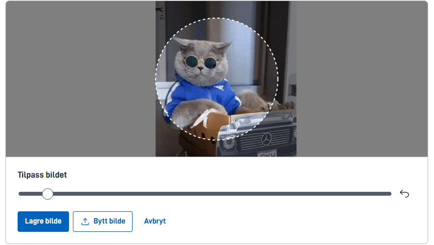

## Bruk

Bruk bildeopplaster-komponenten når brukeren skal laste opp et bilde, for eksempel et profilbilde. Komponenten har innebygd funksjonalitet for å beskjære bildet før det lagres.

### Anatomi

1. **Last opp bilde**: Brukeren klikker på opplastingsområdet for å åpne filutforskeren og velge et bilde fra enheten sin. Alternativt kan brukeren dra og slippe et bilde direkte inn i opplastingsområdet.
   
2. **Forhåndsvisning**: Etter opplasting vises en forhåndsvisning av bildet. Brukeren kan beskjære bildet ved å dra det og zoome inn/ut innenfor den angitte rammen, enten med mus eller tastatur.
   
3. **Kontrollpanel**: Under bildet finnes et kontrollpanel med knapper for å zoome inn, zoome ut, tilbakestille beskjæring og posisjonering, laste opp nytt bilde, og lagre det beskjærte bildet.
4. **Lagre bilde**: Når brukeren er fornøyd med beskjæringen, klikker de på «Lagre»-knappen for å lagre det beskjærte bildet. Det beskjærte bildet vises deretter i forhåndsvisningen sammen med en slett-knapp som lar brukeren fjerne bildet og laste opp et nytt hvis ønskelig.
   

### Konfigurasjon

#### Egenskaper for `imageUpload`-komponenten

Komponenten har noen spesifikke egenskaper som kan konfigureres i tillegg til de generelle egenskapene som gjelder for alle komponenter. Nedenfor er en liste over de viktigste egenskapene:

| Egenskap | Type   | Beskrivelse                                                       | Påkrevd | Standardverdi                            |
| -------- | ------ | ----------------------------------------------------------------- | ------- | ---------------------------------------- |
| id       | string | Unik ID for komponenten                                           | ja      |                                          |
| type     | string | Type komponent, for denne komponenten er det alltid `ImageUpload` | ja      |                                          |
| crop     | object | Konfigurasjon for beskjæringsområdet                              | nei     | `{ "shape": "circle", "diameter": 250 }` |

#### Eksempler på `crop`-objektet

Sirkulær beskjæring (standard):

```json
"crop": {
   "shape": "circle",
   "diameter": 250
}
```

Rektangulær beskjæring:

```json
"crop": {
   "shape": "rectangle",
   "width": 270,
   "height": 200
}
```

{}
**Merk:** For brukervennlighet på mindre skjermer, anbefaler vi en størrelse på maksimalt 270 piksler i bredden for beskjæringsområdet. Dette sikrer at brukere med skjermer ned til 320 piksler i bredde kan bruke komponenten uten problemer.
{}
