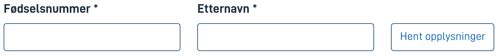
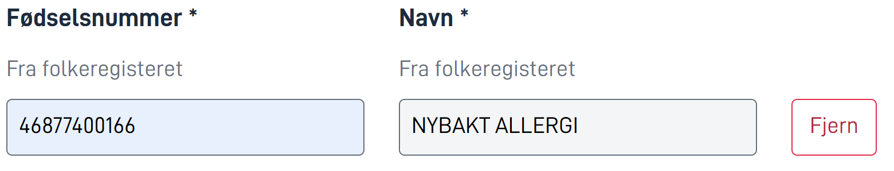
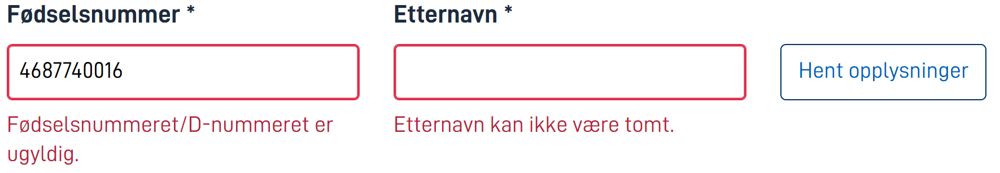
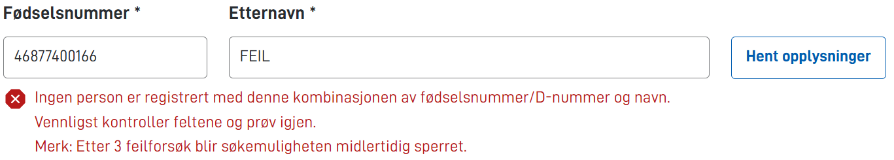
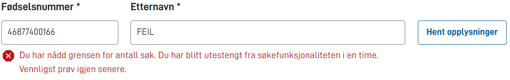

## Bruk

PersonLookup-komponenten søker i det nasjonale folkeregisteret basert på brukerens oppgitte input for fødselsnummer og etternavn, og lagrer resultatet ved hjelp av en datamodellbinding.

## Anatomi

Komponenten består av en hovedtittel, en hjelptekst, en beskrivelse, en fødselsnummer-input tittel, et fødselsnummer-input felt, en etternavn-input tittel, et etternavn-input navn og en hent-knapp.

<iframe style="border: 0px solid rgba(0, 0, 0, 0);" width="100%" height="300" src="https://embed.figma.com/proto/ycDW0BPrMDW3SKZ56de4hY/https%3A%2F%2Fdocs.altinn.studio?page-id=0%3A1&node-id=1-43040&viewport=429%2C-4932%2C0.72&scaling=contain&content-scaling=responsive&starting-point-node-id=1%3A43040&show-proto-sidebar=0&embed-host=share" allowfullscreen></iframe>

{}

1. **Overskrift** – Hovedtittel.
2. **Hjelpetekst** – Klikk for hjelpe-popup.
3. **Vis beskrivelse** – Beskrivelse av komponenten.
4. **Personnummerfelt** – Inndatafelt for fødselsnummer.
5. **Etternavn** – Inndatafelt for etternavn.
6. **Hent opplysninger** – Hent opplysninger basert på inndata.

{}

## Oppførsel

Før en bruker interagerer med komponenten, vises den slik.



Ved en vellykket henting legger komponenten til en beskrivelse i feltene, som indikerer at dataene som vises er hentet fra folkeregisteret. Knappen forvandles fra en hent-knapp til en fjern-knapp.



Komponenten har innebygd validering for inputfeltene både ved tap av fokus og ved henting. NIN-inputfeltet validerer formatet til det nasjonale identitetsnummeret i henhold til de offisielle retningslinjene for NIN.
Etternavn-inputfeltet kontrollerer at et etternavn er oppgitt.
Feilmeldingene for inputfeltsvalideringene vises på PersonLookup-komponenten.



Gitt gyldig inndata, men med en uoverensstemmelse mellom fødselsnavn og etternavn, viser komponenten en feilmelding etter forsøk på henting. Det er en grense for antallet unike mislykkede oppslag før brukeren midlertidig blokkeres.



Når antallet tillatte unike mislykkede oppslag overskrides, gjenspeiler komponenten dette.



## Egenskaper

Følgende er en liste over tilgjengelige egenskaper for {}.

{}
Vi oppdaterer for øyeblikket hvordan vi implementerer komponenter. Listen over egenskaper kan derfor være noe unøyaktig.
{}

| **Egenskap**                           | **Type** | **Beskrivelse**                                                                                                      |
| -------------------------------------- | -------- | -------------------------------------------------------------------------------------------------------------------- |
| `id`                                   | string   | Komponent-ID-en. Må være unik innenfor alle oppsett/sider i et oppsett-sett. Kan ikke slutte med <bindestrek><tall>. |
| `type`                                 | string   | "PersonLookup"                                                                                                       |
| `dataModelBindings.person_lookup_ssn`  | string   | Hvor i datamodellen resultatet (fnr) skal lagres                                                                     |
| `dataModelBindings.person_lookup_name` | string   | Hvor i datamodellen resultatet (navn) skal lagres                                                                    |
| `textResourceBindings.title`           | string   | Ledetekst (valgfritt)                                                                                                |
| `textResourceBindings.description`     | string   | Beskrivelse (valgfritt)                                                                                              |
| `textResourceBindings.help`            | string   | Hjelpetekst (valgfritt)                                                                                              |

## Konfigurasjon

{}
Vi oppdaterer for øyeblikket Altinn Studio med flere muligheter for innstillinger!
Dokumentasjonen oppdateres fortløpende, men det kan være flere innstillinger tilgjengelig enn det som beskrives her og noen innstillinger kan være i betaversjon.
{}

## Eksempel

I følgende eksempel konfigurerer vi opp komponenten for å legge til en styreleder.
Vi sier at det er påkrevd å oppgi en person, og vi overstyrer tittel.
Vi velger å ikke bruke beskrivelse eller hjelpetekst.
Resultatet vil vi ha i datamodellen på `Styre.Styreleder`.

<iframe style="border: 1px solid rgba(0, 0, 0, 0.1);" width="100%" height="175" src="https://embed.figma.com/proto/ycDW0BPrMDW3SKZ56de4hY/https%3A%2F%2Fdocs.altinn.studio?page-id=0%3A1&node-id=1183-7931&viewport=634%2C2793%2C0.78&scaling=contain&content-scaling=responsive&starting-point-node-id=1183%3A7931&show-proto-sidebar=0&embed-host=share" allowfullscreen></iframe>




Legg til styreleder:


App/ui/layouts/{page}.json


```json{hl_lines="6-"}
{
  "$schema": "https://altinncdn.no/toolkits/altinn-app-frontend/4/schemas/json/layout/layout.schema.v1.json",
  {
    "data": {
      "layout": [
        {
          {
            "id": "Styreleder-lookup",
            "type": "PersonLookup",
            "dataModelBindings": {
              "person_lookup_ssn": "Styre.Styreleder.Foedselsnummer",
              "person_lookup_name": "Styre.Styreleder.Name"
            },
            "textResourceBindings": {
              "title": "styre-og-revisjon.Group-1.title"
            },
            "required": true
          },
        }
      ]
    }
  }
}
```




Det finnes for øyeblikket ikke mulighet for å konfigurere PersonLookup i [Altinn Studio Designer](/nb/altinn-studio/v8/getting-started/).



