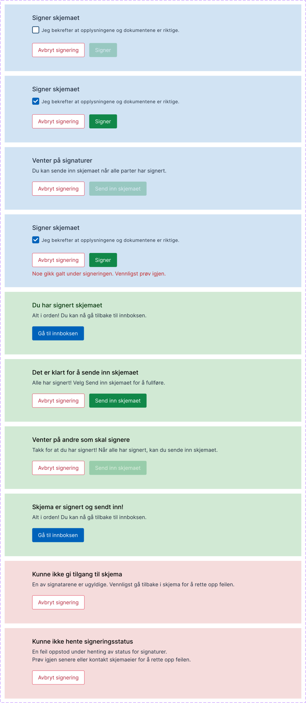

{}
🚧 This documentation is a work in progress.
{}

---

## Usage

The **SigningActions** component takes into account the currently logged in user and the state of the signing step to display
actions that the user may execute. The component may only be used on a signing task.

### Anatomy



1. The user is a signee, and has not signed yet. As the checkbox is not checked, the sign button is greyed out.
2. The user is a signee, and has not signed yet. The checkbox is checked, so the sign button is active.
3. The user is the instance owner. Not all signees have signed, so the submit button is greyed out. The instance owner can cancel the signing process with the cancel button.
4. The user is a signee, and has not signed yet. Something has gone wrong when attempting to sign, an error message is displayed.
5. The user is a signee, and has signed. The component displays a title and summary confirming this, and a button for navigating to their inbox is displayed
6. The user is the instance owner. Every mandatory signature is completed, so they can now send in the form. They may also cancel.
7. The user is the instance owner and has signed themselves. Not all mandatory signatures are completed, so they may not send in the form. They may cancel.
8. The user is the instance owner and has sent in the form. A button is shown which allow them to navigate to their inbox.
9. The user is the instance owner. One of the signatures in not valid. They must cancel and fix the issue to proceed.
10. The user is any user. The signature status could not be fetched. This could be due to no internet connection.

## Properties

The following is a list of the properties available for {}.

**Required properties**: `id`, `type`

| **Property**                                                             | **Type** | **Description**                                                                                                     |
| ------------------------------------------------------------------------ | -------- | ------------------------------------------------------------------------------------------------------------------- |
| `id`                                                                     | string   | The component ID. Must be unique within all layouts/pages in a layout set. Cannot end with <hyphen><number>.        |
| `type`                                                                   | string   | Must be `SigningActions`.                                                                                           |
| `textResourceBindings.awaitingSignaturePanelTitle`                       | string   | The title of the panel that is displayed when the user should sign.                                                 |
| `textResourceBindings.checkboxLabel`                                     | string   | The text to display when a user is asked to confirm what they are signing.                                          |
| `textResourceBindings.checkboxDescription`                               | string   | A text that describes the checkbox label in more detail if needed.                                                  |
| `textResourceBindings.signingButton`                                     | string   | The text to display in the button that the user clicks in order to sign.                                            |
| `textResourceBindings.noActionRequiredPanelTitleHasSigned`               | string   | The title of the panel displayed when the user has signed and no further action is required.                        |
| `textResourceBindings.noActionRequiredPanelTitleNotSigned`               | string   | The title of the panel displayed when the user has not signed and no further action is required.                    |
| `textResourceBindings.noActionRequiredPanelDescriptionHasSigned`         | string   | The description of the panel displayed when the user has signed and no further action is required.                  |
| `textResourceBindings.noActionRequiredPanelDescriptionNotSigned`         | string   | The description of the panel displayed when the user has not signed and no further action is required.              |
| `textResourceBindings.noActionRequiredButton`                            | string   | The text to display in the button that navigates to the inbox when no further action is required.                   |
| `textResourceBindings.awaitingOtherSignaturesPanelTitle`                 | string   | The title for the panel when the signing task is not ready for submit.                                              |
| `textResourceBindings.awaitingOtherSignaturesPanelDescriptionNotSigning` | string   | The description for the panel when the current user is not signing.                                                 |
| `textResourceBindings.awaitingOtherSignaturesPanelDescriptionSigned`     | string   | The description for the panel when the current user has signed.                                                     |
| `textResourceBindings.submitPanelTitle`                                  | string   | The title for the panel when the signing task is ready for submit.                                                  |
| `textResourceBindings.submitPanelDescription`                            | string   | The description for the panel when the signing task is ready for submit.                                            |
| `textResourceBindings.submitButton`                                      | string   | The text to display in the button that the user clicks in order to submit the signing task.                         |
| `textResourceBindings.errorPanelTitle`                                   | string   | The title of the panel displayed when at least one signee is invalid and has not received access to the form.       |
| `textResourceBindings.errorPanelDescription`                             | string   | The description of the panel displayed when at least one signee is invalid and has not received access to the form. |
| `textResourceBindings.rejectModalTitle`                                  | string   | The title of the modal displayed when the user clicks the reject button.                                            |
| `textResourceBindings.rejectModalDescription`                            | string   | The description of the modal displayed when the user clicks the reject button.                                      |
| `textResourceBindings.rejectModalButton`                                 | string   | The text to display in the button that confirms rejection of the signing task.                                      |
| `textResourceBindings.rejectModalTriggerButton`                          | string   | The text to display in the button that triggers the reject modal.                                                   |

## Configuration


App/ui/layouts/{page}.json


```json{hl_lines="6-9"}
{
  "$schema": "https://altinncdn.no/toolkits/altinn-app-frontend/4/schemas/json/layout/layout.schema.v1.json",
  {
    "data": {
      "layout": [
        {
          "id": "mySigningActions",
          "type": "SigningActions"
        }
      ]
    }
  }
}
```
