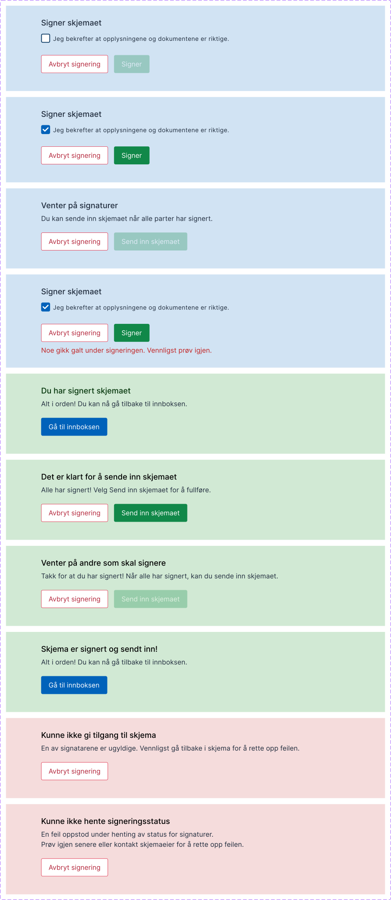

{}
🚧 Denne dokumentasjonen er under arbeid.
{}

---

## Bruk

**SigningActions**-komponenten tar hensyn til den påloggede brukeren og tilstanden til signeringstrinnet for å vise handlinger som brukeren kan utføre.
Komponenten kan kun brukes på et signeringssteg.

### Anatomi

1. Brukeren er en signatar, og har ikke signert ennå. Siden avkrysningsboksen ikke er krysset av, er signeringsknappen grået ut.
2. Brukeren er en signatar, og har ikke signert ennå. Avkrysningsboksen er krysset av, så signeringsknappen er aktiv.
3. Brukeren er instanseieren. Ikke alle signatarer har signert, så innleveringsknappen er grået ut. Instanseieren kan avbryte signeringsprosessen med avbryt-knappen.
4. Brukeren er en signatar, og har ikke signert ennå. Noe har gått galt ved forsøk på signering, en feilmelding vises.
5. Brukeren er en signatar, og har signert. Komponenten viser en tittel og sammendrag som bekrefter dette, og en knapp for å navigere til innboksen vises.
6. Brukeren er instanseieren. Alle obligatoriske signaturer er fullført, så de kan nå sende inn skjemaet. De kan også avbryte.
7. Brukeren er instanseieren og har signert selv. Ikke alle obligatoriske signaturer er fullført, så de kan ikke sende inn skjemaet. De kan avbryte.
8. Brukeren er instanseieren og har sendt inn skjemaet. En knapp vises som lar dem navigere til innboksen.
9. Brukeren er instanseieren. En av signaturene er ikke gyldig. De må avbryte og fikse problemet for å fortsette.
10. Brukeren er en hvilken som helst bruker. Signeringsstatus kunne ikke hentes. Dette kan skyldes manglende internettforbindelse.

## Konfigurasjon

Legg til følgende i sidelayouten for å inkludere komponenten:

      {
        "id": "my-id-here",
        "type": "SigningActions"
      }