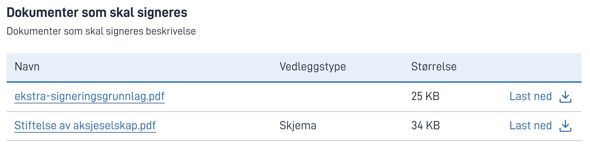

{}
🚧 Denne dokumentasjonen er under arbeid.
{}

---

## Bruk

**SigningDocumentList**-komponenten viser signeringspakken. Skjemadataene og eventuelle andre dokumenter som skal signeres i 
det gjeldende signeringsteget vil vises her. Komponenten kan kun brukes på et signeringsteg.

### Anatomi

Komponenten består av:

1. **Tittel** - Komponenttittel.
2. **Hjelp** - Klikk for hjelp-popup. Valgfritt.
3. **Beskrivelse** - Beskrivelse.
4. **Innhold** - En tabell som viser signeringspakken. Dette inkluderer navn, vedleggstype, størrelse og en nedlastingsknapp for hver oppføring.

## Konfigurasjon - Eksempel

En datamodell må opprettes for å lagre eventuelle tilleggsdokumenter for signeringspakken:

    {
    "id": "extra-documents-to-sign",
    "allowedContentTypes": [
        "application/pdf",
        "image/png",
        "text/plain",
        ...
    ],
    "taskId": "task-where-instance-owner-adds-documents",
    ...  
    },

Signeringspakken må defineres i process.bpmn-filen:

    <altinn:signatureConfig>
      <altinn:dataTypesToSign>
        //Skjemadataene er en del av signeringspakken
        <altinn:dataType>ref-data-as-pdf</altinn:dataType>
        //De ekstra dokumentene er en del av signeringspakken
        <altinn:dataType>extra-documents-to-sign</altinn:dataType>
      </altinn:dataTypesToSign>
    </altinn:signatureConfig>
Komponenten legges til i et side-layout slik:

    {
        //ID-en til komponenten
        "id": "signing-documents",
        //Typen, må settes til SigningDocumentList
        "type": "SigningDocumentList",
        "textResourceBindings": {
        //Tittelen
        "title": "Dokumenter som skal signeres",
        //Beskrivelsen
        "description": "Dokumenter som skal signeres beskrivelse"
        }
    },

Vedleggstypen til et dokument kan endres ved å legge til en eller flere tags.

Fra [v8.9.0](https://github.com/Altinn/app-lib-dotnet/releases/tag/v8.9.0) sorteres radene i tabellen først etter rekkefølgen av datatypene i `dataTypesToSign` i process.bpmn, og deretter etter dokumentenes opprettelsesdato.
