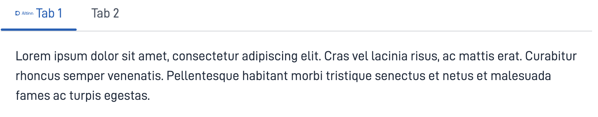

{}
🚧 Denne dokumentasjonen er under arbeid.
{}

---

## Bruk

`Tabs`-komponenten lar deg organisere og bytte mellom ulike innholdsseksjoner ved å klikke på overskriftene. Dette gir en plasseffektiv og ryddig måte å presentere informasjon på.

### Anatomi



{}
1. **Overskrift**: Den klikkbare seksjonstittelen som brukeren samhandler med for å velge eller bytte innhold.
2. **Innholdsområde**: Området som viser eller skjuler informasjon når overskriften klikkes.
   {}

<!-- 
Add the following sections if relevant:

### Behavior

(How the component behaves in different contexts)

### Style

(Visual styling (e.g. alignment, padding, dos and don'ts))

### Best Practices

(Industry standards, dos and don'ts)

### Content guidelines

(E.g. punctuation rules, standard labels, etc.)

### Accessibility

(Component-specific best practices for accessibility.)

### Mobile

(How to apply component in mobile environments.)

-->

## Egenskaper

| **Egenskap**    | **Type** | **Beskrivelse**                                                                                      |
|-----------------|----------|------------------------------------------------------------------------------------------------------|
| `id`            | string   | Unik ID-streng for komponenten.                                                                      |
| `size`          | string   | Setter størrelsen på fanen. **Enum:**: `"small" \| "medium" \| "large"` <br/> **Default:** `medium`. |
| `defaultTab`    | string   | Angir en fane som er valgt som standard.                                                            |
| `tabs`          | Array    | En liste av fane objekter som inneholder konfigurasjon(`id, title, icon, children`) per fane.        |
| `tabs.id`       | string   | Unik ID-streng for fanen. Må være unik blant alle fanene for denne komponenten.                                                                            |
| `tabs.title`    | string   | Tittelen for fanen.                                                                                  |
| `tabs.icon`     | string   | En URL-streng som peker på ikonet til fanen.                                                         |
| `tabs.children` | Array    | Spesifiserer hvilke komponenter du vil vise når fanen er aktiv.                                        |

## Konfigurasjon

### Legg til komponenten

```json{hl_lines="6-9"}
{
 "data": {
    "layout": [
    {
        "id": "tabs",
        "type": "Tabs",
        "tabs": [
         {
           "id": "tab-1",
           "children": ["test-tab-paragraph"],
           "title": "Tab 1",
           "icon": "/ttd/frontend-test/images/altinn-logo.svg"
         },
         {
           "id": "tab-2",
           "children": ["test-tab-paragraph2"],
           "title": "Tab 2"
         }
       ]
    },
  ]
 }
}
```
<br>

### defaultTab
Dette kan settes til ID-en til den spesifikke fanen du ønsker skal være valgt som standard.

### tabs

#### `id`
Unik ID-streng for fanen.

#### `title`

Tittelen for kan legges til som tekst direkte eller refereres via en teksttast til en [tekstressurs](/nb/altinn-studio/v8/reference/ux/texts/#legge-til-og-endre-tekster-i-en-app).

#### `Size`
Setter størrelsen på fanen. **Enum:** `"small" | "medium" | "large"` 
<br/> **Default:** `medium`.

#### `icon`
En URL-sti til ikonet.

#### `children`

Spesifiserer hvilke komponenter du vil vise når fanen er aktiv, ved å legge til ID-ene deres i en liste under `children`.

<br>

## Eksempel

Faner med avsnitt som underordnede elementer.




```json{hl_lines=["9-12"]}
{
 "data": {
    "layout": [
    {
        "id": "tabs",
        "type": "Tabs",
        "tabs": [
         {
           "id": "tab-1",
           "children": ["test-tab-paragraph"],
           "title": "Tab 1",
           "icon": "/ttd/frontend-test/images/altinn-logo.svg"
         },
         {
           "id": "tab-2",
           "children": ["test-tab-paragraph2"],
           "title": "Tab 2"
         }
       ]
    },
  ]
 }
}
```




