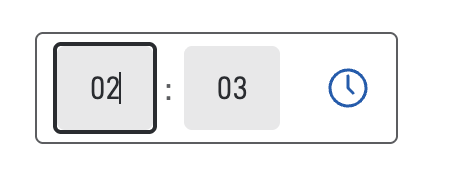
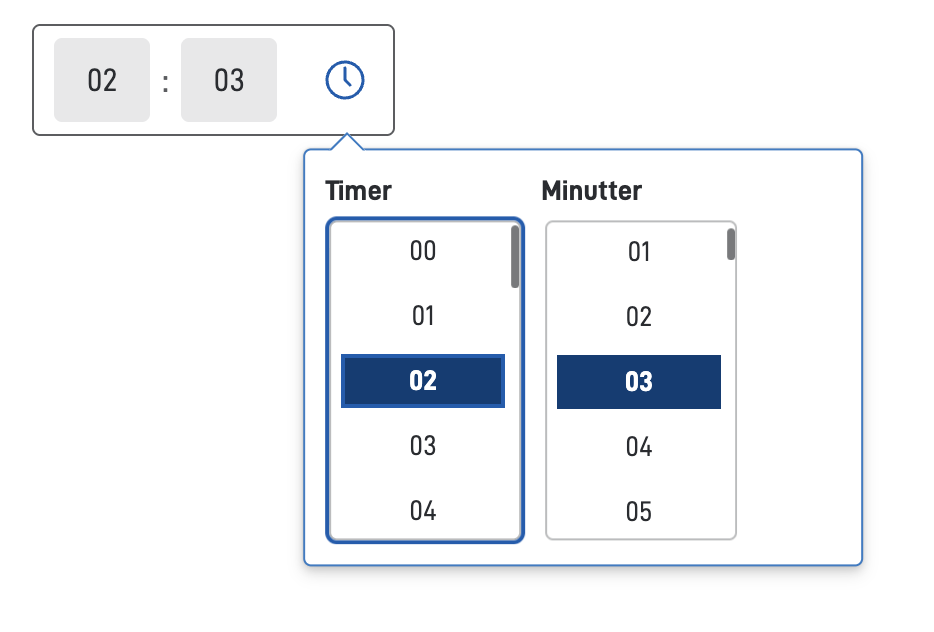

## Usage

The `TimePicker` component allows users to select a time value in a form. It provides a user-friendly interface for time input with support for various time formats including 12-hour and 24-hour formats, with optional seconds display.

1. **Simple**: The user can input a time using the keyboard, or the up and down arrows. Switch between hour/minute/second with arrow buttons or tab.
   
2. **Dropdown**: Clicking on the clock icon opens the dropdown, allowing the user to pick the time with the mouse.
   


### Related

- [`Date`](/en/altinn-studio/v8/reference/ux/components/date/)
- [`Datepicker`](/nb/altinn-studio/v8/reference/ux/components/date/)

## Properties

| **Property**                           | **Type**  | **Description**                                                                                                            |
|----------------------------------------|-----------|----------------------------------------------------------------------------------------------------------------------------|
| `id`                                   | string    | The component ID. Must be unique within all layouts/pages in a layout-set. Cannot end with <dash><number>.                 |
| `dataModelBindings.simpleBinding`      | string    | Data model binding for the component's connection to a single field in the data model. The field should be a string.       |
| `textResourceBindings.title`           | string    | The title/label text for the component.                                                                                    |
| `textResourceBindings.description`     | string    | The description text for the component (optional).                                                                         |
| `textResourceBindings.help`            | string    | The help text for the component (optional).                                                                                |
| `required`                             | boolean   | Boolean or expression indicating if the component is required when filling in the form. Defaults to false.                 |
| `readOnly`                             | boolean   | Boolean or expression indicating if the component should be presented as read only. Defaults to false.                     |
| `format`                               | string    | Time format used for displaying and input. Defaults to `HH:mm`. <br/><br/>**Enum:** [HH:mm, HH:mm:ss, hh:mm a, hh:mm:ss a] |
| `minTime`                              | string    | Sets the earliest allowed time in HH:mm format. Can be a static value or an expression.                                    |
| `maxTime`                              | string    | Sets the latest allowed time in HH:mm format. Can be a static value or an expression.                                      |
| `hidden`                               | boolean   | Boolean value or expression indicating if the component should be hidden. Defaults to false.                               |

## Configuration

### Add component

```json
{
  "id": "appointment-time",
  "type": "TimePicker",
  "dataModelBindings": {
    "simpleBinding": "appointmentTime"
  },
  "textResourceBindings": {
    "title": "Select appointment time"
  }
}
```

### Time format

The `format` property controls how the time is displayed and inputted. You can choose between 24-hour and 12-hour formats, with optional seconds.

#### `format`

Sets the time format for display and input. Based on common time formatting patterns.

- `HH:mm` - 24-hour format without seconds (default)
- `HH:mm:ss` - 24-hour format with seconds
- `hh:mm a` - 12-hour format with AM/PM, without seconds
- `hh:mm:ss a` - 12-hour format with AM/PM, with seconds

#### Example

TimePicker with 12-hour format:

```json
{
  "id": "appointment-time",
  "type": "TimePicker",
  "dataModelBindings": {
    "simpleBinding": "appointmentTime"
  },
  "textResourceBindings": {
    "title": "Select appointment time"
  },
  "format": "hh:mm a"
}
```

### Time constraints

You can set minimum and maximum allowed times using the `minTime` and `maxTime` properties.

#### `minTime`

Sets the earliest allowed time. Must be in HH:mm format (24-hour). Can be a static value or an expression.

#### `maxTime`

Sets the latest allowed time. Must be in HH:mm format (24-hour). Can be a static value or an expression.

#### Example

TimePicker limited to business hours (9 AM - 5 PM):

```json
{
  "id": "appointment-time",
  "type": "TimePicker",
  "dataModelBindings": {
    "simpleBinding": "appointmentTime"
  },
  "textResourceBindings": {
    "title": "Select appointment time",
    "description": "Select a time between 9 AM and 5 PM"
  },
  "minTime": "09:00",
  "maxTime": "17:00",
  "format": "hh:mm a",
  "required": true
}
```