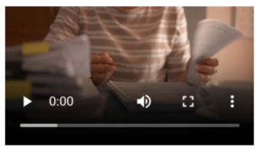

## Bruk

`Video` brukes til å vise en videospiller i applikasjonen din. Den kan brukes frittstående eller som en
mediekomponent i [Cards-komponenten]().

### Anatomi



En standard videospiller inkluderer vanligvis:

1. Videovisningsområde
2. Spill/pause-kontroller
3. Fremdriftsindikator
4. Volumkontroll
5. Fullskjermknapp

Videokomponenten er en enkel innpakning rundt [Videoelementet i HTML](https://developer.mozilla.org/en-US/docs/Web/HTML/Element/video),
og det visuelle utseendet vil variere avhengig av nettleser, operativsystem og andre faktorer.
Skjermbildet ovenfor ble tatt fra Chrome-nettleseren.

### Relatert

- [Cards]() - Kan bruke Videokomponenten som medieinnhold
- [Image]() - Bildekomponent
- [Audio]() - Lydspillerkomponent

## Egenskaper

Følgende er en liste over tilgjengelige egenskaper for {}.

{}
Vi oppdaterer for øyeblikket hvordan vi implementerer komponenter. Listen over egenskaper kan derfor være noe unøyaktig.
{}

| **Egenskap**                   | **Type** | **Beskrivelse**                                                                                                         |
|--------------------------------|----------|-------------------------------------------------------------------------------------------------------------------------|
| `textResourceBindings.altText` | string   | Alternativ tekst som vises for skjermlesere                                                                             |
| `video.src`                    | object   | Et objekt som inneholder videofilene som skal spilles. Nøkkelen er språkkoden, og verdien er URL-en til videofilen.     |

## Konfigurering

{}
Vi oppdaterer for øyeblikket Altinn Studio med flere muligheter for innstillinger!
 Dokumentasjonen oppdateres fortløpende, men det kan være flere innstillinger tilgjengelig enn det som beskrives her
og noen innstillinger kan være i betaversjon.
{}

### Legg til komponent




Du kan legge til en komponent i [Altinn Studio Designer]() ved å dra den fra
komponent-listen til sideområdet.
Når du velger komponenten, vises innstillingspanelet for den.




Grunnleggende komponent:


App/ui/layouts/{page}.json


```json{hl_lines="6-"}
{
  "$schema": "https://altinncdn.no/toolkits/altinn-app-frontend/4/schemas/json/layout/layout.schema.v1.json",
  "data": {
    "layout": [
      {
        "id": "myVideo",
        "type": "Video",
        "textResourceBindings": {
          "altText": "Alternativ tekst for videoen (for skjermlesere)"
        },
        "video": {
          "src": {
            "en": "https://example.com/video.mp4",
            "nb": "/org/app/assets/video.mp4"
          }
        }
      }
    ]
  }
}
```




