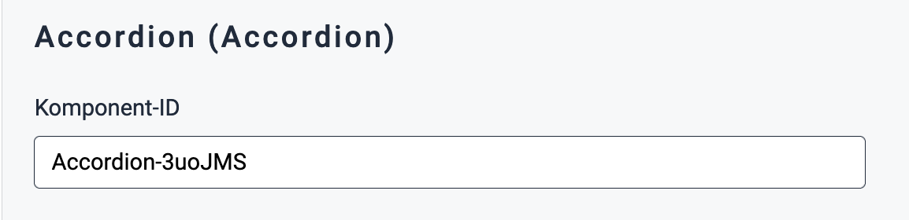
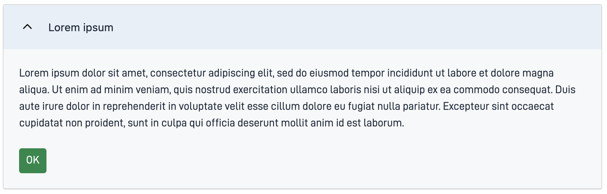

{}
🚧 Denne dokumentasjonen er under oppdatering.
{}

---

## Bruk

Accordion er en trekkspill-komponent som lar brukere utvide og lukke seksjoner med innhold ved å klikke på overskriften,
noe som gir en plassbesparende og organisert måte å presentere informasjon på.

### Anatomi

<iframe style="border: 0px solid rgba(0, 0, 0, 0);" width="100%" height="250" src="https://embed.figma.com/proto/ycDW0BPrMDW3SKZ56de4hY/https%3A%2F%2Fdocs.altinn.studio?page-id=0%3A1&node-id=1320-9369&viewport=634%2C2793%2C0.78&scaling=contain&content-scaling=responsive&starting-point-node-id=1320%3A9369&show-proto-sidebar=0&embed-host=share&hide-ui=true" allowfullscreen></iframe>

<iframe style="border: 0px solid rgba(0, 0, 0, 0);" width="100%" height="300" src="https://embed.figma.com/proto/ycDW0BPrMDW3SKZ56de4hY/https%3A%2F%2Fdocs.altinn.studio?page-id=0%3A1&node-id=1-4275&viewport=634%2C2793%2C0.78&scaling=contain&content-scaling=responsive&starting-point-node-id=1%3A4275&show-proto-sidebar=0&embed-host=share&hide-ui=true" allowfullscreen></iframe>

{}

1. **Overskrift**: Den klikkbare seksjonstittelen som brukere samhandler med for å utvide eller lukke innholdet.
2. **Innholdsområde**: Området som utvider eller kollapser, som viser eller skjuler ytterligere informasjon når overskriften klikkes.
   {}

<!--
Legg til følgende seksjoner dersom de er relevante:

### Oppførsel

(Hvordan komponenten oppfører seg i ulike sammenhenger.)

### Stil

(Visuell styling, e.g. plassering, padding, "dos and don'ts")

### Beste praksis

(Bransjestandarder, "dos and don'ts")

### Veiledning for innhold

(E.g. regler for tegnsetting, standard etiketter, etc.)

-->

### Relatert

- [`AccordionGroup`](#accordiongroup) - Brukes til å gruppere flere Accordion-komponenter sammen

## Egenskaper

| **Egenskap**                 | **Type** | **Beskrivelse**                                                                              |
| ---------------------------- | -------- | -------------------------------------------------------------------------------------------- |
| `children`                   | array    | En array med ID'en til komponenter som tilhører gruppen. **Enum:** `"Paragraph" \| "Button"` |
| `textResourceBindings.title` | string   | Klikkbar seksjonstittel                                                                      |
| `openByDefault`              | boolean  | Åpent eller stengt modus på accordion fra start                                              |
| `headingLevel`               | integer  | Størrelse på header. Standard er `"2"`. **Enum:** `"2" \| "3" \| "4" \| "5" \| "6"`          |

<!-- Følgende er en liste over tilgjengelige egenskaper for {}. Listen er automatisk generert basert på komponentens JSON schema (se link).

{}
Vi oppdaterer for øyeblikket hvordan vi implementerer komponenter. Listen over egenskaper kan derfor være noe unøyaktig.
{}

<!-- Shortkoden `component-props` genererer automatisk en liste over komponentegenskaper fra komponentens JSON schema.
Komponentnavnet kan gis eksplisitt som argument (f.eks. `component-props "Grid"`).
Hvis ingen argument gis, henter shortkoden komponentnavnet fra 'schemaname' i frontmatter.

{}
-->

## Konfigurering

### Legg til komponent

Du kan legge til en komponent i [Altinn Studio Designer](/nb/altinn-studio/v8/getting-started/) ved å dra den fra venstre sidepanel til midten av siden.
Når du velger komponenten, vises et panel med innstillinger for den på høyre side.

### Innstillinger i Altinn Studio Designer

{}
Vi oppdaterer for øyeblikket Altinn Studio med flere muligheter for innstillinger!
Dokumentasjonen oppdateres fortløpende, men det kan være flere innstillinger tilgjengelig enn det som beskrives her og noen innstillinger kan være i betaversjon.
{}




Innstillinger for egenskaper tilgjengelig i Altinn Studio Designer.

{}
**NB!** Accordions egenskap `children` må [legges til manuelt](#children) for å unngå feilmelding.
{}



- **Komponent-ID** (`id`): Automatisk generert komponent-ID (kan redigeres).




Korresponderende innstillinger i sidens JSON-fil.


App/ui/layouts/{page}.json


```json{hl_lines="6-9"}
...

{
  "data": {
    "layout": [
       {
        "id": "Accordion-3uoJMS",
        "type": "Accordion"
      }
    ]
  }
}
```




### Legg til overskrift og underelementer

<br>

#### `textResourceBindings.title`

Overskriften for Accordion kan legges til som en tekst direkte eller refereres via en tekstnøkkel til en [tekstressurs](/nb/altinn-studio/v8/reference/ux/texts/#legge-til-og-endre-tekster-i-en-app).

#### `children`

Spesifiser hvilke komponenter du vil kunne ekspandere ved å legge deres ID-er i en array under `children`.

Følgende typer kan legges til en `Accordion`:

- `Paragraph`
- `Button`

<br>

#### Eksempel

Accordion med et avsnitt og en knapp som underelementer.





App/ui/layouts/{page}.json


```json{hl_lines=["9-12"]}
...

{
  "data": {
    "layout": [
       {
        "id": "Accordion-3uoJMS",
        "type": "Accordion",
        "textResourceBindings": {
          "title": "Lorem ipsum"
        },
        "children": ["lorem-ipsum", "ok-button"]
      },
      {
        "id": "lorem-ipsum",
        "type": "Paragraph",
        "textResourceBindings": {
          "title": "Paragraph.loremIpsum1"
        },
        "dataModelBindings": {}
      },
      {
        "id": "ok-button",
        "type": "Button",
        "dataModelBindings": {},
        "textResourceBindings": {
          "title": "OK"
        }
      }
    ]
  }
}
```






### Nivå for overskrift

Standard nivå for overskrift er `2`. For å endre, legg til egenskapen `headingLevel` som i eksempelet under.
`headingLevel` kan ta verdiene `2 | 3 | 4 | 5 | 6`.





App/ui/layouts/{page}.json


```json{hl_lines="13"}
...

{
  "data": {
    "layout": [
       {
        "id": "Accordion-3uoJMS",
        "type": "Accordion",
        "textResourceBindings": {
          "title": "Lorem ipsum"
        },
        "children": ["lorem-ipsum", "ok-button"],
        "headingLevel": 3
      },
      ...
    ]
  }
}
```




---

## AccordionGroup

`AccordionGroup` brukes til å gruppere relaterte `Accordion`-komponenter sammen.

### Anatomi

<iframe style="border: 0px solid rgba(0, 0, 0, 0);" width="100%" height="200" src="https://embed.figma.com/proto/ycDW0BPrMDW3SKZ56de4hY/https%3A%2F%2Fdocs.altinn.studio?page-id=0%3A1&node-id=1388-7863&viewport=634%2C2793%2C0.78&scaling=contain&content-scaling=responsive&starting-point-node-id=1388%3A7863&show-proto-sidebar=0&embed-host=share&hide-ui=true
" allowfullscreen></iframe>

<iframe style="border: 0px solid rgba(0, 0, 0, 0);" width="100%" height="300" src="https://embed.figma.com/proto/ycDW0BPrMDW3SKZ56de4hY/https%3A%2F%2Fdocs.altinn.studio?page-id=0%3A1&node-id=1388-8448&viewport=634%2C2793%2C0.78&scaling=contain&content-scaling=responsive&starting-point-node-id=1388%3A8448&show-proto-sidebar=0&embed-host=share&hide-ui=true
" allowfullscreen></iframe>

{}
1. **AccordionGroup**: Gruppering av to eller flere Accordion-komponenter.
2. **Overskrift**: Den klikkbare seksjonstittelen som brukere samhandler med for å utvide eller lukke innholdet.
3. **Innholdsområde**: Området som utvider eller kollapser, som viser eller skjuler ytterligere informasjon når overskriften klikkes.

**Merk**: Overskrift og innholdsområde er egenskaper ved `Accordion` underelementer.

{}

### Relatert

- [`Accordion`](#bruk) - Enkelt accordion-komponent

## AccordionGroup Egenskaper

| **Egenskap** | **Type**                                       | **Beskrivelse** |
|--------------|------------------------------------------------|-----------------|
| `children`   | array | En array med ID'en til komponenter som tilhører gruppen. **Enum:** `"Accordion"` |

## AccordionGroup Konfigurering

### Legg til komponent

Du kan legge til en komponent i [Altinn Studio Designer](/nb/altinn-studio/v8/getting-started/) ved å dra den fra venstre sidepanel til midten av siden.
Når du velger komponenten, vises et panel med innstillinger for den på høyre side.

### Innstillinger i Altinn Studio Designer

{}
Vi oppdaterer for øyeblikket Altinn Studio med flere muligheter for innstillinger!
 Dokumentasjonen oppdateres fortløpende, men det kan være flere innstillinger tilgjengelig enn det som beskrives her og noen innstillinger kan være i betaversjon.
{}




Innstillinger for egenskaper tilgjengelig i Altinn Studio Designer.

{}
**NB!** For å unngå feilmelding må egenskapen `children` legges til i koden.
 Se [Legg til underelementer](#legg-til-underelementer-accordiongroup)
{}


- **Komponent-ID** (`id`): Automatisk generert komponent-ID (kan redigeres).




Korresponderende innstillinger i sidens JSON-fil.

{}
**NB!** For å unngå feilmelding må egenskapen `children` legges til i koden.
 Se [Legg til underelementer](#legg-til-underelementer-accordiongroup)
{}


App/ui/layouts/{page}.json


```json{hl_lines=""}
{
  "data": {
    "layout": [
      {
        "id": "accordion-group",
        "type": "AccordionGroup"
      }
    ]
  }
}
```




### Legg til underelementer {#legg-til-underelementer-accordiongroup}

Spesifiser hvilke komponenter av typen `Accordion` du vil gruppere ved å legge til deres komponent-ID-er til `children`-egenskapen som vist under.
`Accordion`-komponentene må legges til den samme siden.
 Rekkefølgen på komponentene i gruppen bestemmes av rekkefølgen på komponent-ID-ene i `children`.





App/ui/layouts/{page}.json


```json{hl_lines=""}
...
{
  "data": {
    "layout": [
      {
        "id": "accordion-group",
        "type": "AccordionGroup",
        "children": [
          "accordion1",
          "accordion2"
        ]
      },
      ...
    ]
  }
}
...
```




## AccordionGroup Eksempel





App/ui/layouts/{page}.json


```json{hl_lines=""}
{
  "$schema": "https://altinncdn.no/toolkits/altinn-app-frontend/4/schemas/json/layout/layout.schema.v1.json",
  "data": {
    "layout": [
      {
        "id": "accordion-group",
        "type": "AccordionGroup",
        "children": [
          "accordion1",
          "accordion2"
        ]
      },
      {
        "id": "accordion1",
        "type": "Accordion",
        "textResourceBindings": {
          "title": "Lorem ipsum"
        },
        "children": [
          "paragraph1",
          "ok-button"
        ]
      },
      {
        "id": "accordion2",
        "type": "Accordion",
        "textResourceBindings": {
          "title": "To avsnitt"
        },
        "headingLevel": 2,
        "children": [
          "paragraph2",
          "paragraph3"
        ]
      },
      {
        "id": "paragraph1",
        "type": "Paragraph",
        "textResourceBindings": {
          "title": "text.loremIpsum"
        },
        "dataModelBindings": {}
      },
      {
        "id": "paragraph2",
        "type": "Paragraph",
        "textResourceBindings": {
          "title": "Dette er et avsnitt."
        },
        "dataModelBindings": {}
      },
      {
        "id": "paragraph3",
        "type": "Paragraph",
        "textResourceBindings": {
          "title": "Dette er et annet avsnitt."
        },
        "dataModelBindings": {}
      },
      {
        "id": "ok-button",
        "type": "Button",
        "dataModelBindings": {},
        "textResourceBindings": {
          "title": "OK"
        }
      }
    ]
  }
}
```




