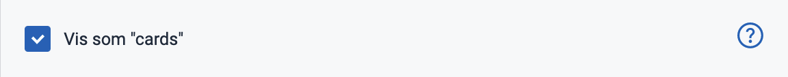
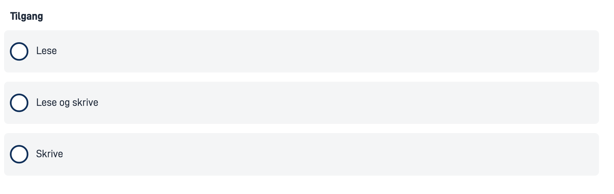

{}
🚧 This documentation is a work in progress.
{}

---

## Usage

Radio buttons are often used in forms to collect input from the user where they need to choose only one of several options from a list.

### Anatomy

<iframe style="border: 0px solid rgba(0, 0, 0, 0.1);" width="100%" height="100%" src="https://embed.figma.com/proto/ycDW0BPrMDW3SKZ56de4hY/Link-fra-Figma-til-Docs?page-id=0%3A1&node-id=1-45753&viewport=-2494%2C-11061%2C1.8&scaling=contain&content-scaling=responsive&starting-point-node-id=1%3A45753&show-proto-sidebar=0&embed-host=share&hide-ui=true" allowfullscreen></iframe>

{}
1. **Title** - Question or instruction.
2. **Current Selection** - Indicates the selected option.
3. **Option** - Enables this option and disables the current selection.
4. **Label** - Text label associated with the radio button.
{}

### Style

* Radio buttons should always have an associated label on the right side.

### Best Practices

- List options in a logical order:
  - most likely to least likely to be selected
  - simplest to most complex operation
  - least to most risk
- Preselect one option. Choose the safest, most secure, and private option first. If safety and security are not important, choose the most likely or convenient option.
- If users should have the option to avoid making a selection, add a "None" (or equivalent) option.
- If you cannot have a list of all possible options, add an "Other" option.
- Avoid alphabetical sorting as it is language-dependent and not localizable.
- Avoid overlapping options. For example, Select age: 0-20, 20-40 — What do you choose if your age is 20?
- Include all relevant options. For example, Select age: Below 20, Above 20 — What do you choose if you are 20?

### Content guidelines

* Keep labels short and descriptive.
* Start all labels with a capital letter.
* Do not include punctuation after labels.

### Related

* For a more compact way to display multiple options with single selection, use [Dropdown](/en/altinn-studio/v8/reference/ux/components/dropdown/).
* If users can choose multiple options from a list, use [Checkboxes](/en/altinn-studio/v8/reference/ux/components/checkboxes/).
* For a more compact way to display multiple options with multiple selection, use [MultipleSelect](/en/altinn-studio/v8/reference/ux/components/multipleselect/).

## Properties

The following is an autogenerated list of the properties available for {} based on the component's JSON schema file.

{}
We are currently updating how we implement components, and the list of properties may not be entirely accurate.
{}

<p><p><strong>Required properties: </strong><code>id</code>,<code>type</code></p><div class="adocs-property-table">
<table>
<tr>
<th><strong>Property</strong></th>
<th><strong>Type</strong></th>
<th><strong>Description</strong></th>
</tr><tr class="main-prop">
<td><h4><code>id</code></h4></td>
<td>string</td>
<td>The component ID. Must be unique within all layouts/pages in a layout-set. Cannot end with &lt;dash&gt;&lt;number&gt;.<br></td></p>
</tr><tr class="main-prop">
    <td><h4><code>type</code></h4></td>
    <td>string</td>
    <td>The component type.<br></td>
</tr><tr class="main-prop">
    <td><h4><code>basicDataModelBindings</code></h4></td>
    <td>object</td>
    <td>Data model bindings for component<br></td>
</tr><tr class="sub-prop">
    <td><code>basicDataModelBindings.simpleBinding</code></td>
    <td>string</td>
    <td>Data model binding for components connection to a single field in the data model<br></td>
</tr><tr class="main-prop">
    <td><h4><code>basicTextResources</code></h4></td>
    <td>object</td>
    <td>Text resource bindings for a component.<br></td>
</tr><tr class="sub-prop">
    <td><code>basicTextResources.description</code></td>
    <td>string</td>
    <td>The description text for the component<br></td>
</tr><tr class="sub-prop">
    <td><code>basicTextResources.help</code></td>
    <td>string</td>
    <td>The help text for the component<br></td>
</tr><tr class="sub-prop">
    <td><code>basicTextResources.shortName</code></td>
    <td>string</td>
    <td>The short name for the component (used in validation messages) (optional). If it is not specified, &#39;title&#39; text is used.<br></td>
</tr><tr class="sub-prop">
    <td><code>basicTextResources.tableTitle</code></td>
    <td>string</td>
    <td>The text shown in column title when component is used in repeating group (optional). If it is not specified, &#39;title&#39; text is used.<br></td>
</tr><tr class="sub-prop">
    <td><code>basicTextResources.title</code></td>
    <td>string</td>
    <td>The title/label text for the component<br></td>
</tr><tr class="main-prop">
    <td><h4><code>required</code></h4></td>
    <td>boolean</td>
    <td>Boolean or expression indicating if the component is required when filling in the form. Defaults to false.<br></td>
</tr><tr class="main-prop">
    <td><h4><code>readOnly</code></h4></td>
    <td>boolean</td>
    <td>Boolean or expression indicating if the component should be presented as read only. Defaults to false. &lt;br /&gt; &lt;i&gt;Please note that even with read-only fields in components, it may currently be possible to update the field by modifying the request sent to the API or through a direct API call.&lt;i/&gt;<br></td>
</tr><tr class="sub-prop">
    <td><code>options.label</code></td>
    <td>string</td>
    <td>The option label. Can be plain text or a text resource binding.<br></td>
</tr><tr class="sub-prop">
    <td><code>options.value</code></td>
    <td>string</td>
    <td>The option value.<br></td>
</tr><tr class="main-prop">
    <td><h4><code>optionsId</code></h4></td>
    <td>string</td>
    <td>Reference to connected options by id.<br></td>
</tr><tr class="main-prop">
    <td><h4><code>autocomplete</code></h4></td>
    <td>string</td>
    <td>The HTML autocomplete attribute lets web developers specify what if any permission the user agent has to provide automated assistance in filling out form field values, as well as guidance to the browser as to the type of information expected in the field.<br><strong>Enum: </strong>[on, off, name, honorific-prefix, given-name, additional-name, family-name, honorific-suffix, nickname, email, username, new-password, current-password, one-time-code, organization-title, organization, street-address, address-line1, address-line2, address-line3, address-level4, address-level3, address-level2, address-level1, country, country-name, postal-code, cc-name, cc-given-name, cc-additional-name, cc-family-name, cc-number, cc-exp, cc-exp-month, cc-exp-year, cc-csc, cc-type, transaction-currency, transaction-amount, language, bday, bday-day, bday-month, bday-year, sex, tel, tel-country-code, tel-national, tel-area-code, tel-local, tel-extension, url, photo]<br></td>
</tr><tr class="main-prop">
    <td><h4><code>grid</code></h4></td>
    <td>object</td>
    <td>Settings for the components grid. Used for controlling horizontal alignment.<br><strong>Example(s): </strong><code>{xs: 12}</code><br><tr class="sub-prop">
    <td><code>gridSettings.innerGrid</code></td>
    <td>gridProps</td>
    <td>Optional grid for inner component content like input field or dropdown. Used to avoid inner content filling the component width.<br><strong>Example(s): </strong><code>{xs: 12}</code><br></b><strong>See</strong>: <a href="/nb/altinn-studio/v8/reference/ux/components/commondefs#gridProps">gridProps</a><br></td>
</tr><tr class="sub-prop">
    <td><code>gridSettings.labelGrid</code></td>
    <td>gridProps</td>
    <td>Optional grid for the component label. Used in combination with innerGrid to align labels on the side.<br><strong>Example(s): </strong><code>{xs: 12}</code><br></b><strong>See</strong>: <a href="/nb/altinn-studio/v8/reference/ux/components/commondefs#gridProps">gridProps</a><br></td>
</tr></td>
</tr><tr class="main-prop">
    <td><h4><code>hidden</code></h4></td>
    <td>boolean</td>
    <td>Boolean value or expression indicating if the component should be hidden. Defaults to false.<br></td>
</tr><tr class="main-prop">
    <td><h4><code>mapping</code></h4></td>
    <td>mapping</td>
    <td>Optionally used to map options<br><tr class="main-prop">
    <td><h4><code>mapping</code></h4></td>
    <td>object</td>
    <td>Mapping<br><strong>Example(s): </strong><code>{some.source.field: key1}</code><br></td>
</tr></td>
</tr><tr class="main-prop">
    <td><h4><code>pageBreak</code></h4></td>
    <td>object</td>
    <td><br></td>
</tr><tr class="sub-prop">
    <td><code>pageBreak.breakAfter</code></td>
    <td>string</td>
    <td>PDF only: Value or expression indicating whether a page break should be added after the component. Can be either: &#39;auto&#39; (default), &#39;always&#39;, or &#39;avoid&#39;.<br><strong>Example(s): </strong><code>auto</code>,<code>always</code>,<code>avoid</code><br></td>
</tr><tr class="sub-prop">
    <td><code>pageBreak.breakBefore</code></td>
    <td>string</td>
    <td>PDF only: Value or expression indicating whether a page break should be added before the component. Can be either: &#39;auto&#39; (default), &#39;always&#39;, or &#39;avoid&#39;.<br><strong>Example(s): </strong><code>auto</code>,<code>always</code>,<code>avoid</code><br></td>
</tr><tr class="main-prop">
    <td><h4><code>preselectedOptionIndex</code></h4></td>
    <td>integer</td>
    <td>Sets a preselected index.<br></td>
</tr><tr class="main-prop">
    <td><h4><code>renderAsSummary</code></h4></td>
    <td>boolean</td>
    <td>Boolean or expression indicating if the component should be rendered as a summary. Defaults to false.<br></td>
</tr><tr class="main-prop">
    <td><h4><code>secure</code></h4></td>
    <td>boolean</td>
    <td>Boolean value indicating if the options should be instance aware. Defaults to false. See more on docs: https://docs.altinn.studio/app/development/data/options/<br></td>
</tr><tr class="main-prop">
    <td><h4><code>showAsCard</code></h4></td>
    <td>boolean</td>
    <td>Boolean value indicating if the options should be displayed as cards. Defaults to false.<br></td>
</tr><tr class="main-prop">
    <td><h4><code>source</code></h4></td>
    <td>object</td>
    <td>Object to define a data model source to be used as basis for options. Can not be used if options or optionId is set. See more on docs: https://docs.altinn.studio/app/development/data/options/<br></td>
</tr><tr class="sub-prop">
    <td><code>source.description</code></td>
    <td>string</td>
    <td>A description of the option displayed in Radio- and Checkbox groups. Can be plain text or a text resource binding.<br><strong>Example(s): </strong><code>some.text.key</code>,<code>My Description</code><br></td>
</tr><tr class="sub-prop">
    <td><code>source.group</code></td>
    <td>string</td>
    <td>The repeating group to base options on.<br><strong>Example(s): </strong><code>model.some.group</code><br></td>
</tr><tr class="sub-prop">
    <td><code>source.helpText</code></td>
    <td>string</td>
    <td>A help text for the option displayed in Radio- and Checkbox groups. Can be plain text or a text resource binding.<br><strong>Example(s): </strong><code>some.text.key</code>,<code>My Help Text</code><br></td>
</tr><tr class="sub-prop">
    <td><code>source.label</code></td>
    <td>string</td>
    <td>Reference to a text resource to be used as the option label.<br><strong>Example(s): </strong><code>some.text.key</code><br></td>
</tr><tr class="sub-prop">
    <td><code>source.value</code></td>
    <td>string</td>
    <td>Field in the group that should be used as value<br><strong>Example(s): </strong><code>model.some.group[{0}].someField</code><br></td>
</tr></table>
    </div>

## Configuration

{}
We are currently updating Altinn Studio Designer with more configuration options!
 The documentation is continuously updated, and there may be more settings available than what is described here, and some settings may be in beta version.
{}

### Add component




You can add a component in [Altinn Studio Designer](/en/altinn-studio/v8/getting-started/) by dragging it from the list of components to the page area.
Selecting the component brings up its configuration panel.




Basic component:


App/ui/layouts/{page}.json


```json{hl_lines="6-9"}
{
  "$schema": "https://altinncdn.no/toolkits/altinn-app-frontend/4/schemas/json/layout/layout.schema.v1.json",
  {
    "data": {
      "layout": [
        {
          "id": "radio-buttons",
          "type": "RadioButtons"
        }
      ]
    }
  }
}
```

















### Show as card (`showAsCards`)

Displays each radio button on a light gray background when checked (`true`).










App/ui/layouts/{page}.json


```json{hl_lines="4"}
{
  "id": "komponent-id",
  ...
  "showAsCard": true
}
```















<!-- ## Examples -->
