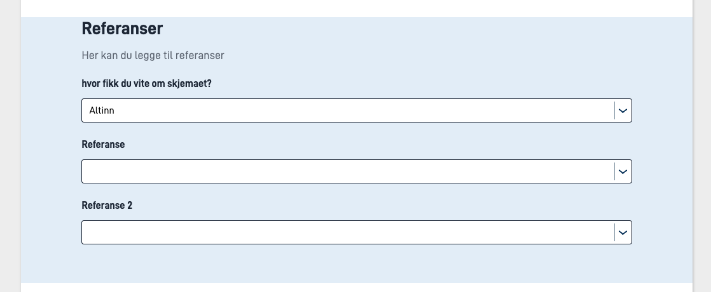
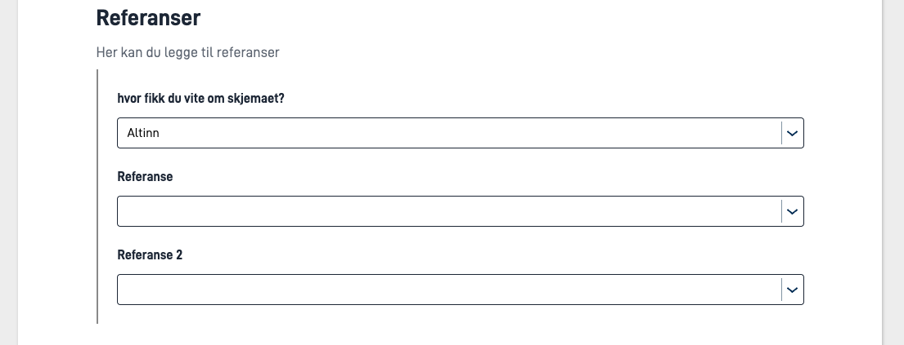

Fields in a form can be set up to be part of a _group_. This can be used to e.g. set up dynamics on multiple
fields/components at once, instead of having to configure them for each single field. Visually, a group of fields will
not look much different than configuring individual fields.

A group is set up in `FormLayout.json`, together with the other components in the form. This can be done manually
directly in the file, or through form editor in Altinn Studio by using the group component.

Here is an example of a (non-repeating) group configuration that contains two fields:
A group is defined as follows in `FormLayout.json`:

```json {hl_lines=[4,"6-7",11,22]}
[
  {
    "id": "<unique-id>",
    "type": "Group",
    "children": [
      "field1",
      "field2"
    ]
  },
  {
    "id": "field1",
    "type": "Input",
    "textResourceBindings": {
      "title": "Field 1"
    },
    "dataModelBindings": {
      "simpleBinding": "field1"
    },
    "required": true
  },
  {
    "id": "field2",
    "type": "Input",
    "textResourceBindings": {
      "title": "Field 2"
    },
    "dataModelBindings": {
      "simpleBinding": "field2"
    },
    "required": true
  }
]
```




## Parameters

| Parameter                                     | Required | Description                                                                                                                                                                |
|-----------------------------------------------|----------|----------------------------------------------------------------------------------------------------------------------------------------------------------------------------|
| id                                            | Yes      | Unique ID, same as ID on other components. Must be unique in the layout file, and should be unique across pages.                                                           |
| type                                          | Yes      | Must be 'Group'                                                                                                                                                            |
| [textResourceBindings](#textresourcebindings) | No       | Can be set for groups, see [description](#textresourcebindings).                                                                                                           |
| children                                      | Yes      | List of the component IDs that are to be included in the group.                                                                                                            |
| groupingIndicator                             | No       | Can be `"indented"` or `"panel"`. Indent shows a vertical line to the left of the group, and panel shows the group as a blue panel to indicate that the fields are related.  |

## textResourceBindings

It is possible to add different keys in textResourceBindings:

- `title` - Sets the group title. If not set, the components in the group will display just as if they were not part of a group (with no title above them)
- `description` - Sets the group body text. This is displayed below the title, and above the components in the group.

## Visual grouping of components

It is possible to visually group components together. This can be done by setting the `groupingIndicator` parameter to `indent` or `panel` on the group component.

### Panel



### Indented






## Parameters

| Parameter                                     | Required | Description                                                                                                                                                    |
|-----------------------------------------------|----------|----------------------------------------------------------------------------------------------------------------------------------------------------------------|
| id                                            | Yes      | Unique ID, same as ID on other components. Must be unique in the layout file, and should be unique across pages.                                               |
| type                                          | Yes      | Must be 'Group'                                                                                                                                                |
| [textResourceBindings](#textresourcebindings) | No       | Can be set for groups, see [description](#textresourcebindings).                                                                                               |
| maxCount                                      | No       | The number of times a group can repeat. Must be omitted or set to `0` for non-repeating groups, otherwise the group becomes a [repeating group](/en/altinn-studio/v8/reference/ux/fields/grouping/repeating/). |
| children                                      | Yes      | List of the component IDs that are to be included in the group.                                                                                                |
| showGroupingIndicator                         | No       | Shows a vertical line to the left of the group to indicate that the fields are related. Can be `true` or `false`.                                              |

## textResourceBindings

It is possible to add different keys in textResourceBindings:

- `title` - Sets the group title. If not set, the components in the group will display just as if they were not part of a group (with no title above them)
- `body` - Sets the group body text. This is displayed below the title, and above the components in the group.
  


