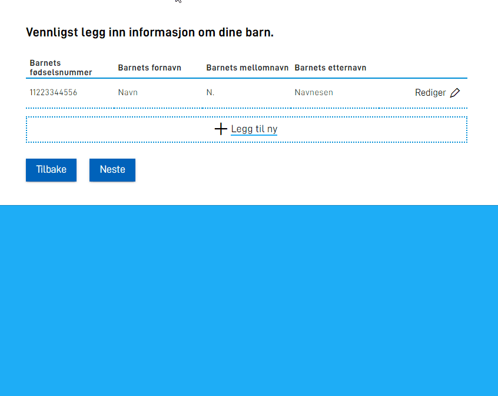

## Flere sider innad i gruppe-visning

{} Denne funksjonaliteten er p.t. kun tilgjengelig for repeterende grupper. Visning av gruppe over
flere sider inne i redigerings-flaten til gruppen støttes KUN for grupper på øverste nivå, og støttes ikke
for grupper i grupper. {}

Når man skal legge inn data i en gruppe, kan det være tilfeller der hvert element i gruppen inneholder mange felter, og at det dermed blir mye scrolling
og uoversiktlig for sluttbruker. For å løse dette er det innført en mulighet til å dele opp utfyllingen over flere visninger, som bruker kan navigere
frem/tilbake mellom mens de fyller ut gruppe-elementet. Navigeringen her skjer innad i en layout, og oppdaterer
kun visningen inne i redigeringsflaten for gruppen.

For å ta i bruk denne funksjonaliteten, må man _prefikse_ komponentene i `children` listen med et tall som tilsier hvilken "side" av utfyllingen
komponenten skal vises på, etterfulgt av `:`. Vi starter tellingen på `0`, dvs. at komponenter som skal vises på den første "siden" må prefikses med
`0:`. Komponenter som skal vises på den andre siden prefikses med `1:`. Osv. I tillegg må man sette `"multiPage": true` i `edit`-parameteren.
Se eksempel under:




```json {hl_lines=["5-8", "14-16"]} {linenos=inline}
{
  "id": "Some-group-id",
  "type": "RepeatingGroup",
  "children": [
    "0:fnr",
    "1:fornavn",
    "1:mellomnavn",
    "1:etternavn"
  ],
  "maxCount": 10,
  "dataModelBindings": {
    "group": "familie.barn"
  },
  "edit": {
    "multiPage": true,
    "mode": "hideTable",
  }
}
```




```json {hl_lines=["5-8", "14-16"]} {linenos=inline}
{
  "id": "Some-group-id",
  "type": "Group",
  "children": [
    "0:fnr",
    "1:fornavn",
    "1:mellomnavn",
    "1:etternavn"
  ],
  "maxCount": 10,
  "dataModelBindings": {
    "group": "familie.barn"
  },
  "edit": {
    "multiPage": true,
    "mode": "hideTable",
  }
}
```




Her har man også lagt inn en [mode](../edit#mode) som skjuler tabellen under redigering.
Resultatet blir som vist under.


