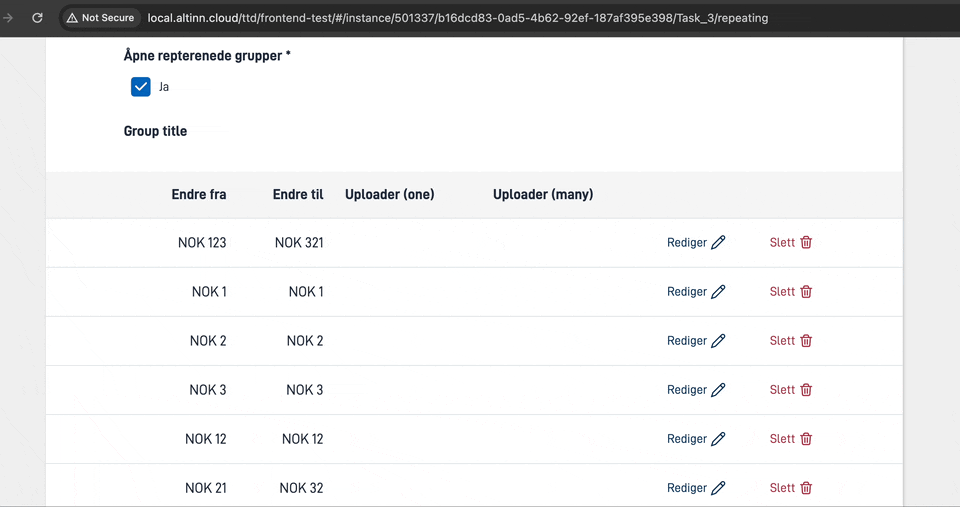
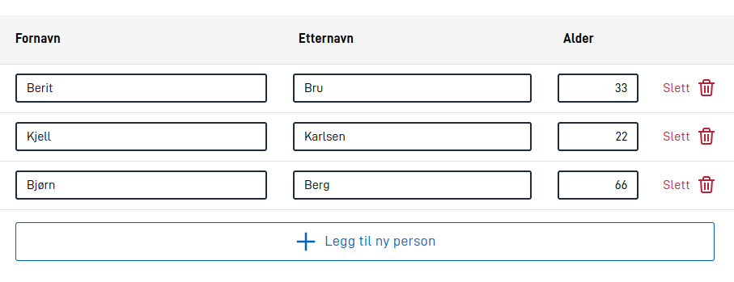
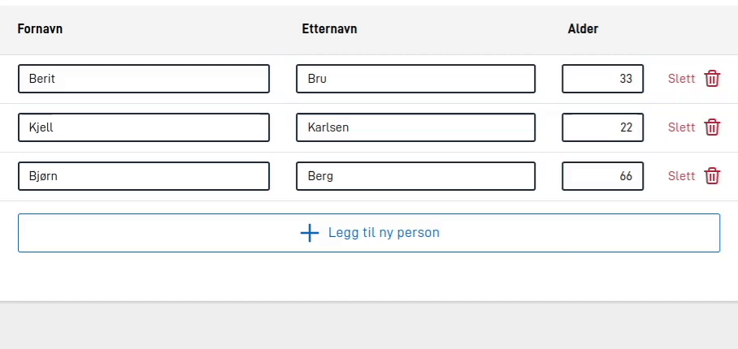
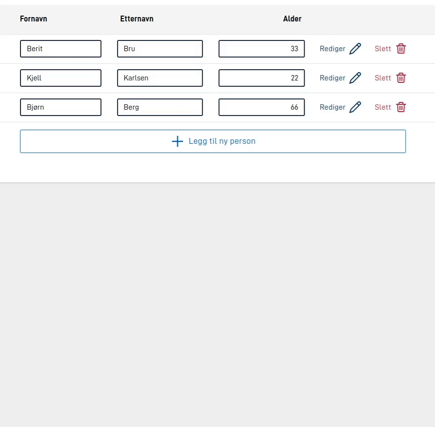

## Separat ledetekst for tabellvisning

Elementer i repeterende grupper som ikke er i redigeringsmodus vises som en tabell. I denne tabellvisningen er det begrenset plass til lange ledetekster. En kortere ledetekst for tabellvisninger kan settes ved å definere `tableTitle` under `textResourceBindings` for hver komponent i en repeterende gruppe.

Eksempel:

```json
{
  ...
  "type": "Input",
  "textResourceBindings": {
    "title": "Skriv inn ditt fulle navn",
    "tableTitle": "Navn"
  },
  ...
},
```

## Bredder, tekst-plassering og skjuling av overflødig tekst

Ved å bruke `tableColumns` er det mulig å konfigurere bredden, tekst plassering, og anntall linjer som vises før overfløding tekst skjules.

- `width` - streng verdi som inneholder en prosent, ex: `"25%"`, eller `"auto"` (default).
- `alignText` - velg mellom `"left"`, `"center"` eller `"right"` for å plassere tekst i celler tilsvarende.
- `textOverflow` - brukes for å kontrollere oppførsel når tekst innhold er for stort til å vises i en celle.
    - `lineWrap` - sett til `false` for å skru av skjuling av overflødig tekst. Standardverdi er `true`.
    - `maxHeight` - setter et maks antall tillatte linjer før tekst skjules med utellatelsestegn (...). `"maxHeight": 0` resulterer i å skru av skjuling av overflødig tekst.
- `editInTable` - settes til `true` for å tillate redigering av komponenten i tabellvisningen. Standardverdi er `false`. Se mer om dette i [seksjonen som beskriver denne funksjonaliteten](#).
- `showInExpandedEdit` - settes til `false` for å skjule komponenten i redigeringsmodus. Standardverdi er `true`. Se mer om dette i [seksjonen som beskriver denne funksjonaliteten](#).

Eksempel:

```json
{
  ...
  "tableHeaders": [
    "streetAdress",
    "postalNumber",
    "city"
  ],
  "tableColumns": {
    "streetAdress": {
      "width": "20%",
      "alignText": "left",
      "textOverflow": {
        "lineWrap": true, 
        "maxHeight": 1
      }
    },
    "postalNumber": {
      "alignText": "right"
    },
    "city": {
      "width": "auto",
      "alignText": "left",
      "textOverflow": {
        "lineWrap": true,
        "maxHeight": 3
      }
    }
  },
  ...
}
```


## Sticky tabell headere




Tabell-headerene kan gjøres "sticky" ved å sette `stickyHeaders`-egenskapen til true. Dette vil få hodene til å sitte fast
øverst på tabellen ved scrolling. Dette kan være nyttig for tabeller med mange rader, der headerene ikke lenger er
synlige når man scroller nedover tabellen.






## Visning av komponenter direkte i tabellen

Det er mulig å tillate redigering av komponenter direkte i tabellen. Dette kan gjøres ved å
sette `editInTable` til `true` for den komponenten som skal tillate redigering i tabellen, i [`tableColumns`-konfigurasjonen](#bredder-tekst-plassering-og-skjuling-av-overflødig-tekst). Dette er nyttig for komponenter og grupper som ikke er for
store, og hvor det ikke er nødvendig å åpne en egen redigeringsmodus for å redigere dataene. Rent visuelt kan dette
ligne på noen konfigurasjoner av [Grid-komponenten](/nb/altinn-studio/v8/reference/ux/components/grid/), men tillater brukeren å legge/til
fjerne rader i tabellen, og lagring av data mot en repeterende gruppe i datamodellen.



Det finnes flere nivåer av konfigurasjon for å tillate redigering i tabellen. Det er mulig å tillate en kombinasjon
av redigering i tabellen og redigering i utvidet redigeringsmodus. Det er også mulig å skjule enkelte komponenter i
den utvidede redigeringsmodusen og kun tillate redigering i tabellen.

### Redigering av alle felter i tabell
Om man ønsker å sette opp en repeterende gruppe hvor alle mulige felter skal redigeres i tabellen, finnes det en snarvei
for dette. Ved å sette [`edit.mode` til `onlyTable`](/nb/altinn-studio/v8/reference/ux/fields/grouping/repeating/edit#mode) blir alle felter i tabellen redigerbare. Merk at ikke alle komponenter
som kan vises i en repeterende gruppe er støttet i tabellen.
Se en fullstendig liste over komponenter som er støttet i tabell-modus under
dokumentasjonen for [Grid-komponenten](/nb/altinn-studio/v8/reference/ux/components/grid/).



Eksempelet over viser en repeterende gruppe hvor alle felter er redigerbare i tabellen. Merk at knappen for å endre
en rad forsvinner i denne modusen, siden alle felter er redigerbare direkte i tabellen.

### Redigering av noen felter i tabell
Man kan også sette opp en repeterende gruppe hvor noen felter skal redigeres i tabellen, mens andre felter skal redigeres
i den utvidede redigeringsmodusen. Dette gjøres ved å sette `editInTable` til `true` for de komponentene som skal
redigeres i tabellen, og `showInExpandedEdit` til `false` for de komponentene som skal skjules i den utvidede
redigeringsmodusen. Se detaljene om hvordan dette
settes i [dokumentasjonen for `tableColumns` over](#bredder-tekst-plassering-og-skjuling-av-overflødig-tekst).



Eksempelet over viser en repeterende gruppe hvor det er satt opp en kombinasjon av redigering i tabellen og redigering i
den utvidede redigeringsmodusen. De to første feltene (fornavn og etternavn) er satt opp til å bare være redigerbare i
tabellen, mens alder er satt opp til å være redigerbar i både tabellen og den utvidede redigeringsmodusen. Det siste
feltet (adresse) er satt opp til å være redigerbar kun i den utvidede redigeringsmodusen.

Konfigurasjonen for Group-komponenten i eksempelet over er som følger:




```json
{
  "id": "myRepeatingGroup",
  "type": "RepeatingGroup",
  "children": ["fornavn", "etternavn", "alder", "fullt-navn", "adresse"],
  "tableHeaders": ["fornavn", "etternavn", "alder"],
  "tableColumns": {
    "fornavn": {
      "editInTable": true,
      "showInExpandedEdit": false
    },
    "etternavn": {
      "editInTable": true,
      "showInExpandedEdit": false
    },
    "alder": {
      "editInTable": true
    }
  },
  "textResourceBindings": {
    "add_button": "person"
  },
  "dataModelBindings": {
    "group": "RepGroup.Personer"
  }
}
```




```json
{
  "id": "myRepeatingGroup",
  "type": "Group",
  "children": ["fornavn", "etternavn", "alder", "fullt-navn", "adresse"],
  "tableHeaders": ["fornavn", "etternavn", "alder"],
  "tableColumns": {
    "fornavn": {
      "editInTable": true,
      "showInExpandedEdit": false
    },
    "etternavn": {
      "editInTable": true,
      "showInExpandedEdit": false
    },
    "alder": {
      "editInTable": true
    }
  },
  "maxCount": 99999,
  "textResourceBindings": {
    "add_button": "person"
  },
  "dataModelBindings": {
    "group": "RepGroup.Personer"
  }
}
```



