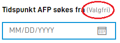

{}

Oppsett av denne funksjonaliteten må gjøres manuelt direkte i form layout inntil videre.

**MERK:** Denne funksjonaliteten krever app-frontend versjon 3. Se [denne lenken](/nb/community/changelog/app-frontend/v3/breaking-changes/).

{}

## Indikere at felt er valgfritt

Det er mulig å styre om et felt er markert som valgfritt eller ikke. Normal oppførsel er at felt som er påkrevd er markert
med en *, valgfrie felter har ingen markering.

.")

.")


Normal oppførsel kan overstyres ved hjelp av innstillinger knyttet til feltbeskrivelsen. Dette gjøres via `labelSettings` 
på en komponent i form layout.

```json
{
  {
    "id": "input-felt1",
    "type": "Input",
    ... 
    "labelSettings": {
      "optionalIndicator": true
    }
  }
}
```

Ved å sette `optionalIndicator` til `true` vil teksten `(Valgfri)` bli vist bak ledeteksten til feltet.



Det er ikke mulig å tvinge visning av *Valgfri* teksten på et felt som er obligatorisk. 
Denne innstillingen styrer ikke feltets faktiske egenskaper.

## Aktiver tegngrense

Det er mulig å aktivere en tegngrense for et tekstfelt. Dette gjøres ved å sette `maxLength`-egenskapen til en komponent i form layout.
Dette vil gi en tellevisning som angir antall gjenværende tegn. Her er eksmpel på en `Input`-komponent med en tegngrense på 10 tegn:

```json
{
  {
    "id": "input-felt1",
    "type": "Input",
    ... 
    "maxLength": 10
  }
}
```

_Merk_: Når du bruker `maxLength` på et felt i skjema-layouten, vil det kun indikere hvor mange tegn som gjenstår. Det vil ikke validere antallet tegn og bruker kan forsatt sende inn skjemaet selv om antall tegn er over grensen.
For å validere antall tegn må du også inkludere `maxLength`-egenskapen i datamodellen av skjemaet. Se [validering](/nb/altinn-studio/reference/logic/validation/) for mer informasjon. 


## Konfigurasjon av automatisk lagring

`Input`-komponenter, `TextArea`-komponenter og `Address` (`AddressComponent` i v3) lagrer automatisk endringer når brukeren
skriver. I utgangspunktet skjer dette 400 millisekunder etter brukeren sist stoppet å skrive. Når lagring av feltet
starter, vil også valideringer og triggere kjøres. I tilfeller hvor disse valideringene og triggere bruker mye resursser
kan det være ønskelig å øke tiden det tar det før data i feltet lagres automatisk - eller at denne funksjonaliteten
skrus av.

Funksjonaliteten styres av `saveWhileTyping`-nøkkelen til en komponent i form layout. I eksempelet under vil det
ta 2 sekunder fra brukeren slutter å skrive i feltet til dataene lagres.

```json {hl_lines=[6]}
{
  {
    "id": "input-felt1",
    "type": "Input",
    ... 
    "saveWhileTyping": 2000
  }
}
```

Hvis denne nøkkelen blir satt til `false` skrus funksjonaliteten av, og lagring vil skje først når brukeren
forlater feltet.