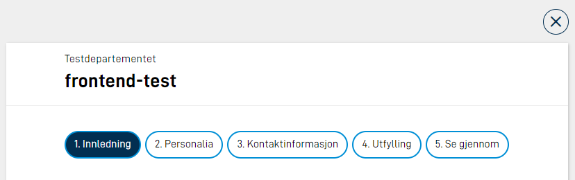

## Gå fra side til side med knapper

Brukerne flytter mellom sider i appen/skjemaet ved hjelp av navigasjonsknapper. Knappene legges til automatisk når du bruker Altinn Studio, men du kan også legge dem til manuelt i koden.

### Legge til navigasjonsknapper manuelt i layoutfilen (NavigationButtons)

Du legger inn navigasjonsknappene i alle layout-filer der det trengs. Hvis du vil at de skal vises nederst på siden, må du plassere dem nederst i layout-filen.

#### Eksempel på konfigurasjon:

```json
{
  "id": "nav-page2",
  "type": "NavigationButtons",
  "textResourceBindings": {
    "next": "next",
    "back": "back"
  },
  "showBackButton": true
}
```

### Parametere for NavigationButtons

| Parameter            | Beskrivelse                                                               |
| -------------------- | ------------------------------------------------------------------------- |
| id                   | Unik ID for komponenten.                                                  |
| type                 | Må være "NavigationButtons".                                              |
| textResourceBindings | Lar deg overstyre standardtekstene på knappene med egne tekster.          |
| showBackButton       | Valgfritt. Viser knappene Forrige og Neste i stedet for bare Neste-knapp. |

## Vise en sidemeny med rekkefølgen på sider/oppgaver

I koden definerer du rekkefølgen på sidene i `Settings.json` for layout-settet:

**Filplassering:** `App/ui/*/Settings.json`

```json
{
  "pages": {
    "order": ["side1", "side2"]
  }
}
```

**Skjule sider dynamisk:** Du kan skjule enkelte sider med [dynamiske uttrykk](/nb/altinn-studio/v8/reference/logic/expressions/#viseskjule-hele-sider).

## Gruppere sider

Du kan gruppere sider og vise dem i en sidemeny som alternativ til tradisjonell rekkefølge. Da erstatter du `pages.order` med `pages.groups`:

**Filplassering:** `App/ui/*/Settings.json`

```json
{
  "pages": {
    "groups": [
      {
        "name": "group.info",
        "type": "info",
        "order": ["info1", "info2"]
      },
      {
        "name": "group.form",
        "markWhenCompleted": true,
        "expandedByDefault": true,
        "order": ["side1", "side2", "side3"]
      },
      {
        "order": ["oppsummering"]
      }
    ]
  }
}
```

### Parametere for sidegrupper

| Parameter         | Beskrivelse                                                                                                |
| ----------------- | ---------------------------------------------------------------------------------------------------------- |
| name              | Tekstressurs som angir navnet på sidegruppen. Må være med hvis gruppen inneholder mer enn én side.         |
| type              | Valgfritt. Bruk "info" eller "default".                                                                    |
| markWhenCompleted | Valgfritt. Markerer sider som ferdig utfylt når alle valideringsfeil er rettet og brukeren har sett siden. |
| expandedByDefault | Valgfritt. Viser sidene i gruppen i sidenavigasjonen fra start. Standard er at sidene er skjult under gruppenavnet til brukeren åpner gruppen. |
| order             | Angir hvilke sider som inngår i gruppen.                                                                   |

## Vise arbeidsflyt og oppgaver i navigasjonsmenyen

### Vise arbeidsflyten ved å definere det i koden

Du kan vise hele arbeidsflyten i navigasjonsmenyen på to måter. I koden gjør du det slik:

- **For hele appen:** i `layout-sets.json` med `uiSettings.taskNavigation`
- **Per layout-sett:** i `Settings.json` med `pages.taskNavigation`

### Eksempel for hele appen:

**Filplassering:** `App/ui/layout-sets.json`

```json
{
  "uiSettings": {
    "taskNavigation": [
      {
        "name": "task.form",
        "taskId": "Task_1"
      },
      {
        "taskId": "Task_2"
      },
      {
        "type": "receipt"
      }
    ]
  }
}
```

### Parametere for stegene i arbeidsflyten

| Parameter | Beskrivelse                                                       |
| --------- | ----------------------------------------------------------------- |
| name      | Valgfri. Tekstressurs som angir navnet på oppgaven.               |
| taskId    | Hvilken oppgave det gjelder. Obligatorisk hvis ikke type er satt. |
| type      | "receipt". Obligatorisk hvis ikke taskId er satt.                 |

## Vise navigasjon fra Altinn Studio

I Studio har vi en egen navigasjonsmeny, som du kan legge til fra **Utforming**-siden. Du kan velge om du vil vise alle sidene/oppgavene i navigasjonen, eller bare de du velger ut.

### Legge til oppgaver i navigasjonen

1. Åpne appen du vil sette inn navigasjonsmeny for.
2. Klikk på **Utforming** i toppmenyen. Du kommer til Oversikt-siden for Utforming, der du ser de oppgavene som er tilgjengelige i appen.
3. Under **Andre innstillinger** ser du øverst en melding om at du ikke viser noen oppgaver i navigasjonsmenyen enda. Under den finner du en tabell med oppgaver som du kan velge å vise.
4. Velg **Vis alle oppgavene** hvis du vil ha med alle i navigasjonsmenyen. Du ser at de blir tilgjengelige i den øverste tabellen. Velg enkeltoppgaver med **Vis oppgaven** hvis du ikke vil ha med alle oppgavene.
5. Den øverste tabellen viser nå de oppgavene du har valgt å vise, og rekkefølgen de vises i.
   Du kan klikke på de tre prikkene til høyre for hver oppgave, og velge om du vil skjule enkeltoppgaver, eller flytte dem opp og ned for å endre rekkefølgen på oppgavene i navigasjonen. Her kan du også endre visningsnavnet for en oppgave og gå direkte til utforming av den.
6. Bruk knappen **Vis med navigasjonsmeny** for å forhåndsvise navigasjonsmenyen på venstre side i appen.

## Vise en fremdriftsindikator

En fremdriftsindikator er et lite visuelt hjul, som viser hvor langt brukerne har kommet med å fylle ut eller lese et skjema. Den kan være nyttig for å gi brukerne oversikt over totalt antall sider, og hvor de er i utfyllingen. Fremdriftsindikatoren vises øverst i det høyre hjørnet.

### Viktig å vite

[Oppgavene i arbeidsflyten](/nb/altinn-studio/v8/reference/configuration/process/) teller med i det totale antall sider i fremdriftsindikatoren. Hvis du har satt opp [sporvalg](/nb/altinn-studio/v8/reference/ux/pages/tracks/) eller [dynamisk skjulte sider](/nb/altinn-studio/v8/reference/logic/expressions#viseskjule-hele-sider), kan antallet sider variere mye og virke forvirrende for brukeren.

**Vurder om det gir mening og verdi for brukeren å legge til en fremdriftsindikator, før du velger å legge den til.**

### Legge til selve fremdriftsindikatoren

**Filplassering:** `App/ui/*/Settings.json`

```json
{
  "$schema": "https://altinncdn.no/toolkits/altinn-app-frontend/4/schemas/json/layout/layoutSettings.schema.v1.json",
  "pages": {
    "order": ["student-info", "school-work", "well-being"],
    "showProgress": true
  }
}
```

## Vise et navigasjonsfelt (NavigationBar)

Et navigasjonsfelt vises øverst på siden i en app/et skjema, og kan gjøre det enklere for brukerne å se alle sidene i appen. Det er viktig at du gir hver side gode navn, for at navigasjonsfeltet skal være nyttig.


### Hvordan fungerer det?

- **Store skjermer:** Alle sider blir vist i listen. Hvis det ikke er plass på én linje, fortsetter listen på neste linje.
- **Små skjermer:** Alle sider er skjult i en nedtrekksmeny. Den aktive siden vises i menyen. Brukerne kan klikke på menyen og få se alle sidene.

### Legge til navigasjonsfeltet i koden

Du legger til navigasjonsfeltet ved å legge inn koden for det i alle layout-filer der det skal brukes:

```json
{
  "id": "navbar-page1",
  "type": "NavigationBar"
}
```

### Vise nedtrekksmenyen på alle skjermer

I koden kan du sette opp at du vil vise sidene i navigasjonsfeltet som nedtrekksmeny, også på større skjermer:

```json
{
  "id": "navbar-page1",
  "type": "NavigationBar",
  "compact": true
}
```

### Endre tekstene på knappene i navigasjonsfeltet

Knappene i navigasjonfeltet henter navnet sitt fra filnavnet til siden, uten filutvidelsen. For eksempel blir `side1.json` og `side2.json` til knappene "side1" og "side2".

**Slik endrer du tekstene:**

Legg til tekster i `resources.XX.json`, der `id` er navnet på filen uten filutvidelsen:

```json
{
  "id": "side1",
  "value": "Første side"
},
{
  "id": "side2",
  "value": "Siste side"
}
```

## Angi validering ved sidebytte

Du kan legge inn kode for å sjekke om det er valideringsfeil når brukeren prøver å gå til neste side. _Valideringsfeil_ kan for eksempel bety at brukeren har glemt å fylle ut et felt eller har fylt det ut med informasjon med feil format. Hvis det er feil, stoppes navigeringen.

Du kan konfigurere dette på tre nivåer med ulik prioritet: globalt for hele appen, per layoutsett og per side. I tillegg kan NavigationButtons, CustomButton og NavigationBar konfigureres på komponentnivå.

### PageValidation-konfigurasjonen

Alle konfigurasjonsnivåer bruker samme objekt med to egenskaper:

```json
{
  "page": "current",
  "show": ["Required", "Schema"]
}
```

**page – hvilke sider som sjekkes:**

| Verdi | Beskrivelse |
| ----- | ----------- |
| `"current"` | Kun gjeldende side sjekkes. |
| `"currentAndPrevious"` | Gjeldende side og alle tidligere besøkte sider sjekkes. |
| `"all"` | Alle sider i layoutsettet sjekkes. |

**show – hvilke valideringstyper som vises:**

| Verdi | Beskrivelse |
| ----- | ----------- |
| `"Required"` | Påkrevde felter som ikke er fylt ut. |
| `"Schema"` | JSON Schema-feil på feltverdier. |
| `"Component"` | Komponentspesifikk validering (f.eks. ugyldig format). |
| `"Expression"` | Egendefinerte valideringsuttrykk. |
| `"CustomBackend"` | Egendefinerte backendvalideringer. |
| `"All"` | Alle frontendvalideringer. |
| `"AllExceptRequired"` | Alle frontendvalideringer unntatt påkrevde felter. |

### Konfigurasjonsnivåer

#### 1. Globalt nivå

Gjelder for alle layoutsett i appen. Konfigurer under `uiSettings` i `layout-sets.json`:

**Filplassering:** `App/ui/layout-sets.json`

```json
{
  "uiSettings": {
    "validationOnNavigation": {
      "page": "current",
      "show": ["Required"]
    }
  }
}
```

#### 2. Per layoutsett

Overstyrer det globale nivået for ett layoutsett. Konfigurer under `pages` i `Settings.json`:

**Filplassering:** `App/ui/*/Settings.json`

```json
{
  "pages": {
    "order": ["personalia", "kontakt", "oppsummering"],
    "validationOnNavigation": {
      "page": "current",
      "show": ["Required"]
    }
  }
}
```

#### 3. Per side

Overstyrer innstillingen for layoutsettet for én enkelt side. Konfigurer direkte på `data`-objektet i layout-filen:

**Filplassering:** `App/ui/*/layouts/side1.json`

```json
{
  "data": {
    "layout": [...],
    "validationOnNavigation": {
      "page": "currentAndPrevious",
      "show": ["All"]
    }
  }
}
```

#### 4. Komponentnivå (NavigationButtons, CustomButton, NavigationBar)

Når ingen av de høyere nivåene er konfigurert, kan du konfigurere validering direkte på komponenten. For NavigationButtons bruker du `validateOnNext` og `validateOnPrevious`:

```json
{
  "id": "nav",
  "type": "NavigationButtons",
  "showBackButton": true,
  "validateOnNext": {
    "page": "current",
    "show": ["Required", "Schema"]
  }
}
```

**Merk:** Dersom `validationOnNavigation` er satt på side-, layoutsett- eller globalt nivå, overstyres komponentnivåkonfigurasjonen:

- `validateOnNext` erstattes av konfigurasjonen fra det høyere nivået.
- `validateOnPrevious` deaktiveres helt.

### Prioritetsrekkefølge

Side → Layoutsett → Globalt → Komponent

Sidenivå har høyest prioritet og overstyrer alt annet. Komponentnivåkonfigurasjon gjelder kun når ingen høyere nivåer er konfigurert.

### Blokkere direktenavigasjon i sidemenyen

Når sidemenyen er aktiv og brukeren forsøker å hoppe direkte til en side lenger fremme i rekkefølgen, blokkeres navigasjonen dersom noen av de mellomliggende sidene har `validationOnNavigation` konfigurert og inneholder valideringsfeil.

**Eksempel:** Brukeren er på side 1 og forsøker å navigere direkte til side 3. Hvis side 2 har `validationOnNavigation` konfigurert og inneholder valideringsfeil, deaktiveres knappen for side 3 til feilene er rettet.

### Hva skjer når det er valideringsfeil?

Når brukeren forsøker å navigere og det er valideringsfeil:

- Feilene gjøres synlige på siden.
- Navigasjonen blokkeres dersom det er feil på gjeldende side eller tidligere sider.
- Dersom feilene kun er på fremtidige sider (ved `"all"`), blokkeres ikke navigasjonen, men feilene vises når brukeren navigerer til de aktuelle sidene.

### Bruke NavigationBar med validering

NavigationBar-komponenten har tilsvarende egenskaper, `validateOnForward` og `validateOnBackward`:

```json
{
  "id": "nav1",
  "type": "NavigationBar",
  "validateOnForward": {
    "page": "current",
    "show": ["All"]
  }
}
```

### App frontend versjon 3

I versjon 3 legger du til en utløser på navigasjonsknappen:

```json
{
  "id": "nav-buttons1",
  "type": "NavigationButtons",
  "textResourceBindings": {
    "next": "Neste"
  },
  "triggers": ["validatePage"]
}
```

### Tilgjengelige utløsere

| Utløser                         | Beskrivelse                                                                                                                |
| ------------------------------- | -------------------------------------------------------------------------------------------------------------------------- |
| validatePage                    | Validerer komponentene på den gjeldende siden.                                                                             |
| validateAllPages                | Validerer alle komponentene på alle sider. Hindrer ikke at brukeren går videre, hvis det bare er feil på fremtidige sider. |
| validateCurrentAndPreviousPages | Validerer både gjeldende og tidligere sider.                                                                               |
