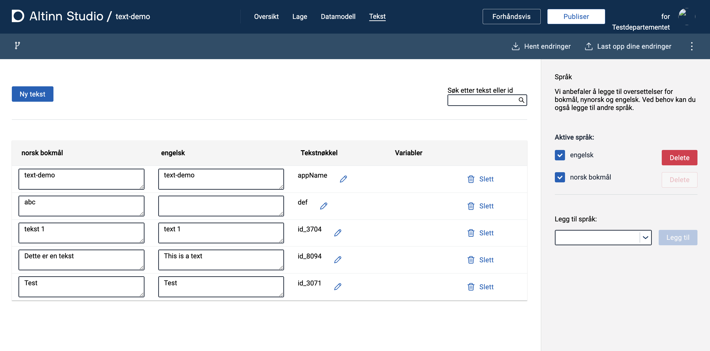
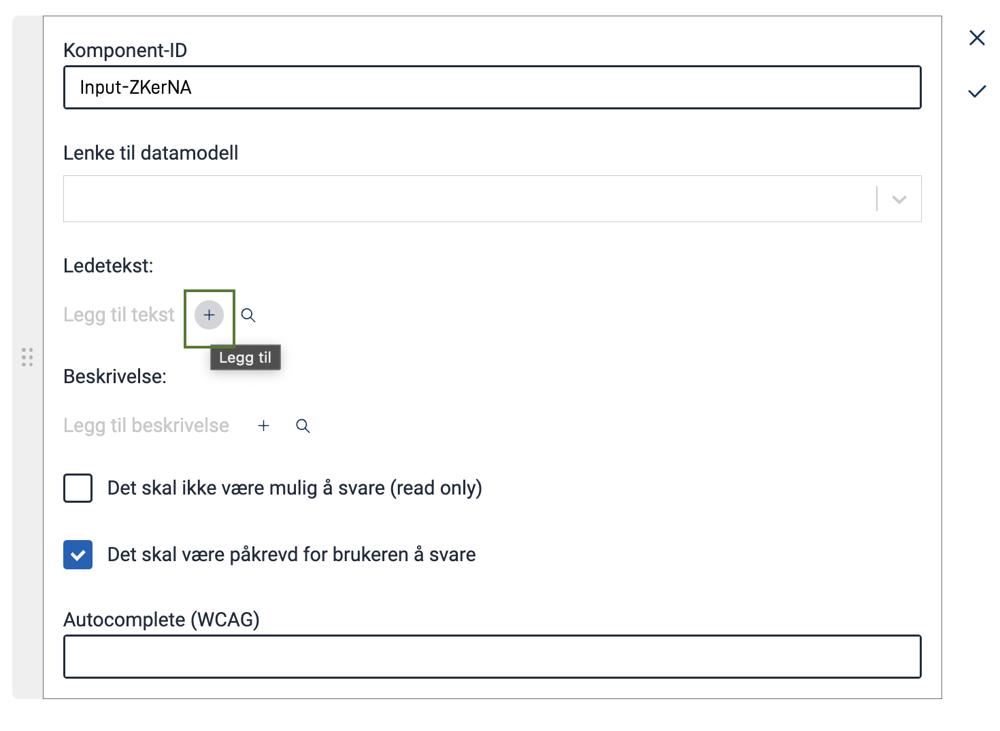
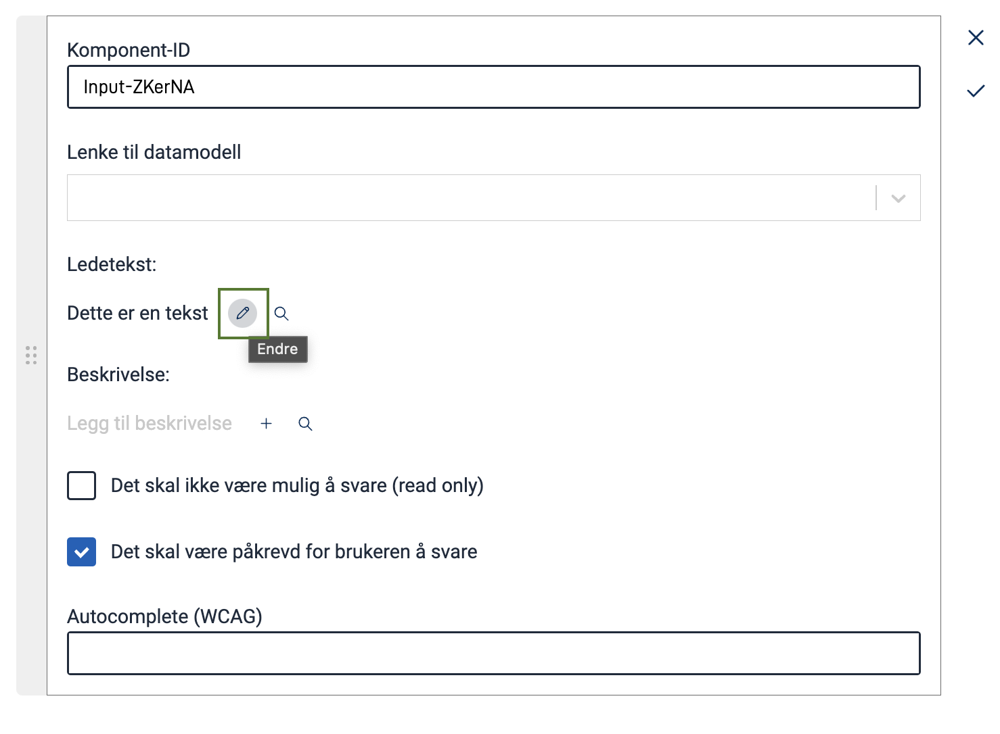
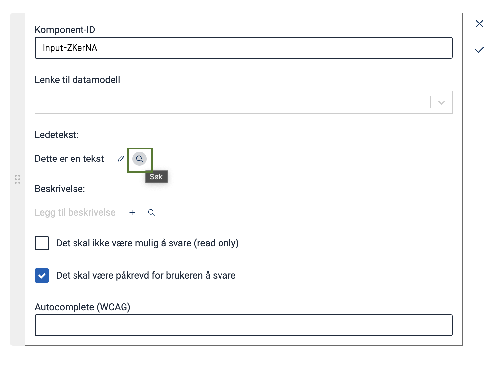
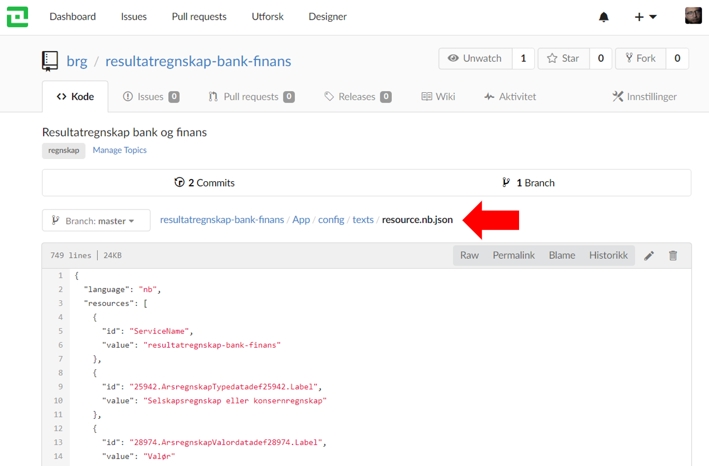
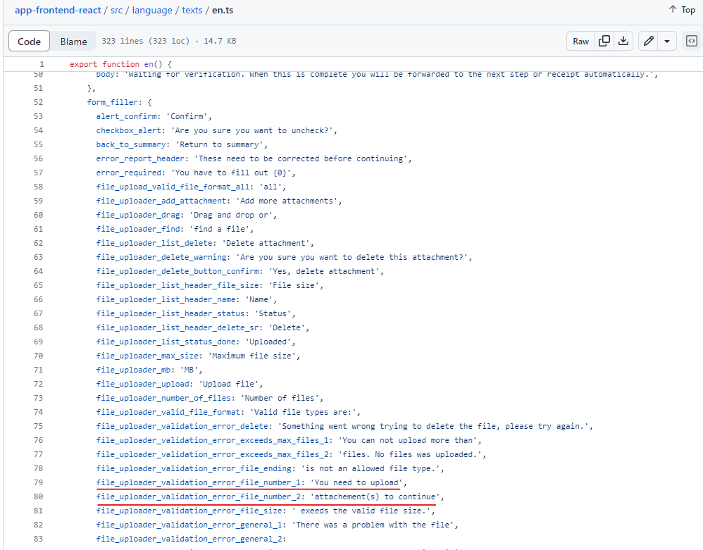

Tekster lagres i ressursfiler i katalogen `App/config/texts`. Tekster kan være fra felles biblioteker, datamodellen eller manuelt lagt inn av utvikler.

Tekstressursene er tilgjengelig når man redigerer UI komponenter i skjemaet via Altinn Studio, og de vises til sluttbruker når skjemaet lastes inn i nettleser.

Tekster lagres i JSON-format og det er én fil pr språk. Format på filnavn for tekster er `resource.[språk].json` f.eks: _resource.nb.json_.

Tekster kan redigeres lokalt, dirkete i JSON-filene, eller via teksteditoren i Altinn Studio.

## Formatering av tekster

Alle tekster kan formateres med markdown. Nedenfor er de mest benyttede formateringene beskrevet.

Mer omfattende dokumentasjon og tips til hvordan markdown kan benyttes finnes her:
[Markdown Cheatsheet](https://github.com/adam-p/markdown-here/wiki/Markdown-Cheatsheet).

### Uthevede tekster

Det er ekstremt enkelt å gjøre ord eller setninger fet eller kursiv i markdown.

```markdown
Dette er en _kursiv tekst_ laget med understrek.
Dette er også en *kursiv tekst* laget med stjerne.
```

```markdown
Dette er __fet tekst__ laget med understrek.
Dette er også **fet tekst**, men laget med stjerner!
```

### Linjeskift
 
Med markdown gjøres dette med `\n` som markerer et linjeskift. For at det faktisk skal vises som et nytt avsnitt
i en tekst må man ha 2 linjeskift etter hverandre i teksten. F.eks.:

```markdown
Dette er en tekst.\n\nDette er en tekst på neste linje. 
```

Alternativt kan man her bruke _html_:
```markdown
Dette er en tekst.<br/>Dette er en tekst på neste linje.
```

### Lenker

Enkle lenker kan bruke markdown-syntaks:

```markdown
Åpne [forsiden av Altinn](https://altinn.no).
```

Om man skal sette flere egenskaper kan man også bruke HTML-syntaks:

```html
Gå til <a href="https://altinn.no" class="same-window">forsiden av Altinn</a>.
```

Ved å spesifisere at lenken åpner i samme vindu, vil brukeren navigeres bort fra skjemaet når lenken åpnes.
Tilstanden til skjemaet lagres i instansen, om brukeren vender tilbake senere.

### Overskrifter

```markdown
# Dette er en stor heading (H1)

## Dette er en litt mindre heading (H2)

### Og enda litt mindre (H3)

#### Bitteliten heading (H4)
```

## Legge til og endre tekster i en app

Man har to alternativer når man skal endre tekster i en app, enten gjøres det via Altinn Studio eller direkte i repository.

### Altinn Studio Designer

#### Teksteditor

I den øverste navigeringsmenyen i Altinn Studio, velg _Tekst_ for å kunne redigere tekster. En oversikt over tekstene som allerede er tilgjengelige for applikasjonen listes opp.

På denne siden kan man redigere eksisterende tekster samt legge til nye tekstressurser. Nye tekster legges til ved å trykke på _Ny tekst_.
En unik tekstnøkkel genereres automatisk, og kan endres ved å trykke på blyant-ikonet ved siden av nøkkelen. Tekster som
endres lagres automatisk og fortløpende.

Man kan velge ønskede språk som skal vises i tabellen for enkel oversettelse, dette gjøres i panelet på høyre side.
Man kan der også legge til nye språk som appen skal oversettes til.



#### Direkte fra redigering av skjemakomponent

Når man konfigurerer en komponent i skjemaeditoren (velg "Lage"-fanen fra toppmenyen), så kan man legge til/redigere/oversette
tekster for den enkelte komponent direkte.

Legg til en tekst ved å trykke på `+`-ikonet for den relevante teksten (Ledetekst eller Beskrivelse).


Rediger en tekst på komponenten ved å trykke på blyant-ikonet for den teksten.


Legg til en eksisterende tekst til komponenten ved å trykke på søke-ikonet og velg blant tilgjengelige tekster.


### Legge til og endre tekster i repository

Dersom det er mange tekster som skal endres på en gang anbefales det å redigere tekstene direkte i repoet. Enten via Altinn Studio Repos eller i en lokal klone i selvvalgt kodeeditor.

Tekstene ligger lagret i `App/config/texts`.



## Endre standardtekster og feilmeldinger i en applikasjon

Det er mulig å endre standardtekster og feilmeldinger som vises i appen.
Her er nøklene med deres standardverdi på [Engelsk](https://github.com/Altinn/app-frontend-react/blob/main/src/language/texts/en.ts), 
[Norsk Bokmål](https://github.com/Altinn/app-frontend-react/blob/main/src/language/texts/nb.ts) og [Nynorsk](https://github.com/Altinn/app-frontend-react/blob/main/src/language/texts/nn.ts) 

Standardtekster som inkluderer tall må behandles på en annen måte. For eksempel vil `file_uploader_validation_error` vise en feilmelding 
hvis det er påkrevd å legge til minst et vedlegg. 
Denne standardfeilmeldingen vil vises som "For å fortsette må du laste opp 1 vedlegg".


Denne standardteksten er delt inn i to strenger, en før tallet: `For å fortsette må du laste opp`, og en tekstressurs etter tallet: `vedlegg`. 
Tallet er for øyeblikket ikke mulig å redigere, siden det, i dette tilfellet, er knyttet til maksimum og minimum antall vedlegg.
Men teksten rundt tallet kan endres."



Legg til tekst nøkkelen og den nye verdien i `App/configuration/texts/resource`. Merk at nøkkelen må henvise til den overordnede gruppen, og deretter tekstnøkkelen separert med `.`"

```json
    {
      "id": "form_filler.file_uploader_validation_error_file_number_1",
      "value": "For å fortsette må du laste opp"
    },
    {
      "id": "form_filler.file_uploader_validation_error_file_number_2",
      "value": "zip-fil som inneholder alle nødvendige filer."
    }
```

Dette vil resultere i visning av en feilmelding som dette:


{} 
Hvis du vil finne mer informasjon om hvordan du endrer standardtekster, kan du gå til
[Tilpasse visninger av steg](/nb/altinn-studio/reference/configuration/process/customize/)
{}

## Variabler i tekster

Variabler i tekster kan inkluderes ved å følge oppsettet nedenfor. Det er viktig at rekkefølgen på variablene er den samme som parameterne i teksten.

```json
{
  "id": "good.text.id",
  "value": "Hello, {0}! Here is a second variable {1}.",
  "variables": [
    {
      "key": "<datamodelField>",
      "dataSource": "dataModel.<dataModelName>"
    },
    {
      "key": "<settings key>",
      "dataSource": "applicationSettings"
    },
    {
      "key": "<instance value key>",
      "dataSource": "instanceContext"
    },
    {
      "key": "<custom text parameter key>",
      "dataSource": "customTextParameters"
    }
  ]
}
```

### Datakilder

Det er per nå mulig å hente verdier fra 4 ulike datakilder.

1. Datamodell  
   Ved å angi `dataModel.<dataModelNavn>` som datakilde kan man hente ut verdier fra felter i skjema som brukeren fyller ut. Data kan hentes fra felter uavhengig av om de er synlige eller ikke. Hvis bruker endrer på data i et felt referert i en variabel så vil teksten bli oppdatert når brukeren stopper å skrive i feltet.
2. Innstillinger  
   Ved å angi `applicationSettings` som datakilde kan man hente ut verdier fra en spesiell seksjon i `appsettings.{miljø}.json` filen(e) med navn `FrontEndSettings`. Dette er en dynamisk liste man kan utvide uten å måtte gjøre endringer i kode. Dette gjør det mulig å ha ulike verdier fra miljø til miljø ved å ha andre verdier i de ulike `appsettings.{miljø}.json` filene. Vær obs på ulik bruk av stor bokstav i starten av nøkkel mellom `FrontEndSettings` og `applicationSettings`.
   ```json
   "FrontEndSettings": {
     "HomeBaseUrl": "https://www.testdirektoratet.no"
   },
   ```
3. Instans  
   Ved å angi `instanceContext` som datakilde kan man hente ut enkelte verdier fra den aktive instansen. Vi har altså ikke gitt tilgang til hele instans objektet. Listen med egenskaper så langt er:
   1. `instanceOwnerPartyId` inneholder avgiver sin party id.
   2. `instanceId` inneholder id'en til den aktive instansen.
   3. `appId` inneholder id'en til appen instansen er knyttet til.
4. Egendefinerte tekstparametere  
   
   Krever versjon >= 8.7.0 av `Altinn.App.*` pakkene.
   
   Ved å angi `customTextParameters` som datakilde kan man hente ut egendefinerte verdier der disse kan settes.
   Per nå kan `CustomTextParameters` settes i `ValidationIssue` og `InstantiationValidationResult`. Eksempel:
   ```cs
    new ValidationIssue()
    {
        CustomTextKey = "good.text.id",
        CustomTextParameters = new() 
          {
            ["<custom text parameter key>"] = someValue 
          },
        Field = "someField",
        Severity = ValidationIssueSeverity.Error,
    };
   ```

### Standardverdi

Hvis en variabel ikke finnes i datakilden, vises stien til det feltet i datakilden. Hvis du imidlertid ønsker å vise noe annet enn denne stien, kan du legge til en standardverdi-alternativ til hver variabel.

Hvis du ønsker at teksten ikke skal vises i det hele tatt hvis feltet i datakilden ikke kan bli funnet, kan du sette `defaultValue` til en tom streng.

```json
{
  "id": "good.text.id",
  "value":  "{0}",
  "variables": [
    {
      "key": "someField",
      "dataSource": "dataModel.default",
      "defaultValue": " "
    }
  ]
}
```

### Komplett eksempel:

```json
{
  "id": "common.submitinfo",
  "value": "You are submitting for: {0} with organisation number: {1}. The organisations party id is {2}. [Link to our page]({3}).",
  "variables": [
    {
      "key": "skattepliktig.organisasjonsnavn",
      "dataSource": "dataModel.default",
      "dataValue": "Mattilsynet"
    },
    {
      "key": "skattepliktig.organisasjonsnummer",
      "dataSource": "dataModel.default"
    },
    {
      "key": "instanceOwnerPartyId",
      "dataSource": "instanceContext"
    },
    {
      "key": "homeBaseUrl",
      "dataSource": "applicationSettings"
    }
  ]
}
```

### Variabler i tekst - repeterende grupper

For at variabler i tekst skal fungere med data som ligger i repeterende grupper, må oppsettet vist over endres litt for de aktuelle feltene,
for å spesifisere den repeterende gruppen dataene ligger i.

Dette gjøres ved å legge til `[{0}]` _etter_ den repeterende gruppen når man spesifiserer felt i datamodellen i `key`-parameteren.
F.eks.:

```json {hl_lines=[6,10]}
{
  "id": "common.submitinfo",
  "value": "Du leverer nå skjema for: {0} med organisasjonsnummer: {1}.",
  "variables": [
    {
      "key": "skattepliktig[{0}].organisasjonsnavn",
      "dataSource": "dataModel.default"
    },
    {
      "key": "skattepliktig[{0}].organisasjonsnummer",
      "dataSource": "dataModel.default"
    }
  ]
}
```

Det er fullt mulig å kombinere variabler fra felter i repeterende gruppe med variabler fra felter utenom den repeterende gruppen. Det anbefales derimot ikke å kombinere variabler fra felter fra _forskjellige_ repeterende grupper, med mindre man er helt sikker på at rekkefølgen på innslag i gruppene vil bli helt like.

## Legge til hjelpetekst

Hjelpetekster er små tekstsnutter som gir en kort og konsis beskrivelse av hva sluttbrukeren er forventet å fylle ut i feltet som teksten er tilknyttet.

Språknøklene som peker på hjelpeteksten er definert i `FormLayout.json`.
I app repoet finner du filen under `App/ui/`.

Nedenfor ser du et eksempel på en _FormLayout.json_ uten hjelpetekster.

```json
{
  "data": {
    "layout": [
      {
        "id": "616071dc-90b1-4ce5-8d18-492844828a41",
        "type": "Header",
        "textResourceBindings": {
          "title": "appName"
        }
      },
      {
        "id": "08d707a9-2475-4d23-bf76-f209fb434ec2",
        "type": "TextArea",
        "textResourceBindings": {
          "title": "tilleggsopplysninger.label",
          "description": "tilleggsopplysninger.desc"
        },
        "dataModelBindings": {
          "simpleBinding": "omsetningsoppgaverTilleggsopplysninger.value"
        }
      },
      {
        "id": "bd6589b6-e2ab-49ba-b39a-dd3f8b63e5de",
        "type": "Button",
        "textResourceBindings": {
          "title": "Send inn"
        }
      }
    ]
  }
}
```

Dersom du skulle ønske å legge til hjelpetekst på en av disse skjemakomponentene må du

1. Legge til hjelpeteksten i tekstressursfilen som beskrevet [her](#legge-til-og-endre-tekster-i-en-app).
2. Åpne `FormLayout.json`-filen.
3. Legg til en binding til den nye hjelpeteksten med nøkkel `"help"` og verdi lik nøkkel til tekstressursen.

Slik ser hele filen ut etter å ha lagt til en hjelpetekst:

```json {linenos=false,hl_lines=[20]}
{
  "data": {
    "layout": [
      {
        "id": "616071dc-90b1-4ce5-8d18-492844828a41",
        "type": "Header",
        "textResourceBindings": {
          "title": "appName"
        }
      },
      {
        "id": "08d707a9-2475-4d23-bf76-f209fb434ec2",
        "type": "TextArea",
        "textResourceBindings": {
          "title": "tilleggsopplysninger.label",
          "description": "tilleggsopplysninger.desc",
          "help": "tilleggsopplysninger.help"
        },
        "dataModelBindings": {
          "simpleBinding": "omsetningsoppgaverTilleggsopplysninger.value"
        }
      },
      {
        "id": "bd6589b6-e2ab-49ba-b39a-dd3f8b63e5de",
        "type": "Button",
        "textResourceBindings": {
          "title": "Send inn"
        }
      }
    ]
  }
}
```

## Endre applikasjonstittel

Når man oppretter en applikasjon vil man ha en tekstressurs med label `appName`.
Dette er tittelen på applikasjonen som vil gjenspeiles flere steder i løsningen vår.
Blant annet når en sluttbruker fyller ut skjema, og når elementer skal vises i meldingsboksen på altinn.no.

Tittelen på applikasjonen skal ligge to steder i applikasjonsrepoet:
1.  I tekstressurser med nøkkelen `appName`.
2.  I `applicationmetadata.json` under property `title`. Denne filen ligger under `App/config/`.

Tjenesteeiere oppfordres til å legge inn tittel på bokmål, nynorsk og engelsk. Dersom tittel mangler i tekstressursene vil lagringsnavnet (navnet på repoet) vises til sluttbrukeren.

Dersom man endrer `appName` på applikasjonen lokalt er det viktig å legge til den oppdatere tittelen i
`applicationmetadata.json` også. Dersom tittelen på applikasjonen endres i Altinn Studio enten på "Om"- eller "Språk"-siden blir `applicationmetadata.json` oppdatert automatisk.

### Eksempel på korrekt konfigurasjon for applikasjonstittel

I `App/config/applicationmetadata.json`:

```json
"title": {
    "nb": "Automatisk deploy applikasjonen",
    "nn": "Automatisk deploy applikasjonen",
    "en": "Auto deploy application"
  },
```

I `App/config/texts/resource.nb.json`:

```json
{
  "language": "nb",
  "resources": [
    {
      "id": "appName",
      "value": "Automatisk deploy applikasjonen"
    },
    ...
  ]
}
```

I `App/config/texts/resource.nn.json`:

```json
{
  "language": "nn",
  "resources": [
    {
      "id": "appName",
      "value": "Automatisk deploy applikasjonen"
    },
    ...
  ]
}
```

I `App/config/texts/resource.en.json`:

```json
{
  "language": "en",
  "resources": [
    {
      "id": "appName",
      "value": "Auto deploy application"
    },
    ...
  ]
}
```

## Endre applikasjonseier tekst

I applikasjonen så vises applikasjonsnavn- og applikasjonseier-tekstene øverst i skjema.


Applikasjonseier hentes som standard ut fra tekstene som er definert i [altinn-orgs.json](https://github.com/Altinn/altinn-cdn/blob/master/orgs/altinn-orgs.json).
Om det er ønskelig å endre på dette navnet kan det gjøres ved å legge til nøkkelen `appOwner` i tekstressursene. Denne vil da overstyre det som ligger på CDN.

Eksempel:

```json
{
  "language": "en",
  "resources": [
    {
      "id": "appOwner",
      "value": "Test Ministry"
    },
    ...
  ]
}
```

## Endre tekster på kvitteringssiden for arkiv

Tekster på kvitteringssiden kan overstyres av applikasjonen ved å spesifisere tekster i applikasjonens `config/texts/resource.[språk].json` fil(er).

{}
Overstyring av tekster i kvitteringen vil ha påvirkning for alle kvitteringer for den gitte applikasjonen.
Dette betyr at alle skjemaer som allerede er innsendt vil også få de oppdaterte tekstene på kvitteringssiden. PDF filen som er generert vil ikke påvirkes av dette.
{}

Markdown og variabler kan benyttes i kvitteringstekstene. Det er kun mulig å hente variabler fra `Instance` (Se [Data Sources](#datakilder) for detaljer)

Dette er tekstnøklene som kan brukes for å overstyre standardtekstene:

```json
receipt_platform.attachments
receipt_platform.date_sent
receipt_platform.helper_text
receipt_platform.is_sent
receipt_platform.receipt
receipt_platform.receiver
receipt_platform.reference_number
receipt_platform.sender
receipt_platform.sent_content

```

Hvis du, for eksempel, vil overstyre hjelpeteksten, kan du legge dette til i `config/texts/resource.nb.json` filen i applikasjonen:

```json
{
  "language": "nb",
  "resources": [
    {
      "id": "receipt_platform.helper_text",
      "value": "Min egendefinerte hjelpetekst"
    }
  ]
}
```

Bildet nedenfor viser hvilke tekstnøkler som styrer hvilken del av brukergrensesnittet:


**Merk!** Disse tekstendringene vil **ikke** være synlige når du tester appen din lokalt, de synes kun i eksternt testmiljø, f.eks. **TT02**.
Du vil se endringene når du åpner et allerede arkivert skjema fra Arkivet ved å trykke på knappen "Se innsendt skjema".   
Disse modifiserte tekstene gjelder kun kvittering i arkiv og vil ikke ha noen effekt på kvitteringen som brukeren ser etter et skjema er ferdig utfylt. Se [kvittering](../../configuration/process/customize/#kvittering-receipt) for informasjon om hvordan du kan tilpasse både tekstene og layouten for denne kvitteringen.



