"Altinn Repositories" er en frittstående [Git] versjonskontroll og [Application Lifecycle Management]-løsning, som både [Designer](/nb/altinn-studio/v8/designer/),
kodeeditorer og andre eksterne verktøy vil benytte som back-end og felles sted for å **lagre** og versjonere tjenestene som utvikles.

Repositories har et GitHub-lignende brukergrensesnitt og både Git og REST-baserte tekniske grensesnitt.

[Application Lifecycle Management]: https://en.wikipedia.org/wiki/Application_lifecycle_management
[Git]: https://en.wikipedia.org/wiki/Git

Det vil være en omfattende jobb å forsøke å utvikle en Git + ALM løsning på egen hånd,
ref. all [funksjonaliteten som behøves](#funksjonalitet-i-repositories).  

Heldigvis finnes det flere open source "GitHub-kloner" som vi kan benytte, og blant dem virker
[Gitea](https://github.com/go-gitea/gitea) å være mest lovende (uttales som /ɡɪ’ti:/ - "gitty").
Bilder fra Gitea benyttes som eksempler videre i denne dokumentasjonen.

## Funksjonalitet i "Repositories"

Repositories inneholder et repository med versjonerte filer for hver [3.0-tjeneste](#30-tjeneste).
Eksempel på typer filer som en "3.0-tjeneste" vil kunne bestå av er kode, tester, web-komponenter, layouts og stiler,
oversettinger, arbeidsflyt og konfigurasjon.

Repositories vil tilby funksjonalitet rundt den enkelte 3.0-tjeneste, og eksponere funksjonaliteten via både brukergrensesnitt
og et REST-API som er en klone av GitHub sitt [v3 API-format](https://developer.github.com/v3/).
Dette er positivt da det finnes andre verktøy som også støtter dette API-formatet, og da det kan forenkle det å kunne erstatte
Gitea som back-end med andre liknende Git-systemer.

<object data="t3-repositories-archimate.svg" type="image/svg+xml" style="width: 100%;"></object>

## 3.0 Tjeneste
Repository som representerer en "3.0-tjeneste", aka app, og inneholder alle filer som tjenesten består av.  
Hver utgave av en tjeneste vil leve i sin egen mappe, slik at ett repository kan inneholde èn eller flere utgaver av den samme tjenesten.

## Repository management

Håndtering av repositories er en kjerneaktivitet, da hver tjeneste som utvikles vil lagres i sitt eget repository.

- Create/delete repository
- Link to repository
- Rename repository
- Fork repository
  - Muliggjør at man kan ha et "master"-repository med felles tjenester som flere andre kan benytte, slik som dagens "master-tjenester" bare mye kraftigere
  - Muliggjør også at utviklere kan lage som egen kopi og teste ut nye muligheter og løsninger på sitt eget område uten å påvirke originalen
- List repositories
- Download/upload files
- Download repo
- Create files and folders
- Read/edit files
- Rename files
- Delete files
- View raw file
- Link to file

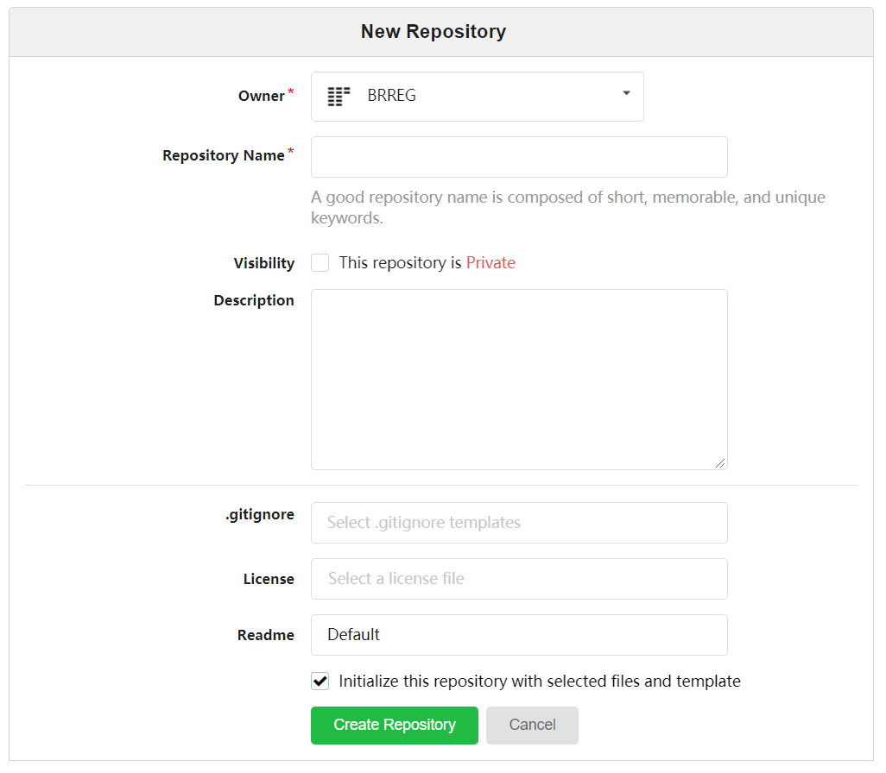

## Dokumentering

Det er viktig å ha god støtte for å dokumentere tjenestene man utvikler,
slik at det vil være enkelt for andre personer på teamet å bidra. Det er derfor ønskelig å ha innebygd Wiki-funksjonalitet med støtte for å
editere i [markdown](https://github.com/adam-p/markdown-here/wiki/Markdown-Cheatsheet), slik som i Altinn docs og AltinnPedia.

- Wiki
  - Add/edit/delete pages
  - Markdown editing
  - Link to specific wiki page
  - Support for other external wikis
  - Emojis
- Markdown editing
  - Preview
  - Fullscreen
  - Side-by-side

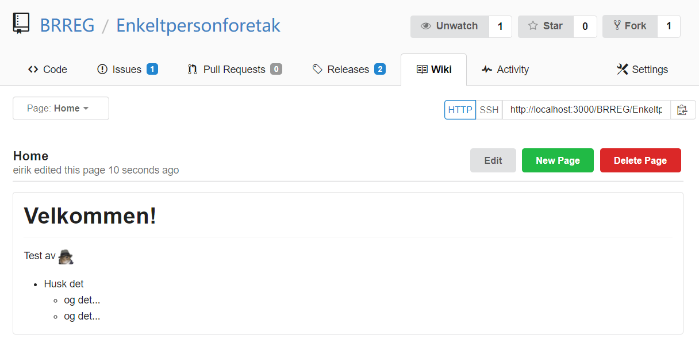

## Versjonering

Hver eneste fil som en 3.0-tjeneste består av skal ha full versjonshistorikk, uavhengig av om man jobber mot filene via [Designer](/nb/altinn-studio/v8/designer/)
eller eksternt og distribuert/lokalt i en kodeeditor på egen maskin.
Repositories sitt versjonskontrollsystem, som er basert på Git, er laget nettopp med tanke på dette.

- Version history of all files, artifacts, code and configuration
  - Link to each change with a unique id
  - Link to each changed file
  - Link to who did the change
  - Highlight the last change done in the repository
  - Time of change
  - Comments/messages
- Diff between versions

## Release management

En svært viktig egenskap når man utvikler programvare (noe som 3.0-tjenester er) er å kunne tagge ulike versjoner, og kunne gå tilbake
og teste eller patche en tidligere versjon hvis man ønsker det. Det er også viktig å kunne se alt som har endret seg mellom versjonene.

Siden Git benyttes for versjonering, så vil en release/tag som opprettes peke på en _eksakt_ versjon av hver eneste fil som en 3.0-tjeneste består av,
og man kan enkelt se hva som er endret.

- Create tags for the 3.0 app
- Link to tags
- Create/delete releases
- Link to releases
- Marking of pre-releases
- Time of release creation
- User that triggered the release
- Download zipped files of release
- Browse content of a given tag/release

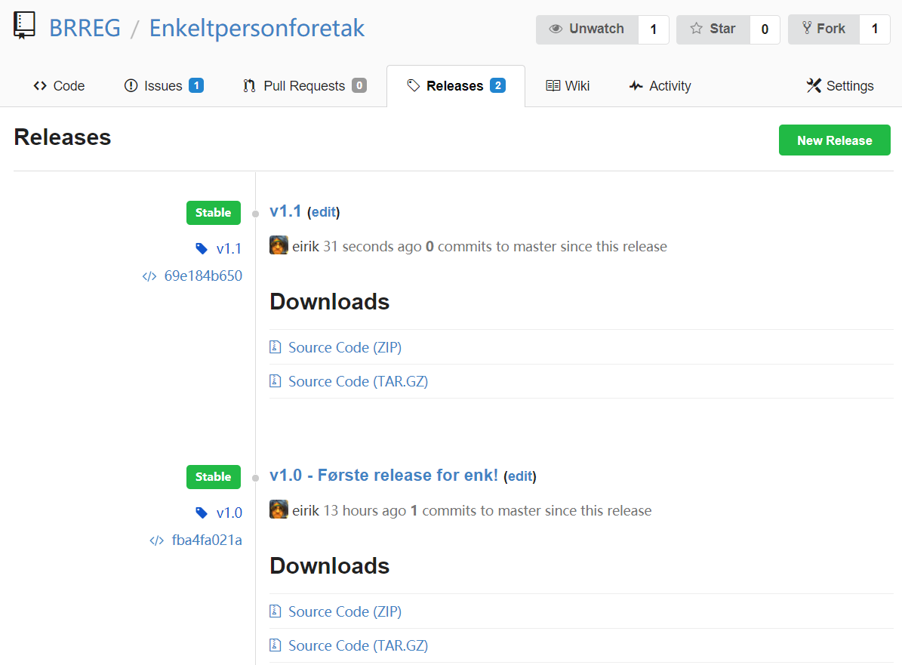

## QA

En QA-prosess for godkjenning av endringer basert på branching og pull requests, vil for større teams kunne være mulig.
Dette er i tråd med hvordan programvare utvikles, inkludert selve Altinn.

## Backlog management

Som for all annen programvareutvikling, så vil hver 3.0-tjeneste typisk ha en egen backlog med bugs, forbedringer, fremtidige features, etc. som
tjenesteutviklerne vil jobbe mot. Dette er en sentral del av [Application Lifecycle Management].

- Create/close issues pr. 3.0 app
  - Time of creation
  - Who
- Filter issues by open/closed
- Add labels
  - Filter issues by label
- Assign to milestone
  - Filter issues by milestone
- Assign to user
  - Filter issues by assignee
- Markdown editing
- Discussions
- Add files to issue
- Notifications when issues change
- Issues search
- List issues

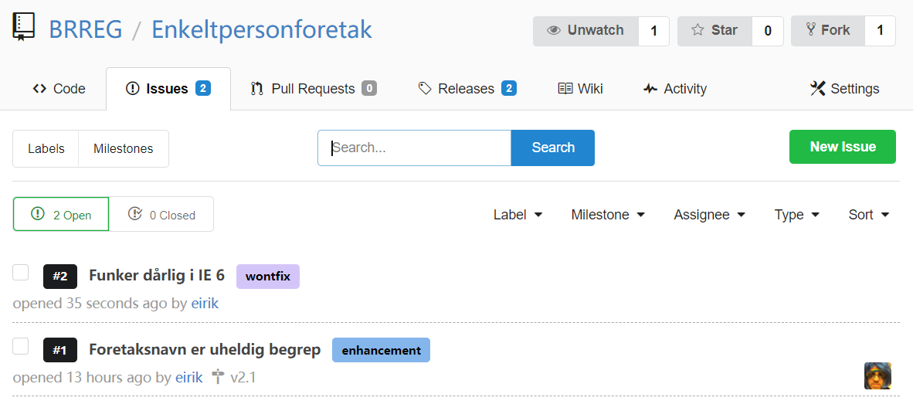

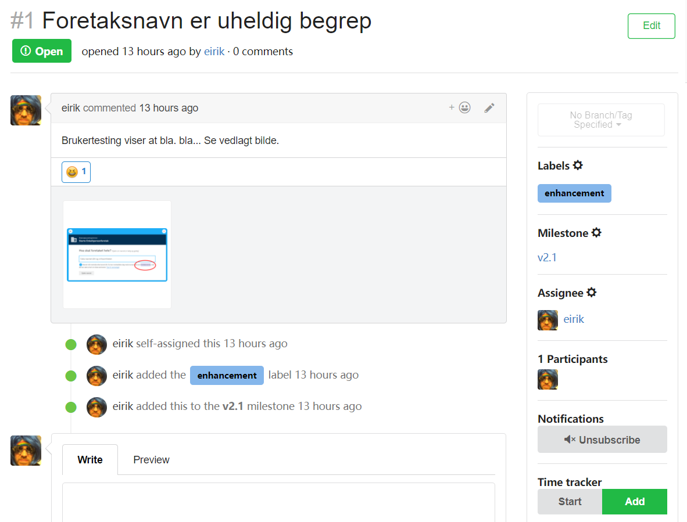

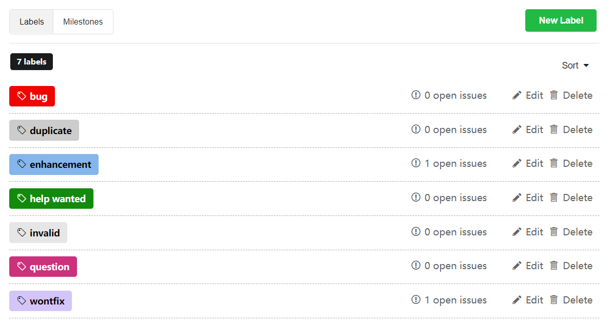

## Org management

Organisasjoner er tjenesteeiere, men i 3.0 er det ikke noe i veien for at brukere også kan utvikle tjenester. 
I en organisasjon så kan man gi tilganger til brukere, og man kan opprette teams med tilgang til en eller flere 3.0-tjenester.  
Det å håndtere organisasjonen, som alt annet, skal være 100% selvbetjent.

- Create/delete organisations
  - Name/shortname
  - URL
  - Logo
- List organisations
- Link to organisation
- Create repository for organisation ref. [repository management](#repository-management)
- Add/remove teams in organisation
- List teams in organisation
- Add/remove users in organisation
- List all users in organisation
- Add/remove users in teams
- List users in teams

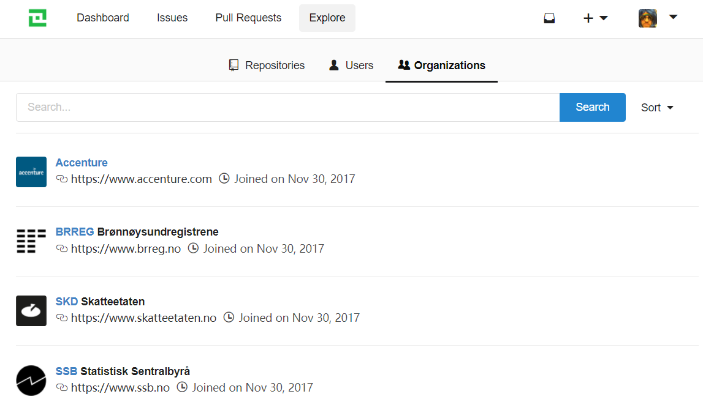

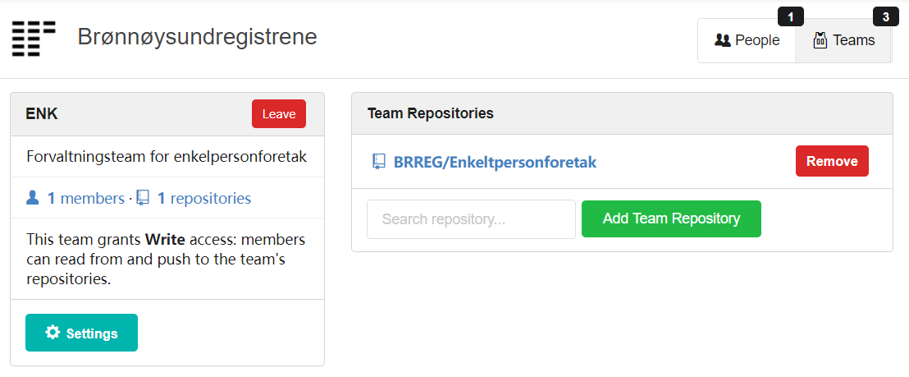

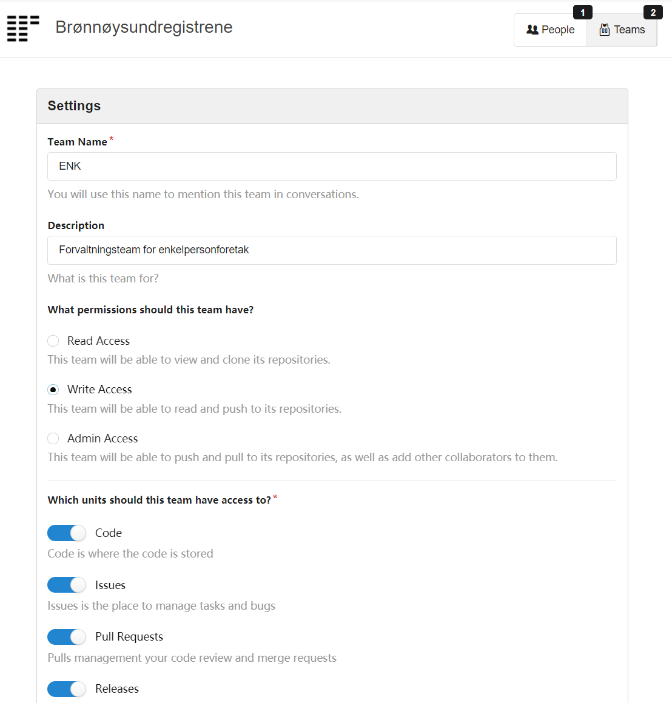

## Brukerstyring

Brukerne i denne sammenheng er tjenesteutvklerne.
Det å håndtere organisasjonen skal være helt selvbetjent.

- Add/remove users
- Name
- Avatar
- Add/remove users to/from teams
- "Starring" of favorite repositories
- List of user repositories (including forks)
- Activity log for user
- Workspace for user (dette er veldig viktig, betyr at tjenesteutviklere kan "leke seg" på sitt eget område)

I første omgang (MVP) vil tjenesteeier (org-admin) legge til alle sine brukere i gruppen "owner" slik at de får tilgang til å opprette repositories (tjenester). Gruppen "owner" gir vide fullmakter på organisasjonsnivå (dvs tjenesteeiernivå), så på sikt vil det implementeres mer granulert tilgangsstyring.  

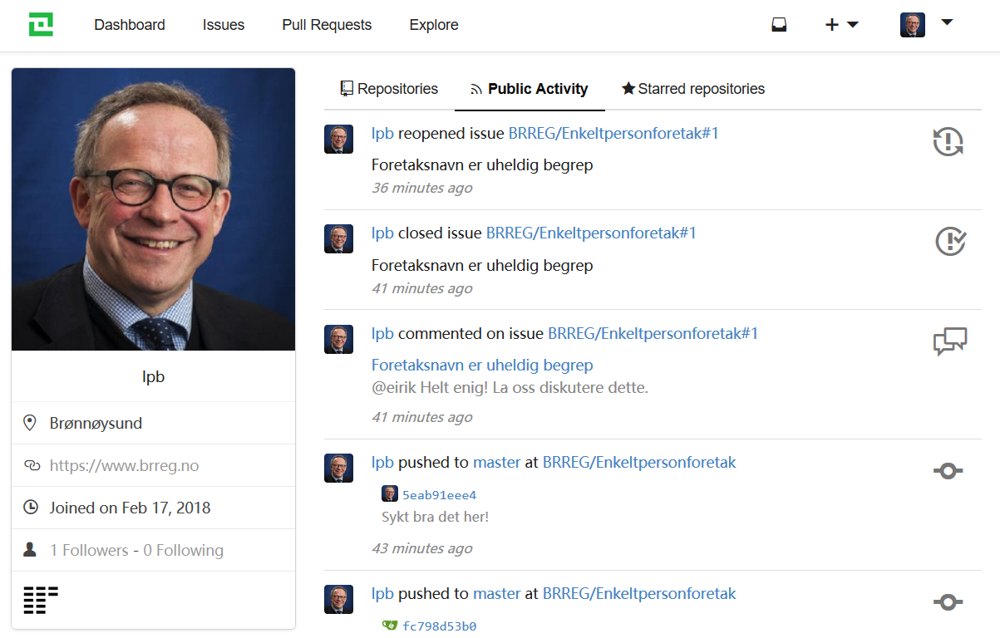

## Søke

Søk er viktig for å finne frem, og skal være bygd inn i løsningen.

- Repositories
- Issues
- Edits
- Users
- Organisations

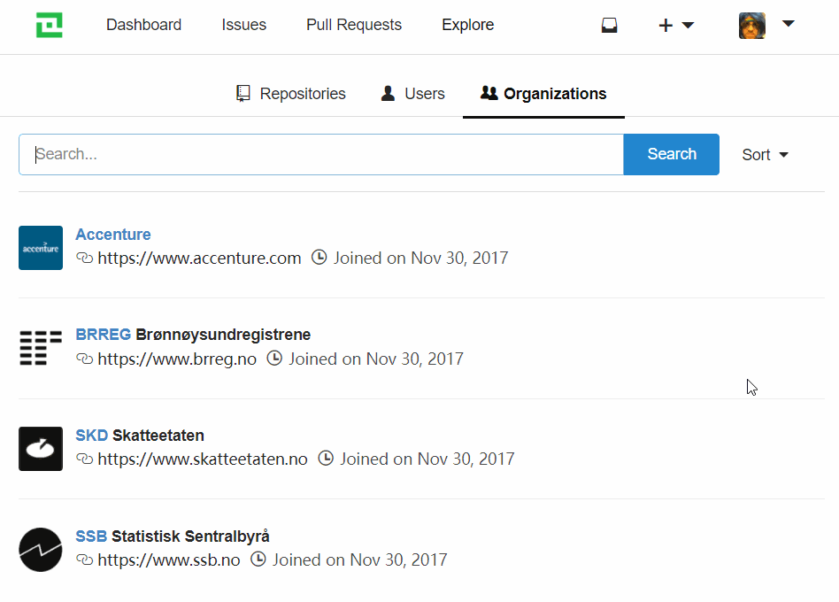

## Tilgangsstyring

Det skal være mulig å styre tilgang til repositories, les/skriv/admin, teams, brukere, samt opprette private repos.

- Access to 3.0 apps (read/write)
- Access to orgs
- Users access
- Private/public app-repos
- Administrator
- AM/AD-integration
- API access

## Trigge hendelser

I dagens hverdag, med bruk av Slack og andre systemer ifbm. utvikling, så er det viktig at "Repositories" kan trigge hendelser i andre
systemer, f.eks. poste til en Slack-kanal når en endring skjer i en 3.0-tjeneste.

- Trigger events at org-level
- Trigger events at 3.0 app-level

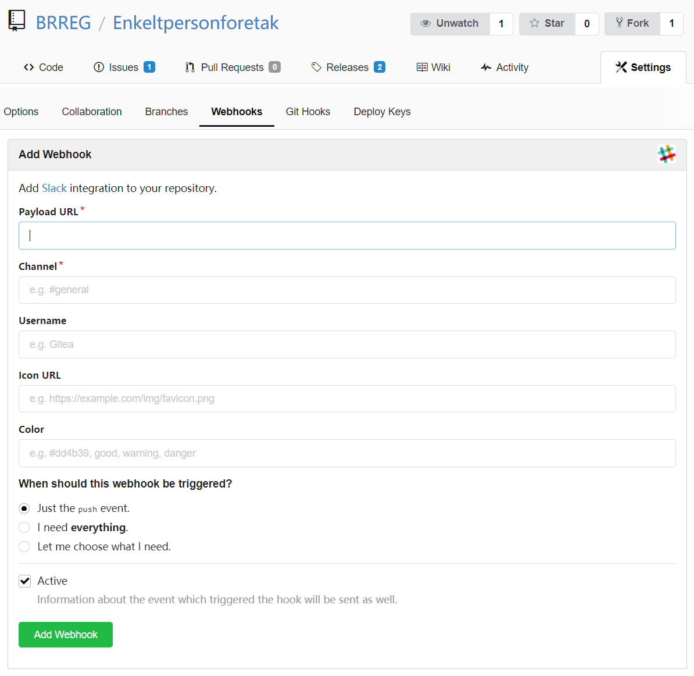

## Logge inn

Tjenesteutviklere og andre interessenter skal kunne logge inn og få tilgang til organisasjoner og 3.0-tjenester.

- Login page
- CAPTCHA?
- Forgot password?
- 2-factor auth
- External authentication

## Sende varslinger

- Send notifications to users based on events or mentions
- User can control the notifications to receive
- Users can follow other users and subscripe to issues

