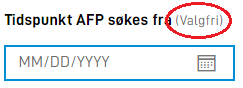

Du setter opp disse innstillingene manuelt i layoutfilen for feltet.

## Indikere at felt er valgfritt

{}
Denne delen oppdateres. Vi vurderer å følge designsystemet.no sin praksis med etikettene **Må fylles ut** og **Valgfritt** i stedet for markeringen beskrevet under.
{}

Du kan styre om et felt ser valgfritt ut eller ikke. Vanlig oppførsel er at påkrevde felt får en markering med `*`, mens valgfrie felt ikke får noen markering.

.")

.")

Du kan overstyre denne oppførselen for valgfrie felt med `labelSettings` på en komponent i layoutfilen.

```json
{
  "id": "input-felt1",
  "type": "Input",
  "labelSettings": {
    "optionalIndicator": true
  }
}
```

Når du setter `optionalIndicator` til `true`, viser appen teksten `(Valgfri)` etter ledeteksten til feltet.



Du kan ikke tvinge frem `(Valgfri)`-teksten på et felt som er obligatorisk. Denne innstillingen styrer bare visningen, ikke om feltet faktisk er påkrevd.

## Aktivere tegngrense

Du kan sette en tegngrense for et tekstfelt ved å legge til `maxLength`-egenskapen på en komponent i layoutfilen. Da viser appen en teller med antall gjenværende tegn. Her er et eksempel på en `Input`-komponent med en tegngrense på 10 tegn:

```json
{
  "id": "input-felt1",
  "type": "Input",
  "maxLength": 10
}
```

_Merk_: `maxLength` i layoutfilen viser bare hvor mange tegn som gjenstår. Den kontrollerer ikke antallet tegn, så brukeren kan fortsatt sende inn skjemaet selv om teksten er lengre enn grensen.
Skal du kontrollere selve antallet tegn, må du også legge til `maxLength`-egenskapen i datamodellen til skjemaet. Se [validering](/nb/altinn-studio/v9/develop-a-service/data/validation/) for mer informasjon.

## Konfigurere automatisk lagring

`Input`, `TextArea` og `Address` oppdaterer skjemadataene mens brukeren skriver. Som standard skjer dette 400 millisekunder etter at brukeren sist skrev noe. Med standardinnstillingen `autoSaveBehavior: "onChangeFormData"` lagrer appen endringene på serveren. Med `onChangePage` lagres de ved sideskifte. Se [innstillinger for automatisk lagring](/nb/altinn-studio/v9/develop-a-service/look-and-feel/ui-settings/#automatisk-lagring).

Du styrer dette med `saveWhileTyping`-egenskapen på en komponent i layoutfilen. I eksempelet under oppdaterer feltet skjemadataene to sekunder etter at brukeren slutter å skrive i feltet.

```json {hl_lines=[4]}
{
  "id": "input-felt1",
  "type": "Input",
  "saveWhileTyping": 2000
}
```

`saveWhileTyping` er en forsinkelse i millisekunder og kan ikke slå av automatisk lagring. En høy verdi er heller ikke en pålitelig måte å unngå lagring på. Andre felt og navigasjon kan føre til at appen lagrer dataene.
