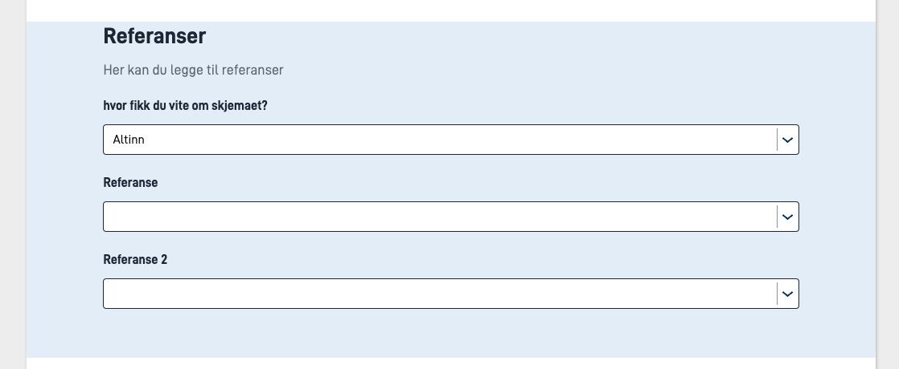
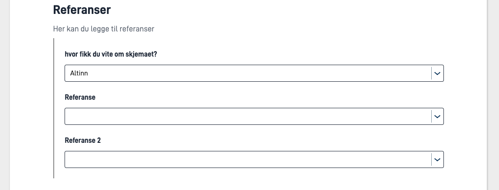

Du kan sette opp felter i skjemaet slik at de blir del av en _gruppe_. Dette kan du for eksempel bruke til å sette opp dynamikk på en enkelt gruppe av felter,
i stedet for på hvert enkelt felt. I tillegg må feltene kunne grupperes for å støtte [repeterende grupper](/nb/altinn-studio/v9/develop-a-service/look-and-feel/components/repeatinggroup/) i skjemaet.

Du setter opp en gruppe i `FormLayout.json`, sammen med de andre komponentene i skjemaet. Dette kan du enten gjøre manuelt direkte i filen,
eller via skjemaeditoren i Altinn Studio Designer ved å bruke Gruppe-komponenten.

Noen punkter du bør merke deg ved manuelt oppsett:

- Gruppen må ligge _før_ eventuelle komponenter som skal inngå i gruppen i FormLayout.json.
- En gruppe _MÅ_ ha `type: "Group"` satt for at den skal registreres som en gruppe

Eksempel på en (repeterende) gruppe definert i `FormLayout.json` som inneholder fire felter som kan repetere tre ganger:
Du definerer en gruppe på følgende måte i FormLayout.json:

```json {hl_lines=[3,"8-12"]}
{
  "id": "<unik-id>",
  "type": "Group",
  "dataModelBindings": {
    "group": "<gruppen i datamodellen (kun repeterende grupper)>"
  },
  "maxCount": "<Antall ganger gruppen kan repetere>",
  "children": [
    "<felt-id>",
    "<felt-id>",
    "osv..."
  ],
  "tableHeaders": [
    "<felt-id>"
  ],
  "textResourceBindings": {
    "add_button": "tekstressurs.felt"
  }
}
```

## Parameters




## Parameters

| Parameter                                     | Påkrevd | Beskrivelse                                                                                                                                                       |
|-----------------------------------------------|---------|-------------------------------------------------------------------------------------------------------------------------------------------------------------------|
| id                                            | Ja      | Unik ID, tilsvarer ID på andre komponenter. Må være unik i layout-filen, og bør være unik på tvers av sider.                                                      |
| type                                          | Ja      | Må settes til `Group`                                                                                                                                             |
| [textResourceBindings](#textresourcebindings) | Nei     | Kan settes for grupper, se [nærmere beskrivelse under](#textresourcebindings).                                                                                    |
| children                                      | Ja      | Liste over komponent-IDer som inkluderes i gruppen.                                                                                                               |
| groupingIndicator                             | Nei     | Grupperer komponentene i gruppen visuelt. Kan være `"indented"` eller `"panel"`.                                       |

## textResourceBindings

Du kan legge til ulike nøkler i textResourceBindings:

- `title` - Setter tittelen på gruppen. Hvis du ikke setter denne, vises komponentene i gruppen som om de ikke var en del av en gruppe (uten tittel over)
- `description` - Setter en beskrivelsestekst. Denne vises under tittelen, og over komponentene i gruppen.

## Visuell gruppering av komponenter

Du kan sette opp en gruppe slik at komponentene i gruppen vises visuelt som en gruppe. Dette gjør du ved å sette `groupingIndicator` til `indented` eller `panel` på gruppen.

### Panel



### Indented






## Parameters

| Parameter                                     | Påkrevd | Beskrivelse                                                                                                                                                       |
|-----------------------------------------------|---------|-------------------------------------------------------------------------------------------------------------------------------------------------------------------|
| id                                            | Ja      | Unik ID, tilsvarer ID på andre komponenter. Må være unik i layout-filen, og bør være unik på tvers av sider.                                                      |
| type                                          | Ja      | Må settes til `Group`                                                                                                                                             |
| [textResourceBindings](#textresourcebindings) | Nei     | Kan settes for grupper, se [nærmere beskrivelse under](#textresourcebindings).                                                                                    |
| maxCount                                      | Nei     | Antall ganger en gruppe kan repetere. Må enten utelates eller settes til `0` for ikke-repeterende grupper, ellers blir det en [repeterende gruppe](/nb/altinn-studio/v9/develop-a-service/look-and-feel/components/repeatinggroup/). |
| children                                      | Ja      | Liste over komponent-IDer som inkluderes i gruppen.                                                                                                               |
| showGroupingIndicator                         | Nei     | Viser en vertikal linje til venstre for gruppen for å indikere at feltene har en sammenheng. Kan være `true` eller `false`.                                       |

## textResourceBindings

Du kan legge til ulike nøkler i textResourceBindings:

- `title` - Setter tittelen på gruppen. Hvis du ikke setter denne, vises komponentene i gruppen som om de ikke var en del av en gruppe (uten tittel over)
- `body` - Setter en beskrivelsestekst. Denne vises under tittelen, og over komponentene i gruppen.



