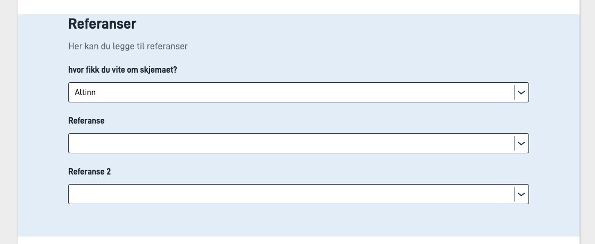
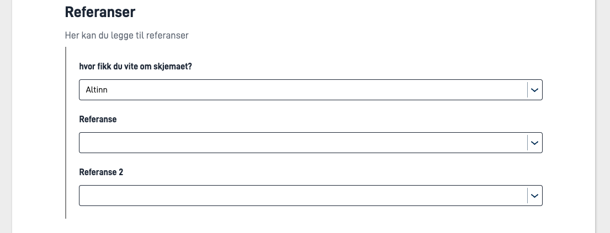

Du kan sette opp felter i skjemaet slik at de blir del av en _gruppe_. Dette kan du for eksempel bruke til å sette opp dynamikk på en enkelt gruppe av felter,
i stedet for på hvert enkelt felt.

Du setter opp en gruppe i layoutfilen til siden, sammen med de andre komponentene i skjemaet. Layoutfilene ligger i `App/ui/{oppgave-ID}/layouts/`. Du kan enten redigere filen direkte eller bruke komponenten **Gruppe** i Altinn Studio Designer.

En gruppe _må_ ha `"type": "Group"`. Repeterende grupper har en egen komponenttype, [`RepeatingGroup`](/nb/altinn-studio/v9/develop-a-service/look-and-feel/components/repeatinggroup/).

Slik definerer du en gruppe som inneholder tre felter:

```json {hl_lines=[3,"7-11"]}
{
  "id": "<unik-id>",
  "type": "Group",
  "textResourceBindings": {
    "title": "tekstressurs.tittel"
  },
  "children": [
    "<felt-id>",
    "<felt-id>",
    "<felt-id>"
  ],
  "groupingIndicator": "panel"
}
```

## Parametere

| Parameter                                     | Påkrevd | Beskrivelse                                                                                                  |
|-----------------------------------------------|---------|--------------------------------------------------------------------------------------------------------------|
| id                                            | Ja      | Unik ID, tilsvarer ID på andre komponenter. Må være unik i layoutfilen, og bør være unik på tvers av sider. |
| type                                          | Ja      | Må settes til `Group`.                                                                                       |
| [textResourceBindings](#textresourcebindings) | Nei     | Kan settes for grupper, se [nærmere beskrivelse under](#textresourcebindings).                               |
| children                                      | Ja      | Liste over komponent-ID-er som inkluderes i gruppen.                                                         |
| groupingIndicator                             | Nei     | Grupperer komponentene i gruppen visuelt. Kan være `"indented"` eller `"panel"`.                             |
| headingLevel                                  | Nei     | Overskriftsnivået for tittelen på gruppen. Kan være `2`, `3`, `4`, `5` eller `6`.                            |

## textResourceBindings

Du kan legge til ulike nøkler i textResourceBindings:

- `title` - Setter tittelen på gruppen. Hvis du ikke setter denne, vises komponentene i gruppen som om de ikke var en del av en gruppe (uten tittel over)
- `description` - Setter en beskrivelsestekst. Denne vises under tittelen, og over komponentene i gruppen. Krever at du har satt `title`.
- `help` - Setter en hjelpetekst. Et spørsmålstegn (hjelpeikonet) vises ved siden av tittelen på gruppen, og hjelpeteksten vises når brukeren klikker på det. Krever at du har satt `title`.

## Visuell gruppering av komponenter

Du kan sette opp en gruppe slik at komponentene i gruppen vises visuelt som en gruppe. Dette gjør du ved å sette `groupingIndicator` til `indented` eller `panel` på gruppen.

### Panel



### Indented


