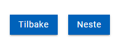
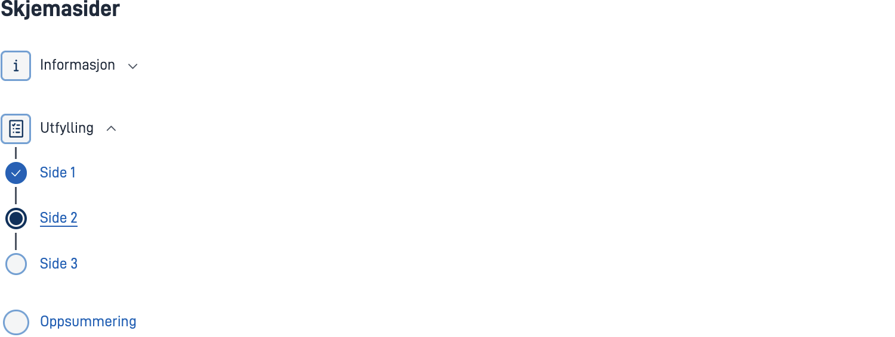
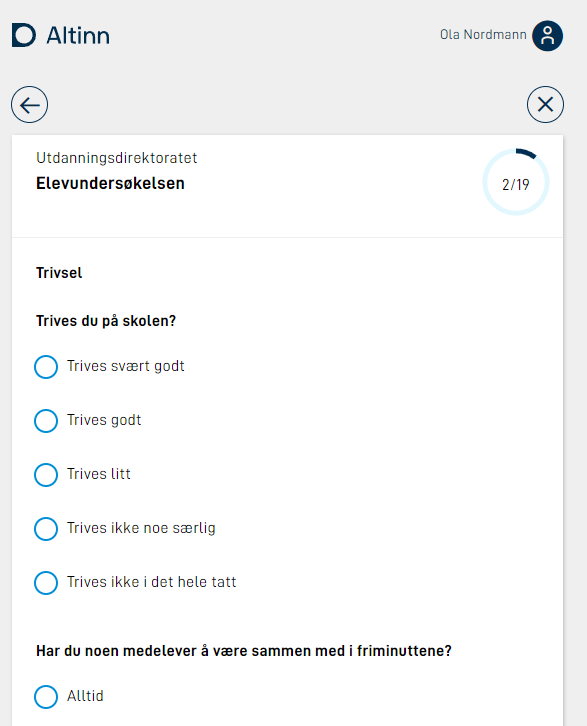
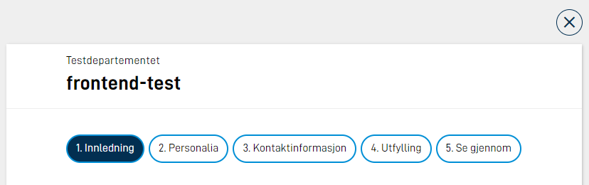
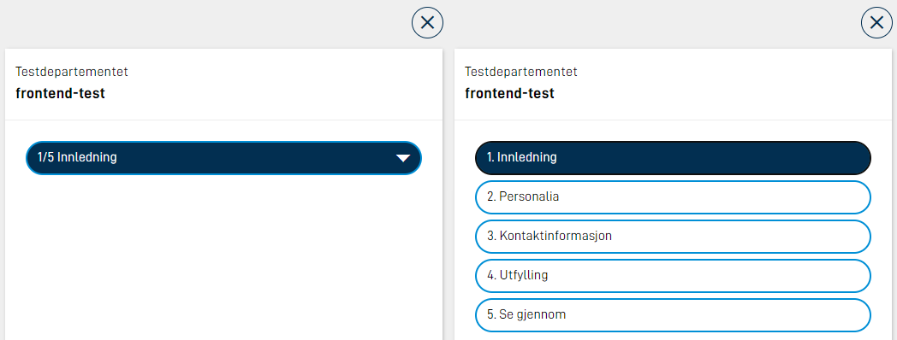

Navigasjon kan handle om flere ting: Du kan la brukeren bevege seg fra side til side med knapper, vise et navigasjonsfelt øverst på siden, eller vise en sidemeny med oversikt over sidene og oppgavene i appen. Denne artikkelen dekker alle tre.

## Gå fra side til side med knapper

Brukeren flytter seg mellom sidene i appen ved hjelp av navigasjonsknapper. Altinn Studio Designer legger til knappene automatisk, men du kan også legge dem til manuelt i koden.

### Legge til navigasjonsknapper manuelt i layoutfilen (NavigationButtons)

Du legger navigasjonsknappene i alle layoutfilene der du trenger dem. Vil du vise dem nederst på siden, plasserer du dem nederst i layoutfilen.

#### Eksempel på konfigurasjon

```json
{
  "id": "nav-page2",
  "type": "NavigationButtons",
  "textResourceBindings": {
    "next": "next",
    "back": "back"
  },
  "showBackButton": true
}
```



### Parametere for NavigationButtons

| Parameter | Beskrivelse |
| --- | --- |
| id | Unik ID for komponenten. |
| type | Må være «NavigationButtons». |
| textResourceBindings | Lar deg overstyre standardtekstene på knappene med egne tekster. |
| showBackButton | Valgfritt. Viser knappene Forrige og Neste i stedet for bare Neste-knappen. |

## Vise en sidemeny med rekkefølgen på sidene

Du definerer rekkefølgen på sidene i `Settings.json`-fila til prosesstegmappen.

**Filplassering:** `App/ui/Task_1/Settings.json` (bytt ut `Task_1` med prosesstegets egen ID)

```json
{
  "pages": {
    "order": ["side1", "side2"]
  }
}
```

**Skjule sider dynamisk:** Du kan skjule enkelte sider med [dynamiske uttrykk](#show-hide-pages).

## Gruppere sider

Du kan gruppere sidene og vise dem i en sidemeny som alternativ til tradisjonell rekkefølge. Da erstatter du `pages.order` med `pages.groups`.

**Filplassering:** `App/ui/Task_1/Settings.json`

```json
{
  "pages": {
    "groups": [
      {
        "name": "group.info",
        "type": "info",
        "order": ["info1", "info2"]
      },
      {
        "name": "group.form",
        "markWhenCompleted": true,
        "expandedByDefault": true,
        "order": ["side1", "side2", "side3"]
      },
      {
        "order": ["oppsummering"]
      }
    ]
  }
}
```

### Parametere for sidegrupper

| Parameter | Beskrivelse |
| --- | --- |
| name | Tekstressurs som angir navnet på sidegruppen. Må være med hvis gruppen inneholder mer enn én side. |
| type | Valgfritt. Bruk «info» eller «default». |
| markWhenCompleted | Valgfritt. Markerer sider som ferdig utfylt når brukeren har rettet alle valideringsfeil og sett siden. |
| expandedByDefault | Valgfritt. Viser sidene i gruppen i sidenavigasjonen fra start. Som standard skjuler appen sidene under gruppenavnet til brukeren åpner gruppen. |
| order | Angir hvilke sider som inngår i gruppen. |



## Vise arbeidsflyt og oppgaver i navigasjonsmenyen

### Vise arbeidsflyten ved å definere det i koden

Du kan vise hele arbeidsflyten i navigasjonsmenyen på to måter i koden:

- **For hele appen:** i `App/ui/Settings.json` med `taskNavigation` direkte i roten av fila (ikke i et eget objekt).
- **Per prosessteg:** i prosesstegets `Settings.json` med `pages.taskNavigation`.

#### Eksempel for hele appen

**Filplassering:** `App/ui/Settings.json`

```json
{
  "taskNavigation": [
    {
      "name": "task.form",
      "taskId": "Task_1"
    },
    {
      "taskId": "Task_2"
    },
    {
      "type": "receipt"
    }
  ]
}
```

### Parametere for stegene i arbeidsflyten

| Parameter | Beskrivelse |
| --- | --- |
| name | Valgfritt. Tekstressurs som angir navnet på oppgaven. |
| taskId | Hvilket prosessteg (task) det gjelder. Obligatorisk hvis ikke type er satt. |
| type | «receipt». Obligatorisk hvis ikke taskId er satt. |


## Vise navigasjon fra Altinn Studio Designer

Altinn Studio Designer har en egen navigasjonsmeny du kan legge til fra **Utforming**-siden. Du velger selv om du vil vise alle sidene og oppgavene i navigasjonen, eller bare noen av dem.

### Legg til oppgaver i navigasjonen

1. Åpne appen du vil sette inn en navigasjonsmeny for.
2. Klikk på **Utforming** i toppmenyen. Du kommer til Oversikt-siden for Utforming, der du ser oppgavene som er tilgjengelige i appen.
3. Under **Andre innstillinger** ser du øverst en melding om at du ikke viser noen oppgaver i navigasjonsmenyen ennå. Under den finner du en tabell med oppgaver du kan velge å vise.
4. Velg **Vis alle oppgavene** hvis du vil ha med alle oppgavene i navigasjonsmenyen. Da ser du at de blir tilgjengelige i den øverste tabellen. Velg enkeltoppgaver med **Vis oppgaven** hvis du ikke vil ha med alle oppgavene.
5. Den øverste tabellen viser nå oppgavene du har valgt å vise, og rekkefølgen de vises i. Klikk på de tre prikkene til høyre for hver oppgave for å skjule enkeltoppgaver, eller flytte dem opp og ned for å endre rekkefølgen i navigasjonen. Her kan du også endre visningsnavnet for en oppgave og gå direkte til utformingen av den.
6. Bruk knappen **Vis med navigasjonsmeny** for å forhåndsvise navigasjonsmenyen på venstre side i appen.

## Vise en fremdriftsindikator

En fremdriftsindikator er et lite visuelt hjul som viser hvor langt brukeren har kommet med å fylle ut eller lese et skjema. Den kan gi brukeren oversikt over totalt antall sider, og hvor i utfyllingen brukeren er. Fremdriftsindikatoren vises øverst i det høyre hjørnet.



### Viktig å vite

Har du satt opp [dynamisk skjulte sider](#show-hide-pages), kan antallet sider variere mye og virke forvirrende for brukeren.

**Vurder om fremdriftsindikatoren gir mening og verdi for brukeren, før du legger den til.**

### Legge til selve fremdriftsindikatoren

Du kan sette `showProgress` per prosessteg, eller globalt for hele appen i `App/ui/Settings.json` (se ). Eksempel per prosessteg:

**Filplassering:** `App/ui/Task_1/Settings.json`

```json
{
  "$schema": "https://altinncdn.no/toolkits/altinn-app-frontend/4/schemas/json/layout/layoutSettings.schema.v1.json",
  "pages": {
    "order": ["student-info", "school-work", "well-being"],
    "showProgress": true
  }
}
```

## Vise et navigasjonsfelt (NavigationBar)

Et navigasjonsfelt vises øverst på siden i appen, og kan gjøre det enklere for brukeren å se alle sidene i appen. Gi hver side et godt navn, slik at navigasjonsfeltet blir nyttig.



### Hvordan fungerer det?

- **Store skjermer:** Appen viser alle sidene i listen. Er det ikke plass på én linje, fortsetter listen på neste linje.
- **Små skjermer:** Appen skjuler alle sidene i en nedtrekksmeny. Den aktive siden vises i menyen. Brukeren klikker på menyen for å se alle sidene.



### Legge til navigasjonsfeltet i koden

Du legger til navigasjonsfeltet ved å legge koden for det i alle layoutfilene der du vil bruke det:

```json
{
  "id": "navbar-page1",
  "type": "NavigationBar"
}
```

### Vise nedtrekksmenyen på alle skjermer

I koden kan du sette opp at appen skal vise sidene i navigasjonsfeltet som en nedtrekksmeny, også på større skjermer:

```json
{
  "id": "navbar-page1",
  "type": "NavigationBar",
  "compact": true
}
```

### Endre tekstene på knappene i navigasjonsfeltet

Knappene i navigasjonsfeltet henter navnet sitt fra filnavnet til siden, uten filutvidelsen. For eksempel blir `side1.json` og `side2.json` til knappene «side1» og «side2».

**Slik endrer du tekstene:**

Legg til tekster i `resources.XX.json`, der `id` er navnet på fila uten filutvidelsen:

```json
{
  "id": "side1",
  "value": "Første side"
},
{
  "id": "side2",
  "value": "Siste side"
}
```

## Angi validering ved sidebytte

Du kan legge inn kode for å sjekke om det finnes valideringsfeil når brukeren prøver å navigere mellom sider. Valideringsfeil kan for eksempel bety at brukeren har glemt å fylle ut et felt, eller har fylt det ut med feil format på informasjonen. Hvis det er feil, stopper appen navigeringen.

Du kan konfigurere dette på tre nivåer med ulik prioritet: globalt for hele appen, per prosessteg og per side. I tillegg kan du konfigurere NavigationButtons, CustomButton og NavigationBar på komponentnivå.

### `validationOnNavigation`-objektet

Du bruker egenskapen `validationOnNavigation` på globalt nivå, per prosessteg og per side. Den har to egenskaper. På komponentnivå bruker du tilsvarende objekt, men via egenskapene `validateOnNext` og `validateOnPrevious` (NavigationButtons) eller `validateOnForward` og `validateOnBackward` (NavigationBar).

```json
{
  "page": "current",
  "show": ["Required", "Schema"]
}
```

**page – hvilke sider appen sjekker:**

| Verdi | Beskrivelse |
| --- | --- |
| `"current"` | Appen sjekker kun gjeldende side. |
| `"currentAndPrevious"` | Appen sjekker gjeldende side og alle tidligere besøkte sider. |
| `"all"` | Appen sjekker alle sidene i prosessteget. |

**show – hvilke valideringstyper appen viser:**

| Verdi | Beskrivelse |
| --- | --- |
| `"Required"` | Påkrevde felter som ikke er fylt ut. |
| `"Schema"` | JSON Schema-feil på feltverdier. |
| `"Component"` | Komponentspesifikk validering (for eksempel ugyldig format). |
| `"Expression"` | Egendefinerte valideringsuttrykk. |
| `"CustomBackend"` | Egendefinerte backendvalideringer. |
| `"All"` | Alle frontendvalideringer. |
| `"AllExceptRequired"` | Alle frontendvalideringer unntatt påkrevde felter. |

### Konfigurasjonsnivåer

#### 1. Globalt nivå

Gjelder for alle prosessteg i appen. Konfigurer direkte i roten av `App/ui/Settings.json` (ikke i et eget objekt).

**Filplassering:** `App/ui/Settings.json`

```json
{
  "validationOnNavigation": {
    "page": "current",
    "show": ["Required"]
  }
}
```

{}
Denne plasseringen følger samme mønster som andre globale innstillinger (se ), men er ikke bekreftet av en utvikler ennå. Sjekk med utvikler før du følger dette eksempelet.
{}

#### 2. Per prosessteg

Overstyrer det globale nivået for ett prosessteg. Konfigurer under `pages` i prosesstegets `Settings.json`.

**Filplassering:** `App/ui/Task_1/Settings.json`

```json
{
  "pages": {
    "order": ["personalia", "kontakt", "oppsummering"],
    "validationOnNavigation": {
      "page": "current",
      "show": ["Required"]
    }
  }
}
```

#### 3. Per side

Overstyrer prosesstegets innstilling for én enkelt side. Konfigurer direkte på `data`-objektet i layoutfila.

**Filplassering:** `App/ui/Task_1/layouts/side1.json`

```json
{
  "data": {
    "layout": [...],
    "validationOnNavigation": {
      "page": "currentAndPrevious",
      "show": ["All"]
    }
  }
}
```

#### 4. Komponentnivå (NavigationButtons, CustomButton, NavigationBar)

Har du ikke konfigurert noen av de høyere nivåene, kan du konfigurere validering direkte på komponenten. For NavigationButtons bruker du `validateOnNext` og `validateOnPrevious`:

```json
{
  "id": "nav",
  "type": "NavigationButtons",
  "validateOnNext": {
    "page": "current",
    "show": ["Required", "Schema"]
  }
}
```

**Merk:** Setter du `validationOnNavigation` på side-, prosessteg- eller globalt nivå, overstyrer denne konfigurasjonen komponentnivået:

- Den erstatter `validateOnNext`.
- Den slår av `validateOnPrevious` helt.

### Prioritetsrekkefølge

Side → Prosessteg → Globalt → Komponent

Sidenivå har høyest prioritet og overstyrer alt annet. Komponentnivåkonfigurasjonen gjelder bare når du ikke har konfigurert noen høyere nivåer.

### Blokkere direktenavigasjon i sidemenyen

Når sidemenyen er aktiv og brukeren prøver å hoppe direkte til en side lenger fremme i rekkefølgen, stopper appen navigasjonen dersom noen av de mellomliggende sidene har `validationOnNavigation` konfigurert og inneholder valideringsfeil.

**Eksempel:** Brukeren er på side 1 og prøver å navigere direkte til side 3. Har side 2 `validationOnNavigation` konfigurert og inneholder valideringsfeil, er ikke knappen for side 3 tilgjengelig før brukeren retter feilene.

### Hva skjer når det er valideringsfeil?

Når brukeren prøver å navigere og det finnes valideringsfeil:

- Appen viser feilene på siden.
- Appen blokkerer navigasjonen hvis det er feil på gjeldende side eller tidligere sider.
- Er feilene bare på fremtidige sider (ved `"all"`), blokkerer ikke appen navigasjonen, men viser feilene når brukeren navigerer til de aktuelle sidene.

### Bruke NavigationBar med validering

NavigationBar-komponenten har tilsvarende egenskaper, `validateOnForward` og `validateOnBackward`:

```json
{
  "id": "nav1",
  "type": "NavigationBar",
  "validateOnForward": {
    "page": "current",
    "show": ["All"]
  }
}
```

