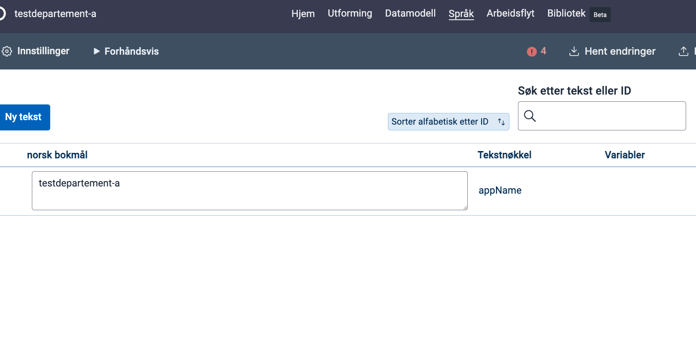
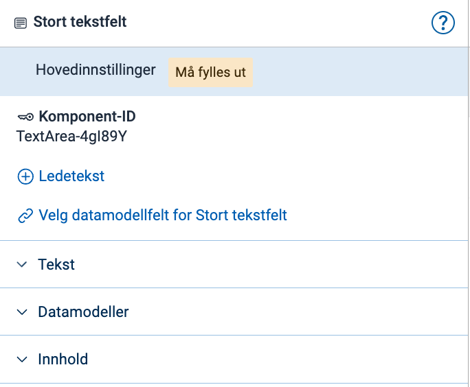
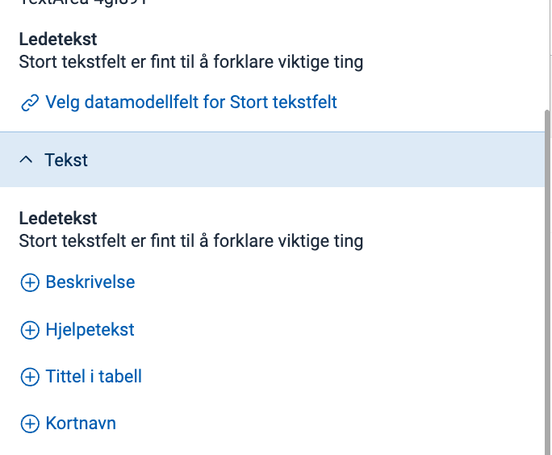
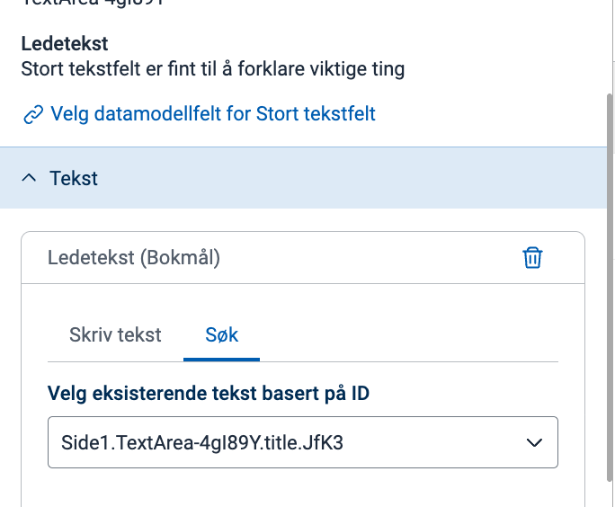
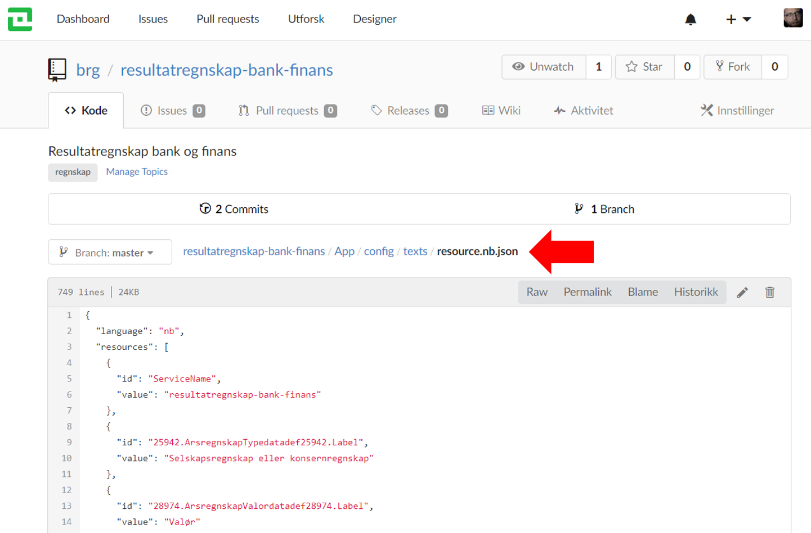
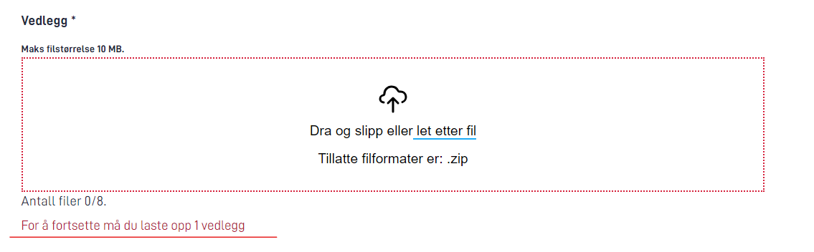
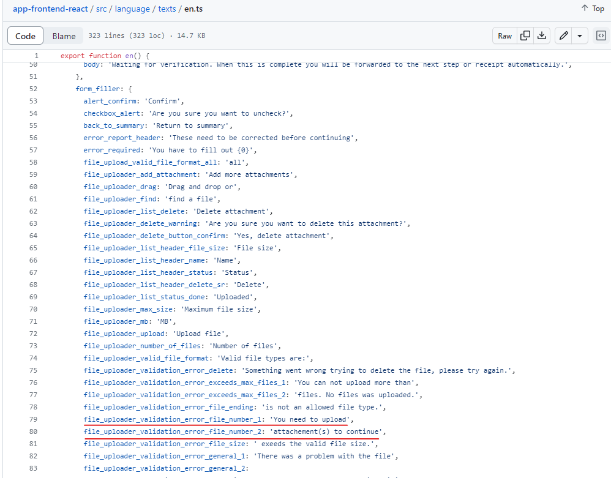
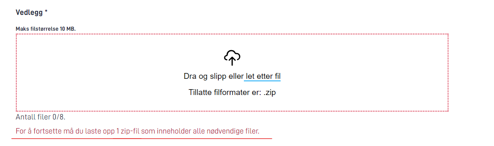
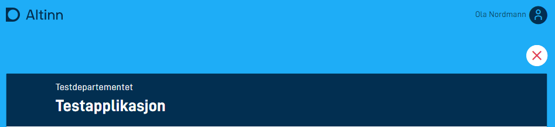
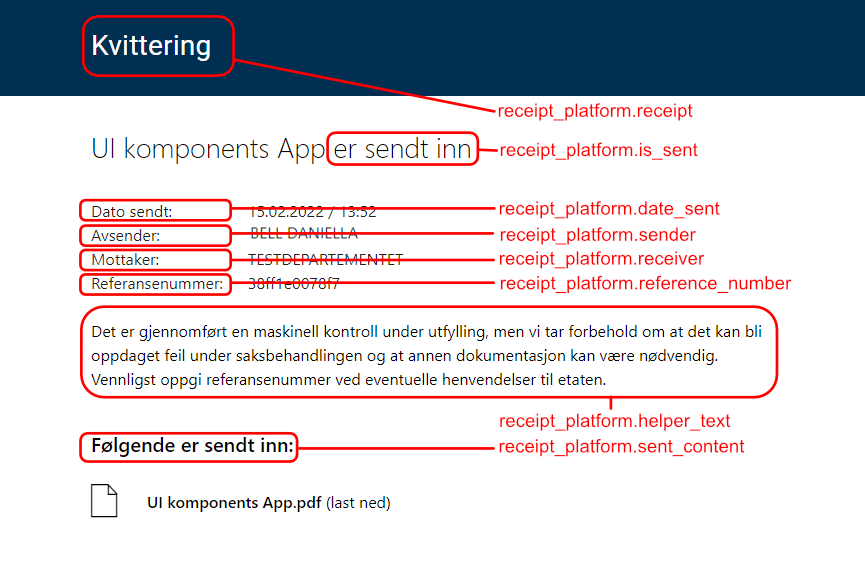

Du lagrer tekster i ressursfiler i katalogen `App/config/texts`. Tekstene kan komme fra felles bibliotek, datamodellen, eller du kan legge dem inn manuelt.

Tekstressursene er tilgjengelige når du redigerer komponenter i skjemaet i Altinn Studio Designer, og appen viser dem til sluttbrukeren når skjemaet laster inn i nettleseren.

Du lagrer tekstene i JSON-format, med én fil per språk. Filnavnet følger formatet `resource.[språk].json`, for eksempel _resource.nb.json_.

Du kan redigere tekstene lokalt, direkte i JSON-filene, eller i teksteditoren i Designer.

## Formatere tekster

Du kan formatere alle tekster med markdown. Under ser du de vanligste formateringene.

Du finner mer utfyllende dokumentasjon og tips til hvordan du kan bruke markdown, i [Markdown Cheatsheet](https://github.com/adam-p/markdown-here/wiki/Markdown-Cheatsheet).

### Uthevede tekster

Det er svært enkelt å gjøre ord eller setninger fete eller kursive i markdown.

```markdown
Dette er en _kursiv tekst_ laget med understrek.
Dette er også en *kursiv tekst* laget med stjerne.
```

```markdown
Dette er __fet tekst__ laget med understrek.
Dette er også **fet tekst**, men laget med stjerner!
```

### Linjeskift

I markdown bruker du `\n` for å markere et linjeskift. Skal det vises som et nytt avsnitt i teksten, må du ha to linjeskift etter hverandre. For eksempel:

```markdown
Dette er en tekst.\n\nDette er en tekst på neste linje. 
```

Alternativt kan du bruke HTML:
```markdown
Dette er en tekst.<br/>Dette er en tekst på neste linje.
```

### Lenker

For enkle lenker kan du bruke markdown-syntaks:

```markdown
Åpne [forsiden av Altinn](https://altinn.no).
```

Skal du sette flere egenskaper, kan du bruke HTML-syntaks i stedet:

```html
Gå til <a href="https://altinn.no" class="same-window">forsiden av Altinn</a>.
```

Når du velger at lenken skal åpne i samme vindu, forlater brukerne skjemaet idet de klikker på lenken. Appen lagrer tilstanden til skjemaet i instansen, slik at brukerne kan vende tilbake senere.

### Overskrifter

```markdown
# Dette er en stor heading (H1)

## Dette er en litt mindre heading (H2)

### Og enda litt mindre (H3)

#### Bitteliten heading (H4)
```

## Legge til og endre tekster i en app

Du har to alternativer når du skal endre tekster i en app: via Altinn Studio Designer, eller direkte i repoet.

### Altinn Studio Designer

#### Teksteditor

I toppmenyen i Altinn Studio Designer velger du **Språk** for å redigere tekster. Der får du en oversikt over tekstene som allerede er tilgjengelige for appen.

På denne siden kan du redigere eksisterende tekster og legge til nye tekstressurser. Du legger til en ny tekst ved å klikke på **Ny tekst**. Du får da en unik tekstnøkkel automatisk, og kan endre den ved å klikke på blyantikonet ved siden av nøkkelen. Endringer i tekstene lagrer appen underveis.

Du velger hvilke språk som skal vises i tabellen, for enklere oversettelse. Det gjør du i panelet til høyre. Der kan du også legge til nye språk du vil oversette appen til.



#### Direkte i komponentredigeringen

Når du konfigurerer en komponent i skjemaeditoren (velg **Utforming** i toppmenyen), kan du legge til, redigere og oversette tekster for den enkelte komponenten direkte.

Legg til en tekst ved å klikke på `+`-ikonet for den aktuelle teksten (Ledetekst eller Beskrivelse).


Rediger en tekst på komponenten ved å holde musepekeren over feltet Ledetekst. Da dukker redigeringsblyanten opp til høyre for navnet, og du kan klikke på den for å redigere teksten.


Legg til en eksisterende tekst på komponenten ved å klikke på fanen **Søk**, og velg blant de tilgjengelige tekstene.


### Legge til og endre tekster i repoet

Skal du endre mange tekster samtidig, anbefaler vi at du redigerer dem direkte i repoet — enten via Altinn Studio Repos, eller i en lokal klone i kodeeditoren du selv velger.

Du finner tekstene i `App/config/texts`.



## Endre standardtekster og feilmeldinger i appen

Du kan endre standardtekster og feilmeldinger som vises i appen.
Her finner du nøklene med standardverdiene på [engelsk](https://github.com/Altinn/app-frontend-react/blob/main/src/language/texts/en.ts), 
[norsk bokmål](https://github.com/Altinn/app-frontend-react/blob/main/src/language/texts/nb.ts) og [nynorsk](https://github.com/Altinn/app-frontend-react/blob/main/src/language/texts/nn.ts).

Du må håndtere standardtekster som inneholder tall, på en litt annen måte. `file_uploader_validation_error` er et eksempel: den viser en feilmelding hvis appen krever minst ett vedlegg.
Denne standardfeilmeldingen vises som «For å fortsette må du laste opp 1 vedlegg».



Denne standardteksten er delt i to strenger: én før tallet, `For å fortsette må du laste opp`, og én tekstressurs etter tallet, `vedlegg`.
Du kan ikke redigere selve tallet, siden det i dette tilfellet er knyttet til maksimum og minimum antall vedlegg. Men teksten rundt tallet kan du endre.



Legg til tekstnøkkelen og den nye verdien i `App/configuration/texts/resource`. Merk at nøkkelen må vise til den overordnede gruppen, og deretter tekstnøkkelen, atskilt med `.`

```json
    {
      "id": "form_filler.file_uploader_validation_error_file_number_1",
      "value": "For å fortsette må du laste opp"
    },
    {
      "id": "form_filler.file_uploader_validation_error_file_number_2",
      "value": "zip-fil som inneholder alle nødvendige filer."
    }
```

Dette gir en feilmelding som vist under:


## Variabler i tekster

Du kan sette inn variabler i tekster ved å følge oppsettet under. Det er viktig at rekkefølgen på variablene er den samme som parameterne i teksten.

```json
{
  "id": "good.text.id",
  "value": "Hello, {0}! Here is a second variable {1}.",
  "variables": [
    {
      "key": "<datamodelField>",
      "dataSource": "dataModel.<dataModelName>"
    },
    {
      "key": "<settings key>",
      "dataSource": "applicationSettings"
    },
    {
      "key": "<instance value key>",
      "dataSource": "instanceContext"
    },
    {
      "key": "<custom text parameter key>",
      "dataSource": "customTextParameters"
    }
  ]
}
```

### Datakilder

Du kan hente verdier fra fire ulike datakilder:

1. **Datamodell**  
   Ved å angi `dataModel.<dataModelNavn>` som datakilde kan du hente verdier fra felt i skjemaet som brukeren fyller ut. Du kan hente data fra felt uavhengig av om de er synlige eller ikke. Endrer brukeren data i et felt en variabel refererer til, oppdaterer appen teksten når brukeren slutter å skrive i feltet.
2. **Innstillinger**  
   Ved å angi `applicationSettings` som datakilde kan du hente verdier fra en egen seksjon i `appsettings.{miljø}.json`-filene, kalt `FrontEndSettings`. Dette er en dynamisk liste du kan utvide uten å endre koden. Dermed kan du ha ulike verdier fra miljø til miljø, ved å sette andre verdier i de ulike `appsettings.{miljø}.json`-filene. Legg merke til at `FrontEndSettings` og `applicationSettings` bruker stor forbokstav forskjellig.
   ```json
   "FrontEndSettings": {
     "HomeBaseUrl": "https://www.testdirektoratet.no"
   },
   ```
3. **Instans**  
   Ved å angi `instanceContext` som datakilde kan du hente enkelte verdier fra den aktive instansen — du har ikke tilgang til hele instansobjektet. Så langt kan du hente disse egenskapene:
   1. `instanceOwnerPartyId` inneholder avgiverens party-id.
   2. `instanceId` inneholder id-en til den aktive instansen.
   3. `appId` inneholder id-en til appen instansen hører til.
4. **Egendefinerte tekstparametere**  
   Ved å angi `customTextParameters` som datakilde kan du hente egendefinerte verdier, der du selv setter dem. I dag kan du sette `CustomTextParameters` i `ValidationIssue` og `InstantiationValidationResult`. Eksempel:
   ```cs
    new ValidationIssue()
    {
        CustomTextKey = "good.text.id",
        CustomTextParameters = new() 
          {
            ["<custom text parameter key>"] = someValue 
          },
        Field = "someField",
        Severity = ValidationIssueSeverity.Error,
    };
   ```

### Standardverdi

Finner ikke appen en variabel i datakilden, viser den i stedet stien til feltet i datakilden. Ønsker du å vise noe annet enn denne stien, kan du legge til et standardverdialternativ for hver variabel.

Vil du at appen ikke skal vise teksten i det hele tatt når den ikke finner feltet i datakilden, kan du sette `defaultValue` til en tom streng.

```json
{
  "id": "good.text.id",
  "value":  "{0}",
  "variables": [
    {
      "key": "someField",
      "dataSource": "dataModel.default",
      "defaultValue": " "
    }
  ]
}
```

### Fullstendig eksempel

```json
{
  "id": "common.submitinfo",
  "value": "You are submitting for: {0} with organisation number: {1}. The organisations party id is {2}. [Link to our page]({3}).",
  "variables": [
    {
      "key": "skattepliktig.organisasjonsnavn",
      "dataSource": "dataModel.default",
      "dataValue": "Mattilsynet"
    },
    {
      "key": "skattepliktig.organisasjonsnummer",
      "dataSource": "dataModel.default"
    },
    {
      "key": "instanceOwnerPartyId",
      "dataSource": "instanceContext"
    },
    {
      "key": "homeBaseUrl",
      "dataSource": "applicationSettings"
    }
  ]
}
```

### Variabler i tekst – repeterende grupper

For at variabler i tekst skal fungere med data i repeterende grupper, må du endre oppsettet ovenfor litt for de aktuelle feltene, slik at du spesifiserer hvilken repeterende gruppe dataene ligger i.

Det gjør du ved å legge til `[{0}]` _etter_ den repeterende gruppen når du angir felt i datamodellen i `key`-parameteren. For eksempel:

```json {hl_lines=[6,10]}
{
  "id": "common.submitinfo",
  "value": "Du leverer nå skjema for: {0} med organisasjonsnummer: {1}.",
  "variables": [
    {
      "key": "skattepliktig[{0}].organisasjonsnavn",
      "dataSource": "dataModel.default"
    },
    {
      "key": "skattepliktig[{0}].organisasjonsnummer",
      "dataSource": "dataModel.default"
    }
  ]
}
```

Du kan fritt kombinere variabler fra felt i en repeterende gruppe med variabler fra felt utenfor den repeterende gruppen. Vi anbefaler derimot ikke å kombinere variabler fra felt i _forskjellige_ repeterende grupper, med mindre du er helt sikker på at rekkefølgen på oppføringene i gruppene alltid blir helt lik.

## Legge til hjelpetekst

Hjelpetekster er korte tekstsnutter som gir en kort og presis beskrivelse av hva sluttbrukeren skal fylle ut i feltet teksten hører til.

Du definerer nøklene for hjelpeteksten i `FormLayout.json`, som du finner under `App/ui/` i repoet.

Under ser du et eksempel på en `FormLayout.json`-fil uten hjelpetekster.

```json
{
  "data": {
    "layout": [
      {
        "id": "616071dc-90b1-4ce5-8d18-492844828a41",
        "type": "Header",
        "textResourceBindings": {
          "title": "appName"
        }
      },
      {
        "id": "08d707a9-2475-4d23-bf76-f209fb434ec2",
        "type": "TextArea",
        "textResourceBindings": {
          "title": "tilleggsopplysninger.label",
          "description": "tilleggsopplysninger.desc"
        },
        "dataModelBindings": {
          "simpleBinding": "omsetningsoppgaverTilleggsopplysninger.value"
        }
      },
      {
        "id": "bd6589b6-e2ab-49ba-b39a-dd3f8b63e5de",
        "type": "Button",
        "textResourceBindings": {
          "title": "Send inn"
        }
      }
    ]
  }
}
```

Vil du legge til hjelpetekst på en av disse skjemakomponentene, gjør du dette:

1. Legg til hjelpeteksten i tekstressursfilen, som beskrevet [her](#legge-til-og-endre-tekster-i-en-app).
2. Åpne `FormLayout.json`-filen.
3. Legg til en binding til den nye hjelpeteksten, med nøkkelen `"help"` og verdi lik nøkkelen til tekstressursen.

Slik ser hele filen ut etter at du har lagt til en hjelpetekst:

```json {linenos=false,hl_lines=[20]}
{
  "data": {
    "layout": [
      {
        "id": "616071dc-90b1-4ce5-8d18-492844828a41",
        "type": "Header",
        "textResourceBindings": {
          "title": "appName"
        }
      },
      {
        "id": "08d707a9-2475-4d23-bf76-f209fb434ec2",
        "type": "TextArea",
        "textResourceBindings": {
          "title": "tilleggsopplysninger.label",
          "description": "tilleggsopplysninger.desc",
          "help": "tilleggsopplysninger.help"
        },
        "dataModelBindings": {
          "simpleBinding": "omsetningsoppgaverTilleggsopplysninger.value"
        }
      },
      {
        "id": "bd6589b6-e2ab-49ba-b39a-dd3f8b63e5de",
        "type": "Button",
        "textResourceBindings": {
          "title": "Send inn"
        }
      }
    ]
  }
}
```

## Endre app-tittel

Når du oppretter en app, får du automatisk en tekstressurs med nøkkelen `appName`.
Dette er tittelen på appen, og den vises flere steder i løsningen — blant annet når sluttbrukeren fyller ut skjemaet, og når elementer vises i meldingsboksen på altinn.no.

Tittelen på appen skal ligge to steder i app-repoet:
1. I tekstressursene, med nøkkelen `appName`.
2. I `applicationmetadata.json`, under egenskapen `title`. Denne filen ligger under `App/config/`.

Vi oppfordrer deg til å legge inn tittelen på bokmål, nynorsk og engelsk. Mangler tittelen i tekstressursene, viser appen i stedet lagringsnavnet (navnet på repoet) til sluttbrukeren.

Endrer du `appName` lokalt, er det viktig at du også legger den oppdaterte tittelen inn i `applicationmetadata.json`. Endrer du derimot tittelen på appen i Altinn Studio Designer — enten på siden **Om** eller **Språk** — oppdaterer Designer `applicationmetadata.json` automatisk.

### Eksempel på korrekt konfigurasjon for app-tittel

I `App/config/applicationmetadata.json`:

```json
"title": {
    "nb": "Automatisk deploy applikasjonen",
    "nn": "Automatisk deploy applikasjonen",
    "en": "Auto deploy application"
  },
```

I `App/config/texts/resource.nb.json`:

```json
{
  "language": "nb",
  "resources": [
    {
      "id": "appName",
      "value": "Automatisk deploy applikasjonen"
    },
    ...
  ]
}
```

I `App/config/texts/resource.nn.json`:

```json
{
  "language": "nn",
  "resources": [
    {
      "id": "appName",
      "value": "Automatisk deploy applikasjonen"
    },
    ...
  ]
}
```

I `App/config/texts/resource.en.json`:

```json
{
  "language": "en",
  "resources": [
    {
      "id": "appName",
      "value": "Auto deploy application"
    },
    ...
  ]
}
```

## Endre app-eiertekst

Appen viser app-navnet og app-eierteksten øverst i skjemaet.



Som standard henter appen app-eieren fra tekstene i [altinn-orgs.json](https://github.com/Altinn/altinn-cdn/blob/master/orgs/altinn-orgs.json).
Vil du endre dette navnet, legger du til nøkkelen `appOwner` i tekstressursene. Den overstyrer da verdien som ligger på CDN-en.

Eksempel:

```json
{
  "language": "en",
  "resources": [
    {
      "id": "appOwner",
      "value": "Test Ministry"
    },
    ...
  ]
}
```

## Endre tekster på kvitteringssiden for arkiv

Du kan overstyre tekstene på kvitteringssiden ved å legge tekster i appens `config/texts/resource.[språk].json`-fil(er).

{}
Når du overstyrer tekster i kvitteringen, påvirker det alle kvitteringer for appen. Det betyr at skjemaer som allerede er sendt inn, også får de oppdaterte tekstene på kvitteringssiden. Dette påvirker ikke den genererte PDF-filen.
{}

Du kan bruke markdown og variabler i kvitteringstekstene. Du kan derimot bare hente variabler fra `Instance` (se [Datakilder](#datakilder) for detaljer).

Dette er tekstnøklene du kan bruke til å overstyre standardtekstene:

```json
receipt_platform.attachments
receipt_platform.date_sent
receipt_platform.helper_text
receipt_platform.is_sent
receipt_platform.receipt
receipt_platform.receiver
receipt_platform.reference_number
receipt_platform.sender
receipt_platform.sent_content

```

Vil du for eksempel overstyre hjelpeteksten, kan du legge dette til i `config/texts/resource.nb.json`-filen i appen:

```json
{
  "language": "nb",
  "resources": [
    {
      "id": "receipt_platform.helper_text",
      "value": "Min egendefinerte hjelpetekst"
    }
  ]
}
```

Bildet under viser hvilke tekstnøkler som styrer hvilken del av brukergrensesnittet:



{}
**Merk:** Disse tekstendringene er **ikke** synlige når du tester appen din lokalt — de vises bare i et eksternt testmiljø, for eksempel **TT02**. Du ser endringene når du åpner et allerede arkivert skjema fra Arkivet, ved å klikke på knappen **Se innsendt skjema**. De endrede tekstene gjelder bare kvitteringen i arkivet, og påvirker ikke kvitteringen brukeren ser rett etter at skjemaet er sendt inn. Se [kvittering](#kvittering) for hvordan du kan tilpasse både tekstene og oppsettet i denne kvitteringen.
{}


