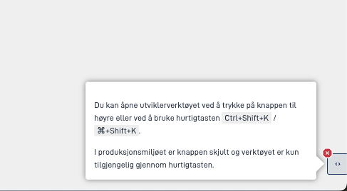

>Du gjør oppsettet i denne seksjonen fra **Utforming**-siden i appens arbeidsflate. Naviger dit ved å klikke på **Utforming** i toppmenyen fra appens arbeidsflate.

### Slik viser du betalingsinformasjon i skjemaet

> Du skal gjøre dette steget i oppgaven som er selve skjemaet. Gå til **Oversikt** på **Utforming**-siden, og klikk på **Utform** på kortet for oppgaven. Skjemaoppgaven som følger med appen når du oppretter den, har ID-en `Task_1`. Hvis du har lagt til andre skjemaoppgaver i prosessen, velger du kortet med samme ID som oppgaven i prosessen.

- Dra komponenten **Betalingsdetaljer** inn i skjemaet. Denne komponenten viser en tabell som viser elementene brukeren må betale for.
  - Komponenten ligger i **Avansert** i komponentkolonnen til venstre på siden.

  Du kan plassere denne komponenten hvor som helst i skjemaet ditt, men vi anbefaler å sette den på den siste siden før brukeren blir bedt om å betale.

- Systemet beregner ordrelinjene ut fra data i skjemaet. Når brukeren endrer disse dataene, må appen hente ordrelinjene på nytt. Derfor legger du til datafeltene som systemet bruker i beregningen, i `refetchDependencies`. Hver verdi er et uttrykk som peker på et felt i datamodellen. Navnet på nøkkelen kan du velge fritt, og verdiene sendes ikke til serveren. Dette gjør du manuelt, direkte i layoutfilene:

```json
{
  "id": "paymentDetails",
  "type": "PaymentDetails",
  "textResourceBindings": {
    "title": "Oversikt over betaling",
    "description": "Her er en oversikt over hva du skal betale for."
  },
  "refetchDependencies": {
    "inventory": ["dataModel", "GoodsAndServicesProperties.Inventory.InventoryProperties"]
  }
}
```

### Slik viser du betalingsinformasjon i betalingssteget
Systemet setter dette opp automatisk hvis du brukte Altinn Studio Designer og prosessverktøyet til å sette opp betalingssteget.

### Slik setter du opp egen visning for kvittering for betaling (valgfritt)
Dette steget er valgfritt. Hvis du ikke gjennomfører dette steget, brukes oppsettet fra betalingssteget.

1. Sjekk at det er utforming for betalingssteget som vises på **Utforming**-siden.
2. Klikk på **Legg til ny side**.
3. I konfigurasjonspanelet for siden åpner du **PDF** og klikker på **Gjør om siden til PDF**.
4. Legg til komponenten **Betaling**, og eventuelt andre tekster og komponenter du ønsker på PDF-siden.
5. Forhåndsvis PDF-en ved å åpne utviklerverktøyet med ikonknappen nederst til høyre i forhåndsvisningen , og klikk deretter på **Generer PDF**.
