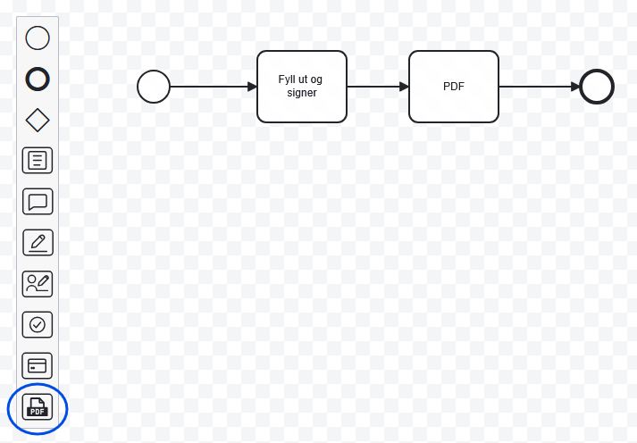
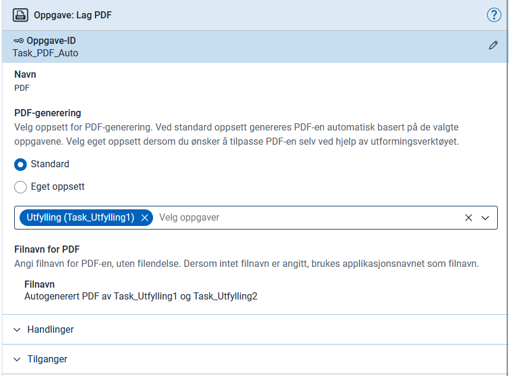
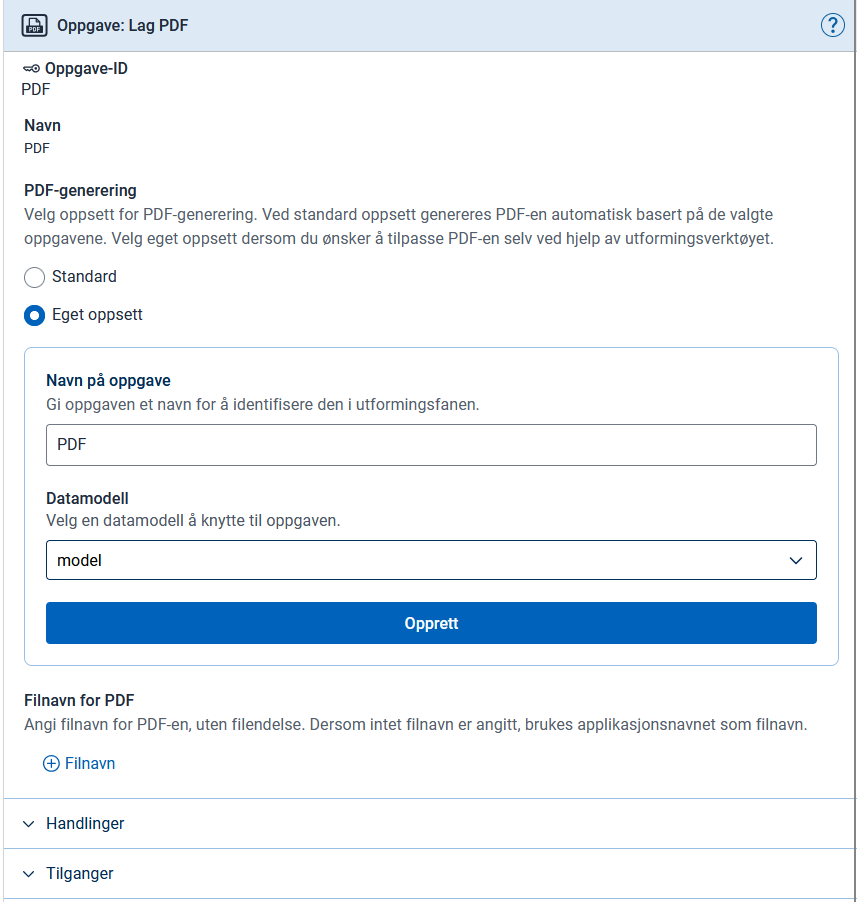

## Overview

The app generates PDFs through a **service task** that you add as a step in the process. The task defines which content the PDF should contain and where in the process it is generated.

To generate PDFs of subforms, there is a separate service task. See [PDF generation for subforms](/nb/altinn-studio/v9/develop-a-service/look-and-feel/subform/subform-pdf/) (documentation available in Norwegian only).

{}
Images in this guide show Norwegian GUI elements, as Altinn Studio Designer is only available in Norwegian.
{}

## Setup

You can use the Arbeidsflyt tab in Altinn Studio to add a PDF service task.



Drag and drop the PDF service task to where in the process you want to generate a PDF, often right after a data task.

Once you have placed the task, a configuration panel opens on the right side of the screen.
There you choose between two approaches: standard or custom PDF.

{}

If you select this option, you specify which previous tasks should be included in the PDF. The content is based on the components in the selected tasks, displayed in summary mode. This function does not respect the pdfLayoutName configuration in Settings.json.



Altinn Studio inserts a service task into `process.bpmn`. The result may differ slightly from the example below.


  App/config/process/process.bpmn


```xml
<bpmn:serviceTask id="Pdf" name="PDF">
    <bpmn:extensionElements>
        <altinn:taskExtension>
            <altinn:taskType>pdf</altinn:taskType>
            <altinn:pdfConfig>
                <altinn:filenameTextResourceKey>pdfFileName</altinn:filenameTextResourceKey>
                <altinn:autoPdfTaskIds>
                    <altinn:taskId>Task_Utfylling1</altinn:taskId>
                </altinn:autoPdfTaskIds>
            </altinn:pdfConfig>
        </altinn:taskExtension>
    </bpmn:extensionElements>
    <bpmn:incoming>Flow_0er70tq</bpmn:incoming>
    <bpmn:outgoing>Flow_19ikt1z</bpmn:outgoing>
</bpmn:serviceTask>
```

{}

{}

If you select this option, you can determine the content of the PDF yourself by defining your own layout files for the PDF service task.

You first provide a name for the PDF service task and then choose a data model as the default model. You can, for example, choose the model of one of the tasks included in the PDF.



Altinn Studio inserts a service task into `process.bpmn` and generates the task's layout files, but without content in PdfLayout.json.


  App/config/process/process.bpmn


```xml
<bpmn:serviceTask id="Pdf" name="PDF">
    <bpmn:extensionElements>
        <altinn:taskExtension>
        <altinn:taskType>pdf</altinn:taskType>
        <altinn:pdfConfig>
            <altinn:filenameTextResourceKey>pdfFileName</altinn:filenameTextResourceKey>
        </altinn:pdfConfig>
        </altinn:taskExtension>
    </bpmn:extensionElements>
    <bpmn:incoming>SequenceFlow_0c458hu</bpmn:incoming>
    <bpmn:outgoing>SequenceFlow_5assd2s</bpmn:outgoing>
</bpmn:serviceTask>
```

### Folder structure and files

The PDF service task needs its own folder of layout files to define the content. If you use the Arbeidsflyt editor, Altinn Studio generates this automatically. You then only need to edit the content in `PdfLayout.json`.

The files and folder structure should look approximately like this:

```text
App/ui/
├── Task_Utfylling1/
│   ├── Settings.json
│   └── layouts/
│       └── ...
└── Pdf/
    ├── Settings.json
    └── layouts/
        ├── PdfLayout.json
        └── ServiceTask.json
```

#### Settings.json


  App/ui/Pdf/Settings.json


```json
{
  "$schema": "https://altinncdn.no/schemas/json/layout/layoutSettings.schema.v1.json",
  "defaultDataType": "model",
  "pages": {
    "pdfLayoutName": "PdfLayout",
    "taskNavigation": [
      {
        "taskId": "Task_Utfylling1",
        "name": "Utfylling"
      },
      {
        "type": "receipt"
      }
    ],
    "order": [
      "ServiceTask"
    ]
  }
}
```

#### PdfLayout.json

In this file, you define the content of the PDF. You typically use the Summary2 component, either against individual components or against entire pages and process tasks.


  App/ui/Pdf/layouts/PdfLayout.json


```json
{
  "$schema": "https://altinncdn.no/toolkits/altinn-app-frontend/4/schemas/json/layout/layout.schema.v1.json",
  "data": {
    "layout": [
      {
        "id": "InstanceInformation",
        "type": "InstanceInformation"
      },
      {
        "id": "SummaryTaskUtfylling1",
        "type": "Summary2",
        "target": {
          "type": "layoutSet",
          "taskId": "Task_Utfylling1"
        }
      }
    ]
  }
}
```

#### ServiceTask.json

A service task with its own folder of layout files must have at least one page, so Altinn Studio creates this one. The user does not normally see it: while the PDF is being generated, the app shows its ordinary loading view, and if generation fails, it shows its own failure page with a **Try again** button. See [What the user sees while a service task runs](/nb/altinn-studio/v9/develop-a-service/process/service-tasks/visning/) (documentation available in Norwegian only).


  App/ui/Pdf/layouts/ServiceTask.json


```json
{
  "$schema": "https://altinncdn.no/schemas/json/layout/layout.schema.v1.json",
  "data": {
    "layout": [
      {
        "size": "L",
        "id": "service-task-waiting-title",
        "type": "Heading",
        "textResourceBindings": {
          "title": "service_task.waiting_title"
        }
      },
      {
        "id": "service-task-waiting-body",
        "type": "Paragraph",
        "textResourceBindings": {
          "title": "service_task.waiting_body"
        }
      }
    ]
  }
}
```

{}

## Filename

Including `<altinn:filenameTextResourceKey>` is optional. Here you specify a text resource key to use as the filename, with support for languages and variables. If you omit it, the PDF uses the application name as the filename.

```json
{
  "id": "pdfFileName",
  "value": "My filename {0}",
  "variables": [
    {
      "key": "DataModelFieldName",
      "dataSource": "dataModel.model"
    }
  ]
}
```


  When using standard PDF, you cannot use `dataModel.default`. You must use the actual ID of the data model, e.g. `dataModel.model`.


## Testing

Fill out the form and proceed. When you reach the PDF service task in the workflow, the app generates the PDF and automatically proceeds to the next step in the process, for example the receipt.

## Troubleshooting

If you get an error message that the service task failed during PDF generation, you can open the form in the app and add the query parameter `pdf=1`. You will then see the same content the PDF should have displayed, and any error messages.
