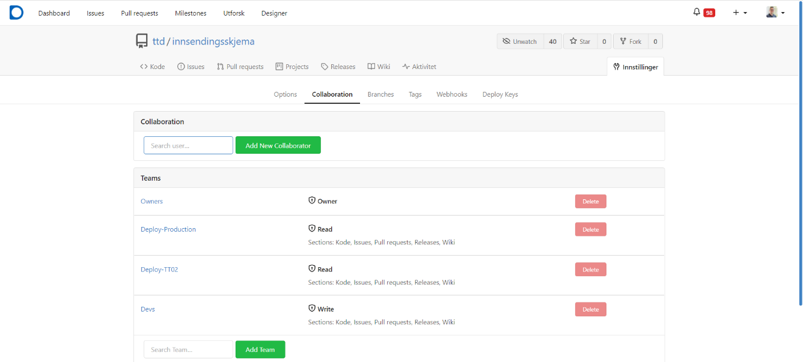

## Tilgangsstyring for organisasjonen

Som eier av en organisasjon i Altinn Studio kan du konfigurere tilgangene til de øvrige brukerne som er knyttet til organisasjonen.

Gå til `https://altinn.studio/repos/org/{org}/teams/` (erstatt `{org}` med organisasjonskoden din).

Altinn Studio har fire standardteam som legger føringer for hva en bruker har lov til å gjøre i organisasjonen. Ved behov kan du som eier legge til eller fjerne brukere i team, opprette nye team og endre konfigurasjonen til eksisterende team.

### Owners (eiere)

Medlemmer i dette teamet er administratorer for organisasjonen. De kan administrere tilgangsstyringen for alle team og repositorier som er knyttet til organisasjonen.

Som medlem i teamet kan du blant annet

- opprette og slette team
- legge til og fjerne brukere i ulike team
- endre konfigurasjonen til team

#### Konfigurasjon

Dette teamet finnes som standard i alle organisasjoner, og du kan ikke endre konfigurasjonen til teamet.

#### Anbefaling: Ha rutiner når eiere er borte

Organisasjonen må selv ha rutiner for hvordan den håndterer tilgangsstyring dersom en eller flere eiere er borte – for eksempel ved ferie, permisjon eller endring i rolle.

Digitaliseringsdirektoratet og Altinn kan ikke legge til brukere, endre team eller gjøre andre endringer i tilgangene til organisasjonen. Dette er av sikkerhetshensyn.

### Deploy-Production (produksjon)

Medlemmer i dette teamet kan distribuere applikasjoner til produksjonsmiljøet.

Standardkonfigurasjonen gir teamet lesetilgang til alle repositorier og full tilgang til alle områder i Gitea, men ikke rettighet til å opprette nye repositorier. Eierne kan definere øvrige rettigheter fritt.

#### Konfigurasjon

Eierne kan justere konfigurasjonen til teamet ved behov. Muligheten til å distribuere til produksjonsmiljøet avhenger ikke av den øvrige konfigurasjonen.

Standardkonfigurasjonen til teamet gir rettighet til å

- lese alle repositorier
- få tilgang til alle områder i Gitea

### Deploy-TT02 (testmiljø)

Medlemmer i dette teamet kan distribuere applikasjoner til testmiljøet.

Standardkonfigurasjonen gir teamet lesetilgang til alle repositorier og full tilgang til alle områder i Gitea, men ikke rettighet til å opprette nye repositorier. Eierne kan definere øvrige rettigheter fritt.

#### Konfigurasjon

Eierne kan justere konfigurasjonen til teamet ved behov. Muligheten til å distribuere til testmiljøet avhenger ikke av den øvrige konfigurasjonen.

Standardkonfigurasjonen til teamet gir rettighet til å

- lese alle repositorier
- få tilgang til alle områder i Gitea

### Devs (utviklere)

Medlemmer i dette teamet utvikler applikasjoner og har tilgang til alle repositorier.

#### Konfigurasjon

Eierne kan justere konfigurasjonen til teamet ved behov, avhengig av hvor mye frihet apputvikleren skal ha. Du kan blant annet spesifisere hvilke repositorier teamet skal ha tilgang til.

Standardkonfigurasjonen til teamet gir rettighet til å

- opprette nye repositorier
- skrive til alle repositorier
- få tilgang til alle områder i Gitea

## Tilgangsstyring for et enkelt repositorium

En administrator for organisasjonen kan også styre hvem som har tilgang til det enkelte repositoriet.

Gå til repositoriet i Gitea, og velg fanen **Collaboration** under **Innstillinger**. Du kan gi tilgang til både team og enkeltbrukere. Vi anbefaler at du primært setter opp team for tilgangsstyring, slik at du holder oversikten. For å gi et team tilgang, søk det opp og klikk på **Add Team**.

