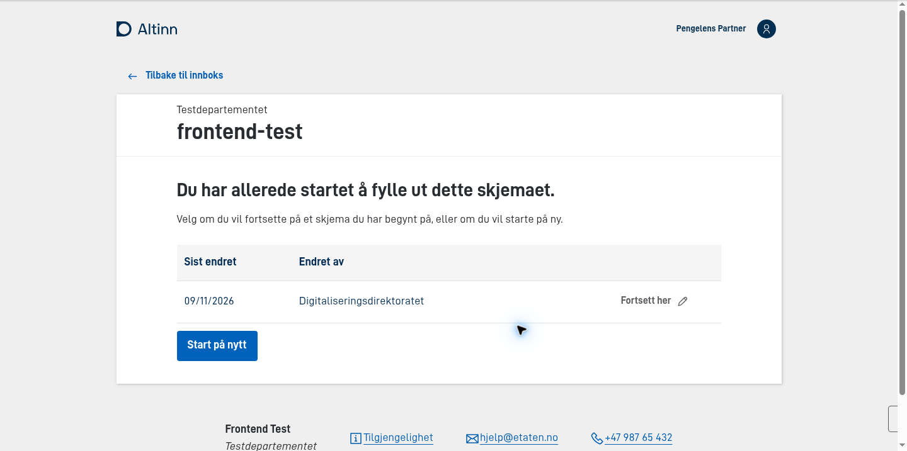

Egenskapen `onEntry.show` i `App/config/applicationmetadata.json` styrer hva som skjer når brukeren åpner appen uten en lenke til en bestemt instans.

For en app som oppretter og bruker instanser, kan du velge mellom:

- `new-instance`: Appen oppretter en ny instans. Dette er standardverdien når `onEntry.show` ikke er satt.
- `select-instance`: Appen lar brukeren fortsette på en aktiv instans eller opprette en ny.

Hvis appen skal starte med en tilstandsløs visning, kan du i stedet angi ID-en til den aktuelle brukergrensesnittmappen. Se [konfigurasjon av tilstandsløse apper](../stateless/).

## La brukeren velge en aktiv instans

Sett `onEntry.show` til `select-instance`:


App/config/applicationmetadata.json


```json
{
  "onEntry": {
    "show": "select-instance"
  }
}
```

Appen undersøker om den valgte avgiveren har aktive instanser:

- Hvis det ikke finnes noen aktive instanser, oppretter appen en ny instans automatisk.
- Hvis det finnes én eller flere aktive instanser, viser appen siden for instansvalg.

På siden for instansvalg kan brukeren fortsette på en eksisterende instans eller velge **Start på nytt**. Siden vises også når det bare finnes én aktiv instans, slik at brukeren fortsatt kan velge å opprette en ny.



## Tilpass siden for instansvalg

Bruk `onEntry.instanceSelection` for å styre sortering og paginering:

- `sortDirection`: Sorterer instansene i stigende (`asc`) eller synkende (`desc`) rekkefølge etter siste endring. Standardverdien er `asc`.
- `rowsPerPageOptions`: Angir alternativene for hvor mange instanser som vises per side. Standardverdien er `[10, 25, 50]`.
- `defaultSelectedOption`: Angir indeksen i `rowsPerPageOptions` som skal være valgt når siden åpnes. Indeksen starter på `0`, som også er standardverdien.

Eksempelet nedenfor viser 25 instanser per side som standard:


App/config/applicationmetadata.json


```json
{
  "onEntry": {
    "show": "select-instance",
    "instanceSelection": {
      "sortDirection": "desc",
      "rowsPerPageOptions": [10, 25, 50, 100],
      "defaultSelectedOption": 1
    }
  }
}
```
