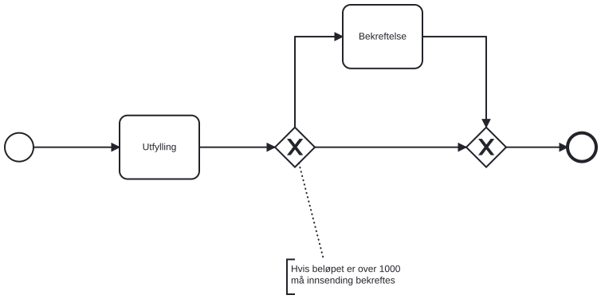

## Eksklusive gateways

Med en eksklusiv gateway velger du hvilken vei prosessen følger videre. Valget kan bygge på det brukeren fyller ut, på andre data eller på tilpasset kode.

## Gateways som kontrollerer flyten med uttrykk

### Forutsetninger

Du trenger

- en app som bruker versjon 8.0.0 eller nyere av Altinn-pakkene
- en prosess som inneholder en eksklusiv gateway

### Slik styrer du flyten ut av en gateway med data fra brukeren

Du kan la data som brukeren leverte i en tidligere oppgave avgjøre hvilken flyt som går ut av gatewayen. Du bruker samme uttrykksspråk som når du skjuler eller viser elementer i brukergrensesnittet.

Først må du bestemme hvilke skjemadata uttrykkene skal kunne bruke.

Eksempel:
```xml {hl_lines=["6-10"]}
...
<bpmn:exclusiveGateway id="Gateway_1">
    <bpmn:incoming>Flow_t1_g1</bpmn:incoming>
    <bpmn:outgoing>Flow_g1_t2</bpmn:outgoing>
    <bpmn:outgoing>Flow_g1_end</bpmn:outgoing>
    <bpmn:extensionElements>
        <altinn:gatewayExtension>
            <altinn:connectedDataTypeId>Schema</altinn:connectedDataTypeId>
        </altinn:gatewayExtension>
    </bpmn:extensionElements>
</bpmn:exclusiveGateway>
<bpmn:sequenceFlow id="Flow_g1_t2" sourceRef="Gateway_1" targetRef="Task_2" />
<bpmn:sequenceFlow id="Flow_g1_end" sourceRef="Gateway_1" targetRef="EndEvent" />
...
```
I eksempelet ovenfor bruker gatewayen skjemadata fra datatypen _Schema_ i uttrykkene. Du definerer skjemadata og datatyper i filen _applicationmetadata.json_.

Når gatewayen er koblet til en datatype, kan du bruke uttrykksspråket til å avgjøre hvilke flyter ut av gatewayen som er tilgjengelige.

{}
Nøyaktig én flyt må være gyldig når uttrykkene er regnet ut. Hvis ingen eller flere flyter er gyldige, går ikke prosessen videre, og brukeren får en feil. Systemet regner en flyt uten uttrykk alltid som gyldig.
{}

Nå må du skrive uttrykkene i de utgående flytene fra gatewayen. Eksempelet har to utgående flyter: _Flow_g1_t2_ og _Flow_g1_end_.

Prosessen skal følge _Flow_g1_t2_ hvis feltet _Amount_ i skjemadataene er større enn eller lik 1000, og _Flow_g1_end_ hvis det er mindre enn 1000.

Du gjør dette ved å legge til betingelsesuttrykk (`conditionExpression`) i de utgående flytene.

```xml {hl_lines=[2,5]}
<bpmn:sequenceFlow id="Flow_g1_t2" sourceRef="Gateway_1" targetRef="Task_2">
    <bpmn:conditionExpression>["greaterThanEq", ["dataModel", "Amount"], 1000]</bpmn:conditionExpression>
</bpmn:sequenceFlow>
<bpmn:sequenceFlow id="Flow_g1_end" sourceRef="Gateway_1" targetRef="EndEvent">
    <bpmn:conditionExpression>["lessThan", ["dataModel", "Amount"], 1000]</bpmn:conditionExpression>
</bpmn:sequenceFlow>
```
Hvis brukeren har sendt inn en _Amount_ på 1000, blir uttrykket i sekvensflyten _Flow_g1_end_ usant. Systemet fjerner da denne flyten fra dem det kan velge mellom. Den eneste tilgjengelige flyten er _Flow_g1_t2_, og derfor velger systemet den.

Du finner flere muligheter på siden om [uttrykk]().

### Slik styrer du flyten ut av en gateway med brukerhandlingen

Du kan også la handlingen som brukeren eller systemet utførte i oppgaven før gatewayen, avgjøre hvilken flyt prosessen følger. Da skriver du et betingelsesuttrykk i prosessen, i tillegg til uttrykkene mot datamodellen.

Hvis appen har et bekreftelsessteg, kan du la sluttbrukeren avvise dataene. Prosessen sender da instansen tilbake til forrige oppgave (_Task_1_).

```xml
<bpmn:task id="Task_2" name="Person">
    <bpmn:incoming>Flow_t1_t2</bpmn:incoming>
    <bpmn:outgoing>Flow_t2_g1</bpmn:outgoing>
    <bpmn:extensionElements>
        <altinn:taskExtension>
            <altinn:taskType>confirmation</altinn:taskType>
            <altinn:actions>
                <altinn:action>confirm</altinn:action>
                <altinn:action>reject</altinn:action>
            </altinn:actions>
        </altinn:taskExtension>
    </bpmn:extensionElements>
</bpmn:task>
<bpmn:exclusiveGateway id="Gateway_1">
    <bpmn:incoming>Flow_t2_g1</bpmn:incoming>
    <bpmn:outgoing>Flow_g1_t1</bpmn:outgoing>
    <bpmn:outgoing>Flow_g1_end</bpmn:outgoing>
</bpmn:exclusiveGateway>
<bpmn:sequenceFlow id="Flow_g1_t1" sourceRef="Gateway_1" targetRef="Task_1" />
<bpmn:sequenceFlow id="Flow_g1_end" sourceRef="Gateway_1" targetRef="EndEvent" />
```

I eksempelet ovenfor har _Task_2_ to handlinger: `confirm` og `reject`. Du kan [lese mer om handlinger]().

Prosessen skal følge _Flow_g1_t1_ hvis brukeren utfører handlingen _reject_, og _Flow_g1_end_ hvis handlingen var _confirm_.

Du gjør dette med uttrykksfunksjonen _gatewayAction_:

```xml {hl_lines=[2,5]}
<bpmn:sequenceFlow id="Flow_g1_t1" sourceRef="Gateway_1" targetRef="Task_1">
    <bpmn:conditionExpression>["equals", ["gatewayAction"], "reject"]</bpmn:conditionExpression>
</bpmn:sequenceFlow>
<bpmn:sequenceFlow id="Flow_g1_end" sourceRef="Gateway_1" targetRef="EndEvent">
    <bpmn:conditionExpression>["equals", ["gatewayAction"], "confirm"]</bpmn:conditionExpression>
</bpmn:sequenceFlow>
```

Uttrykksfunksjonen _gatewayAction_ gir deg handlingen som brukeren utførte i oppgaven prosessen nettopp forlot. I eksempelet ovenfor er det _Task_2_.

Du kan kombinere _gatewayAction_ med alle de andre funksjonene i [uttrykksspråket]().

## Komplekse gateways som krever tilpasset kode

Hvis uttrykk ikke er nok til å styre gatewayen din, kan du skrive tilpasset kode som tar valget om hvilken flyt prosessen skal følge.

### Forutsetninger

Du trenger

- en app som bruker versjon 7.1.0 eller nyere av Altinn-pakkene
- en prosess som inneholder en eksklusiv gateway

### Eksempelprosess med eksklusive gateways

```xml
<?xml version="1.0" encoding="UTF-8"?>
<bpmn:definitions xmlns:xsi="http://www.w3.org/2001/XMLSchema-instance" xmlns:bpmn="http://www.omg.org/spec/BPMN/20100524/MODEL" xmlns:bpmndi="http://www.omg.org/spec/BPMN/20100524/DI" xmlns:dc="http://www.omg.org/spec/DD/20100524/DC" xmlns:di="http://www.omg.org/spec/DD/20100524/DI" xmlns:altinn="http://altinn.no/process" id="Altinn_SingleDataTask_Process_Definition" targetNamespace="http://bpmn.io/schema/bpmn" exporter="bpmn-js (https://demo.bpmn.io)" exporterVersion="10.2.0">
  <bpmn:process id="SingleDataTask" isExecutable="false">
    <bpmn:startEvent id="StartEvent_1">
      <bpmn:outgoing>Flow_s_t1</bpmn:outgoing>
    </bpmn:startEvent>
    <bpmn:sequenceFlow id="Flow_s_t1" sourceRef="StartEvent_1" targetRef="Task_1" />
    <bpmn:task id="Task_1" name="Utfylling">
      <bpmn:incoming>Flow_s_t1</bpmn:incoming>
      <bpmn:outgoing>Flow_t1_g1</bpmn:outgoing>
      <bpmn:extensionElements>
        <altinn:taskExtension>
            <altinn:taskType>data</altinn:taskType>
        </altinn:taskExtension>
      </bpmn:extensionElements>
    </bpmn:task>
    <bpmn:sequenceFlow id="Flow_t1_g1" sourceRef="Task_1" targetRef="Gateway_1" />
    <bpmn:exclusiveGateway id="Gateway_1">
      <bpmn:incoming>Flow_t1_g1</bpmn:incoming>
      <bpmn:outgoing>Flow_g1_g2</bpmn:outgoing>
      <bpmn:outgoing>Flow_g1_t2</bpmn:outgoing>
    </bpmn:exclusiveGateway>
    <bpmn:sequenceFlow id="Flow_g1_g2" sourceRef="Gateway_1" targetRef="Gateway_2" />
    <bpmn:sequenceFlow id="Flow_g1_t2" sourceRef="Gateway_1" targetRef="Task_2" />
    <bpmn:task id="Task_2" name="Bekreftelse">
      <bpmn:incoming>Flow_g1_t2</bpmn:incoming>
      <bpmn:outgoing>Flow_t2_g2</bpmn:outgoing>
      <bpmn:extensionElements>
        <altinn:taskExtension>
            <altinn:taskType>confirmation</altinn:taskType>
            <altinn:actions>
              <altinn:action>confirm</altinn:action>
            </altinn:actions>
        </altinn:taskExtension>
      </bpmn:extensionElements>
    </bpmn:task>
    <bpmn:sequenceFlow id="Flow_t2_g2" sourceRef="Task_2" targetRef="Gateway_2" />
    <bpmn:exclusiveGateway id="Gateway_2">
      <bpmn:incoming>Flow_g1_g2</bpmn:incoming>
      <bpmn:incoming>Flow_t2_g2</bpmn:incoming>
      <bpmn:outgoing>Flow_g2_end</bpmn:outgoing>
    </bpmn:exclusiveGateway>
    <bpmn:sequenceFlow id="Flow_g2_end" sourceRef="Gateway_2" targetRef="EndEvent_1" />
    <bpmn:endEvent id="EndEvent_1">
      <bpmn:incoming>Flow_g2_end</bpmn:incoming>
    </bpmn:endEvent>
  </bpmn:process>
  <!-- BPMN Diagram part is omitted for brevity -->
</bpmn:definitions>
```


Diagrammet viser BPMN-definisjonen:



### Skrive og registrere tilpasset kode for gatewayen

For at systemet skal velge riktig sekvensflyt ut av den eksklusive gatewayen basert på instansdata, må du opprette en klasse som implementerer `Altinn.App.Core.Features.IProcessExclusiveGateway`. Du må også registrere klassen som en tjeneste i avhengighetsinjeksjonen.

Grensesnittet har en strengegenskap `GatewayId` og en metode `FilterAsync`.

Du bruker `GatewayId` til å identifisere gatewayen i prosessdefinisjonen den er tilknyttet.

I eksempelet setter du `GatewayId` til `Gateway_1` for den første gatewayen, fordi det er verdien i attributtet `id` på den eksklusive gatewayen i prosessdefinisjonen.

I metoden `FilterAsync` skriver du den tilpassede logikken som filtrerer sekvensflytene ut av gatewayen, basert på instansdataene.

Du finner mer om grensesnittet i XML-dokumentasjonen:

https://github.com/Altinn/app-lib-dotnet/blob/main/src/Altinn.App.Core/Features/IProcessExclusiveGateway.cs

Når du har skrevet den tilpassede koden, registrerer du den i `Program.cs`, i metoden `RegisterCustomAppServices`.

Eksempel:

```csharp
void RegisterCustomAppServices(
    IServiceCollection services, 
    IConfiguration config, 
    IWebHostEnvironment env)
{
    services.AddTransient<IProcessExclusiveGateway, GatewayOne>();
}
```
