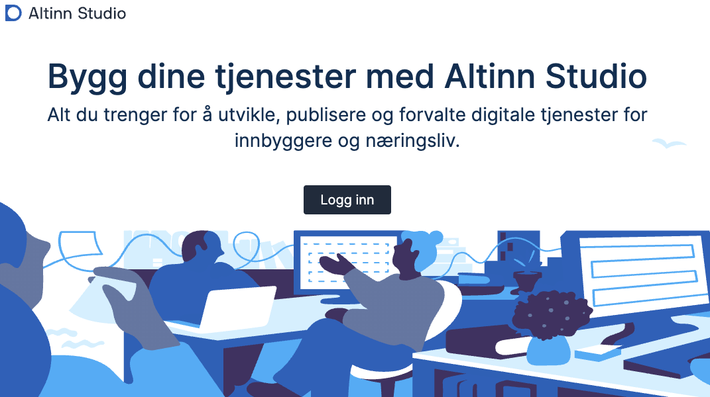
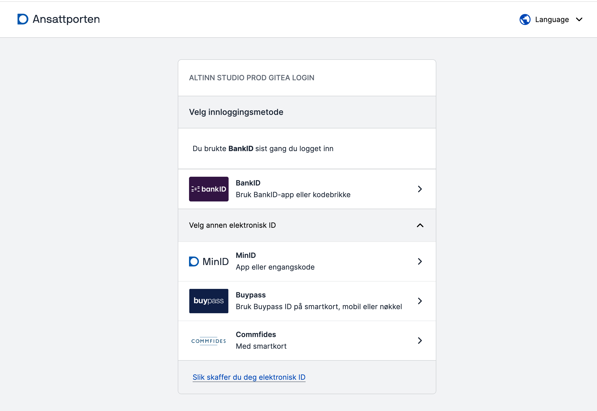
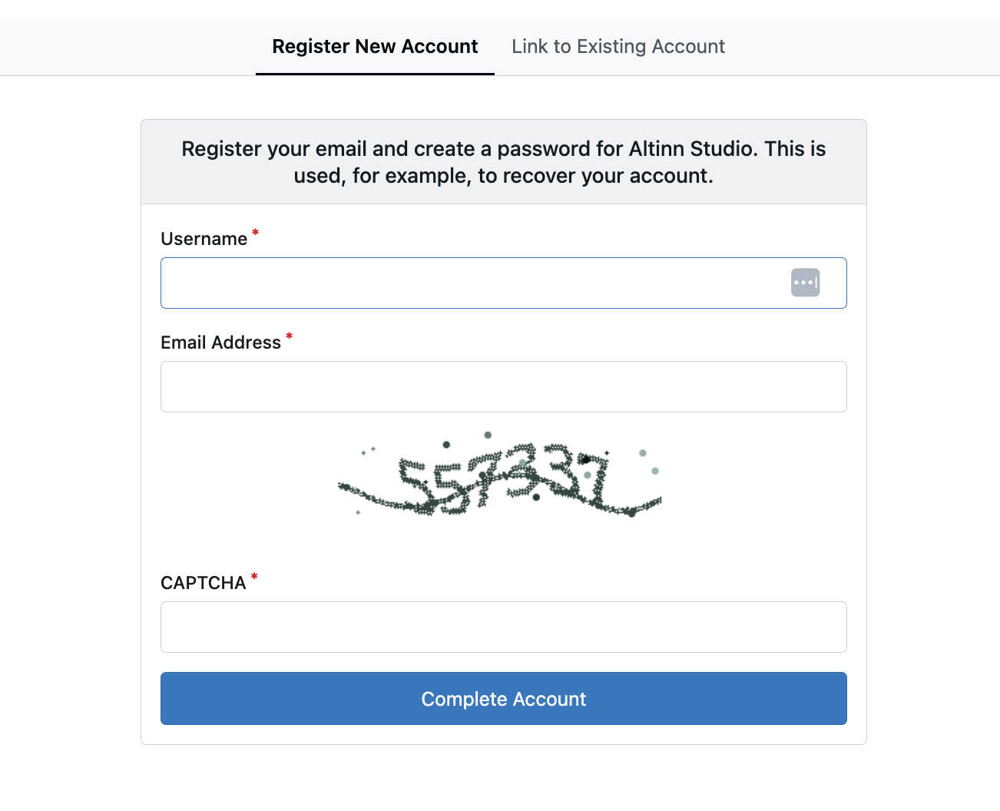
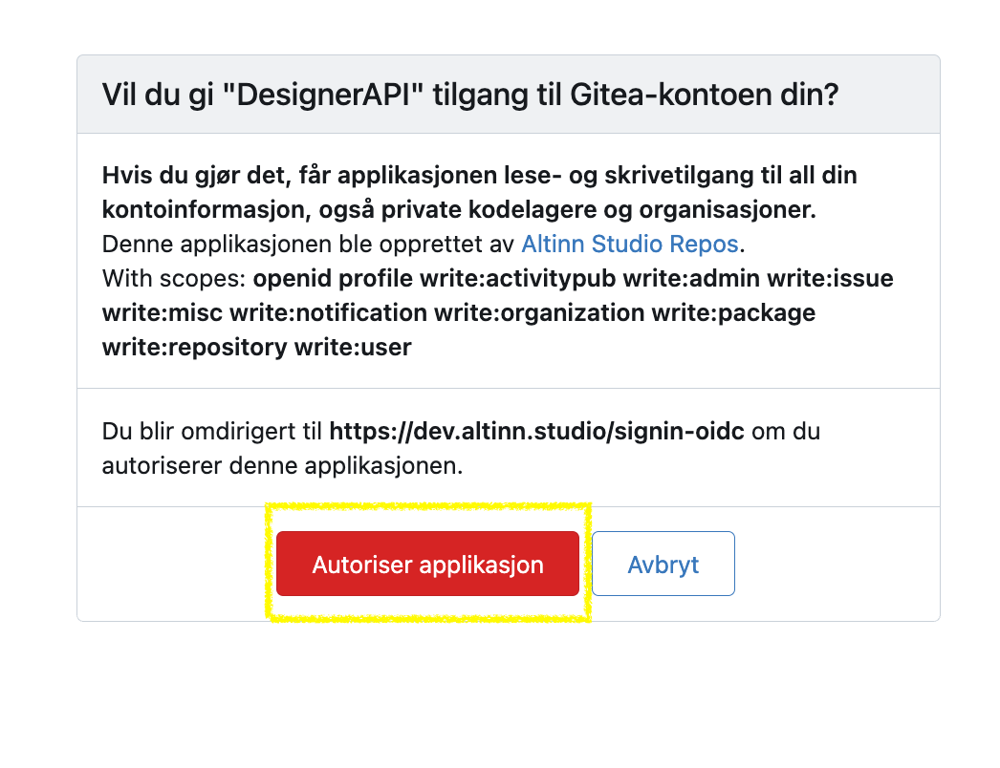

Alle som ønsker å teste og/eller bruke Altinn Studio må først lage en bruker. Dette er selvbetjent.
Altinn Studio-brukeren din er personlig for deg. Du kan knytte den til en eller flere organisasjoner for å samarbeide med andre og få tilgang til eksisterende apper.
Om du skal ha tilgang til å lage tjenester for en organisasjon, må du kontakte den som administrerer Altinn Studio
for organisasjonen din.

## Lag en bruker med Ansattporten
{.floating-bullet-numbers-sibling-ol}

1. Gå til [altinn.studio](https://altinn.studio) og klikk på **Logg inn**.
   

2. Registrer deg eller logg inn gjennom Ansattporten.
   - Du registrerer deg ved å logge inn via Ansattporten.
   - Velg BankID eller en av de andre innloggingsmetodene.
   - *Av sikkerhetsmessige årsaker kan du kun bruke Ansattporten til innlogging og registrering. Du trenger ikke å være knyttet
      til en virksomhet i offentlig sektor.*

   

3. Lag en Altinn Studio-bruker ved å fylle ut brukernavn, e-post, passord og en bekreftelse på at du er et menneske. Klikk deretter på **Fullfør**.
   Brukeren i Altinn Studio blir koblet til Ansattporten-brukeren din.
   

4. Aktiver kontoen din ved å bekrefte e-postadressen du registrerte med.
   - *Du får en e-post med en lenke til e-postadressen du oppga. Kopier lenken, og lim den inn i nettleservinduet.*

   {}
   Hvis du får en feilmelding om at lenken er utløpt, prøv å logge inn på nytt (via Ansattporten). Kontoen skal være aktivert.
   {}

5. Gi Altinn Studio-applikasjonen tilgang til brukerkontoen din.
   

Etter at du har aktivert kontoen, klikker du på logoen øverst til venstre på siden for å gå til tjenestedashboardet ditt.
Du er nå klar til å lage den første tjenesten din.

## Bli del av en organisasjon

Organisasjoner i Altinn Studio eier applikasjonene og gjør det mulig for flere innen samme organisasjon å samarbeide.

For å bli del av en organisasjon må en administrator for organisasjonen din gi deg tilgang.
Hvis du er usikker på hvem som er administrator, eller du ikke vet om organisasjonen din er satt opp i Altinn Studio,
kan du spørre [Altinn Servicedesk](mailto:tjenesteeier@altinn.no) om hjelp.

_Er du administrator for organisasjonen din og skal legge inn brukere? Se [veiledning for hvordan du legger inn brukere](/nb/altinn-studio/v9/manage-a-service/access-management/studio/)._

## Opprette en organisasjon

Det er Digdir som oppretter organisasjoner i Altinn Studio.

For å kunne få en organisasjon i Altinn Studio må virksomheten din

- være tjenesteeier og ha inngått en avtale med Altinn, eller
- tilby tjenesteutvikling i Altinn Studio på vegne av offentlige virksomheter

Organisasjoner som ikke er tjenesteeiere vil ikke få tilgang til eget test- eller produksjonsmiljø.

For å opprette en ny organisasjon, send en e-post til [Altinn Servicedesk](mailto:tjenesteeier@altinn.no) med navn på organisasjonen og hvem som skal være administrator.
Det kan ta noen dager, og du får svar på e-post så snart det er gjort.
