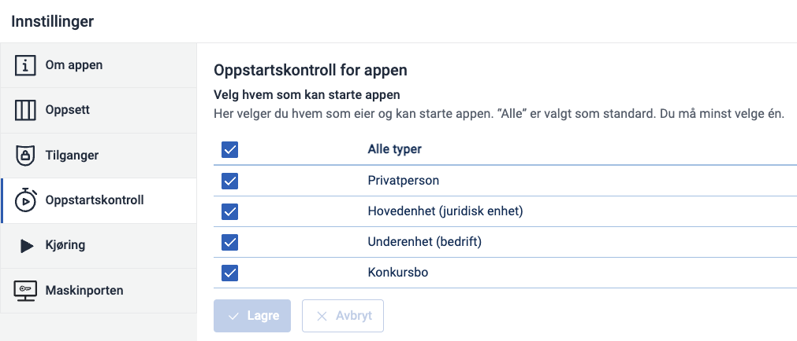
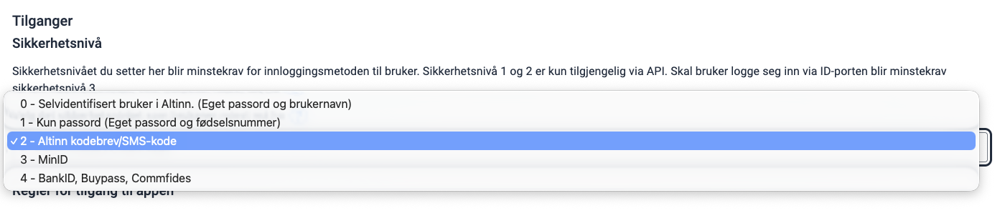
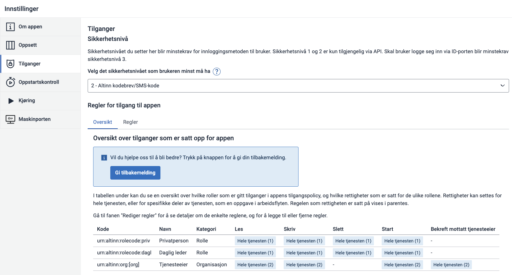
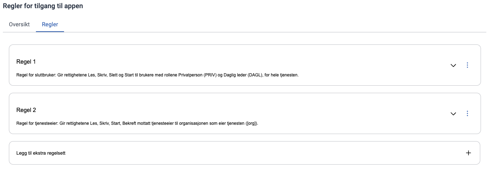

Før vi går videre med tjenesten skal vi sette opp regler for hvem som skal ha lov til å bruke tjenesten. Altinn Studio kommer med noen regler som standard, men du må alltid vurdere disse før du publiserer tjenesten. Standard oppsett innebærer at både privatpersoner og virksomheter kan ta i bruk tjenesten, inkludert virksomheter som er under konkursbehandling. I tillegg er din virksomhet som eier tjenesten også satt opp med tilgang.

## Oppstartskontroll
Det første vi skal gjøre er å vurdere hvem som får lov til å starte tjenesten. Dette finner du under Innstillinger og Oppstartskontroll.

Her har du 4 valg:
* Privatperson
* Hovedenhet - Selskap, forening, enkeltpersonforetak og andre som er registrert i [Enhetsregisteret](https://www.brreg.no/om-oss/registrene-vare/om-enhetsregisteret/)
* Underenhet - En underenhet av en hovedenhet registrert i [Enhetsregisteret](https://www.brreg.no/bedrift/underenhet/)
* Konkursbo - Enheter som er under konkursbehandling i [Konkursregisteret](https://www.brreg.no/om-oss/registrene-vare/om-konkursregisteret/)

De du krysser av for er de som har lov til å starte skjemaet/tjenesten din.

---

## Sikkerhetsnivå
Det neste du bestemmer er sikkerhetsnivå som bestemmer minstekravet til innloggingsmetoden for brukeren. Dette finner du under Instillinger og Tilganger. Her har du 5 valg:

* 0 - Selvidentifisert bruker i Altinn (Eget passord og brukernavn)
* 1 - Kun passord (Eget passord og fødselsnummer)
* 2 - Altinn kodebrev/SMS-kode
* 3 - MinID
* 4 - BankID, Buypass, Commfides

Altinn kodebrev/SMS-kode er standard sikkerhetsnivå. Dersom brukeren prøver å ta i bruk en tjeneste og har for lavt sikkerhetsnivå vil de få beskjed om å logge inn på nytt og velge en annen innloggingsmetode.

---

## Tilgangsstyring

Oppstartskontroll og sikkerhetsnivå handler om hvem tjenesten er rettet mot og hva som minimum kreves for å komme inn, men det betyr ikke at du nødvendigvis har rettighetene til å bruke den. Hvem som får lov til å gjøre hva inne i en tjeneste styres av tilgangsregler. Reglene finner du under Instillinger og Tilganger.

En regel består 3 deler:
* *HVEM* får tilgangen
* *HVA* gis det tilgang til (kalles ofte ressurs)
* *HVILKE* handlinger, eller rettigheter, får man på det man har fått tilgang til

F. eks. kan vi gi Revisor (HVEM) signeringsrett (HVILKEN handling) til signeringssteget i tjenesten (HVA), mens Daglig leder (HVEM) får skrivetilgang (HVILKEN handling) til skjemautfyllingssteget (HVA).

Som man ser er disse 3 konseptene i seg selv faste for hver regel, men hva de skal settes til i den enkelte tjeneste vil naturligvis variere avhengig av hva slags prosess tjenesten har definert (ikke alle har signeringssteg), hvilke handlinger som er definert i tjenesten, hva slags tjeneste det er og hvem den rettes mot. Tilgangsstyring og regler er derfor vesentlig å tenke gjennom **før** man lanserer tjenesten.

For å endre, eller legge til en regel, klikker du på fanen "Regler". 

Legg merke til at det er to regler, mens oversiktstabellen viser tre rader. Årsaken finner vi når vi ser på Regel 1. Den beskriver to roller i samme regel, Daglig leder og Privatperson, dermed så blir det to rader for en regel i oversikten siden denne tar utgangspunkt i HVEM som har hvilken tilgang.