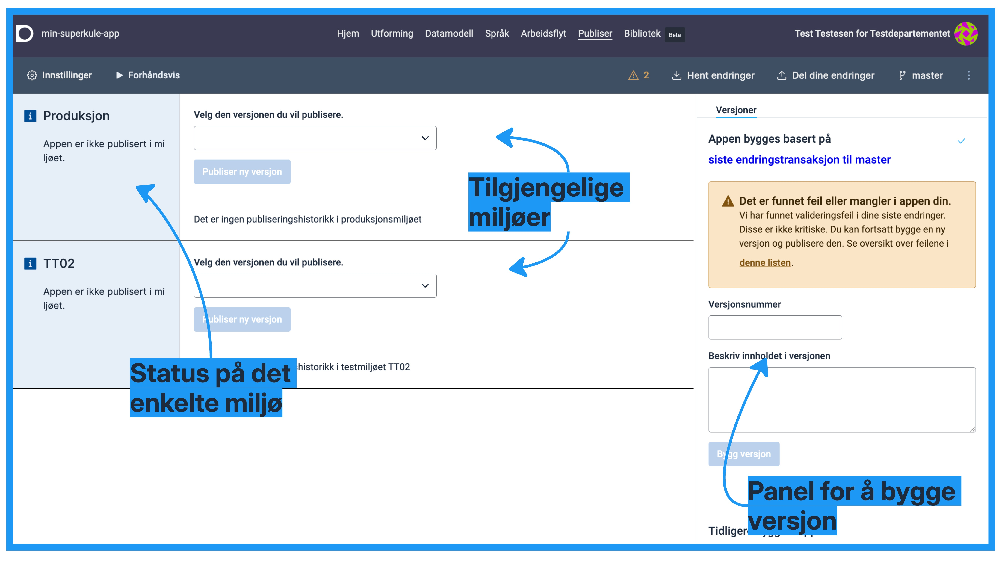
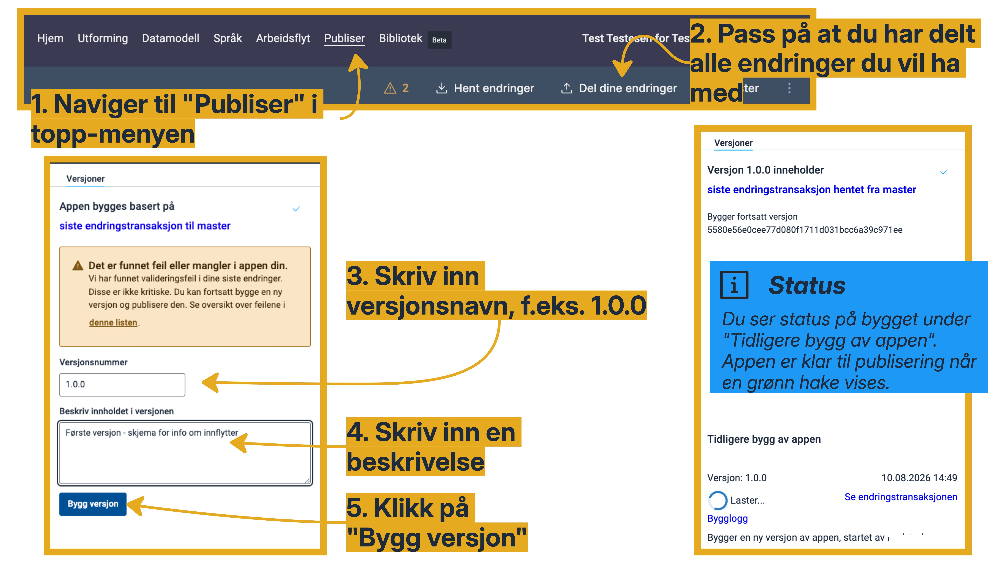
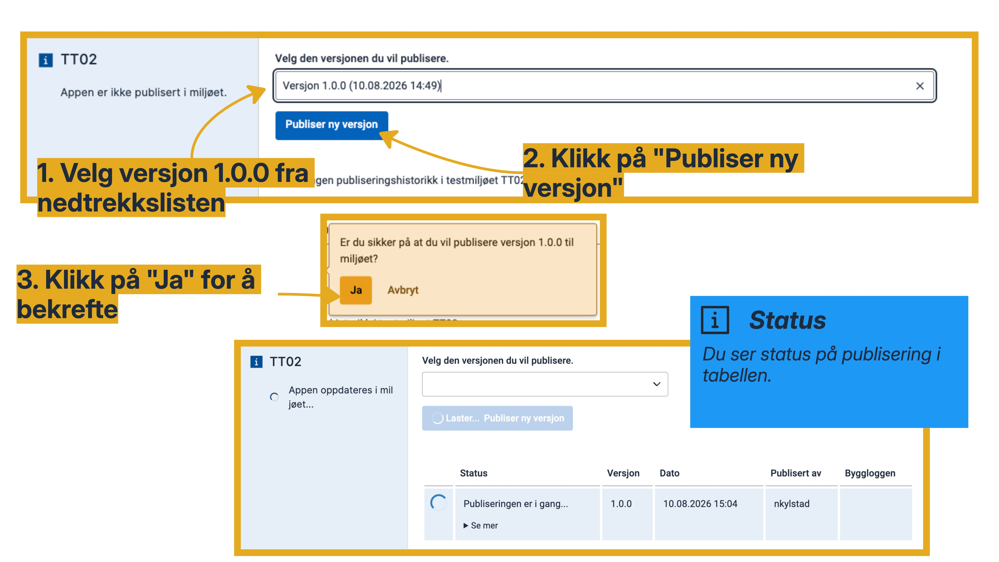

Appen består av et sett med kodefiler og konfigurasjonsfiler. Alt dette må pakkes inn i en pakke, som så publiseres ut til miljøet.
Hver gang du lager en ny pakke, lager du en ny _versjon_ av appen som kan publiseres.
Dette gjør du via **Publiser**-siden som du finner i toppmenyen.

Siden har 3 kolonner:
- Høyre kolonne er der kan bygge en ny versjon, og se oversikt over tidligere versjoner som er bygget.
- I midten kan du velge versjon og publisere til valgt miljø. Her ser du og historikk over tidligere publiseringer.
- Til venstre ser du status på appen i de forskjellige miljøene, og lenke til appen i miljøet om den er tilgjengelig der.

---

## Bygg en ny versjon av appen

1. Naviger til **Publiser** i toppmenyen.
2. Påse at du har delt alle endringene du vil ha med før du begynner.
3. Skriv inn versjonsnavn i feltet **Versjonsnummer**. F.eks. `1.0.0` Versjonsnummeret må være unikt (ikke brukt tidligere for denne appen).
4. Skriv inn beskrivelse for denne versjonen av appen.
5. Klikk på **Bygg versjon** for å starte bygget.

Du ser status for bygget under **Tidligere bygg av applikasjonen**. Når status er grønn er denne versjonen av appen klar til distribusjon til testmiljø.

---

## Publiser appen til testmiljø

1. Velg versjonen av appen du vil publisere fra nedtrekkslisten under miljøet TT02 (testmiljø).
2. Klikk på **Publiser ny versjon**.
3. Klikk på "Ja" for å bekrefte

Systemet publiserer valgt versjon til valgt miljø. Du kan publisere ny versjon eller gå tilbake til en eldre versjon hvis du ønsker det.

---

## Test tjenesten i testmiljø

Logg inn i testmiljøet med testbruker. Bruk lenken du ser over hvert miljø i fanen **Publiser** for å komme til ønsket testmiljø og starte ny instans av appen.

Du finner alle instanser i meldingsboksen/arkivet til valgt aktør, på samme måte som dagens tjenester (som er basert på Altinn II).

