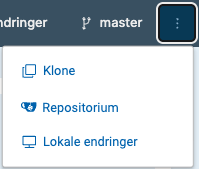

Designer is the tool you start in after logging in to
https://altinn.studio.
It is a tool for designing, setting up and publishing apps.

## Open an App
On the dashboard, you can see all the apps you have access to.
Click the app you want to open.

If you want to go to the repository for the app whilst working in the designer, you can go to the three dots at the top right and select **Repositorium**.

## Edit an App

Use the top menu to build and modify your app. In the top menu, you select the areas of the app you want to work on.

- **Hjem**: Here you get an overview of your app. You can see which environments the app is published in, and recent activity. From here you can also go directly to the other tools in Designer, and find help and news.
- **Utforming**: Here you choose which components you want to include, for example in a form you are creating. You set up, amongst other things, the order and criteria for how the fields in the form should be displayed and behave for end users.
- **Datamodell**: Here you can choose to use existing data models or create new ones.
- **Språk**: Here you can manage texts in your app and translate them.
- **Arbeidsflyt**: Workflow gives you an overview of the processes you want to include in your app, for example payment and receipt.
- **Publiser**: Use Publish to build versions of your app and publish it to an environment.
- **Bibliotek**: In the library you will find both resources you have saved for your apps and resources that are shared in the organisation, for example code lists and images.


