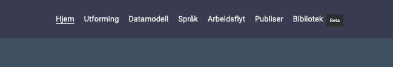

Designer er verktøyet du starter i etter å ha logget inn på https://altinn.studio.
Det er et verktøy for å utforme, sette opp og publisere apper.

## Åpne en app
På dashboardet ser du alle appene du har tilgang til.
Klikk på appen du vil åpne.

Hvis du vil gå til repositoriet for appen mens du jobber i designeren, kan du gå til de tre prikkene øverst til høyre og velge __Repositorium__.

## Redigere en app

Bruk toppmenyen til å bygge og endre appen din. I toppmenyen velger du de områdene i appen du vil jobbe med.

- **Hjem**: Her får du en oversikt over appen din. Du ser hvilke miljøer appen er publisert i, og siste aktivitet. Herfra kan du også gå direkte til de andre verktøyene i Designer, og finne hjelp og nyheter.
- **Utforming**: Her velger du hvilke komponenter du vil ha med, for eksempel i et skjema du skal lage. Du setter blant annet opp rekkefølgen og kriteriene for hvordan feltene i skjemaet skal vises og oppføre seg for sluttbrukerne.
- **Datamodell**: Her kan du velge å bruke eksisterende datamodeller eller lage nye.
- **Språk**: Her kan du håndtere tekstene i appen din og oversette dem.
- **Arbeidsflyt**: Arbeidsflyt gir deg oversikt over prosessene du vil ha med i appen din, for eksempel betaling og kvittering.
- **Publiser**: Bruk Publiser til å bygge versjoner av appen din og publisere den til et miljø.
- **Bibliotek**: I biblioteket finner du både ressurser du har lagret for appene dine og ressurser som er delt i organisasjonen, for eksempel kodelister og bilder.


